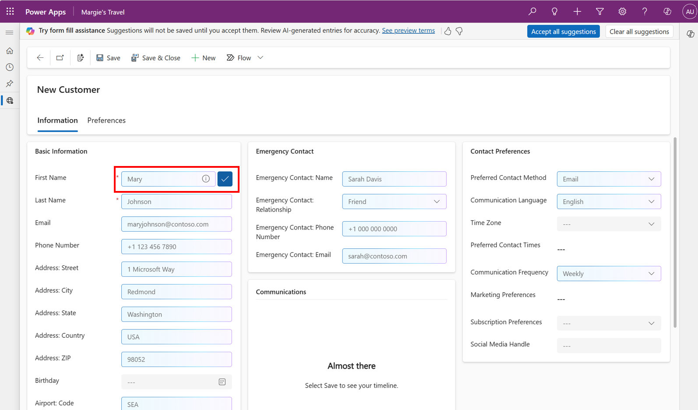

# Copilot assistance for filling forms for app users in model-driven apps

With Copilot assistance for filling forms in model-driven apps, users receive suggestions generated by AI for fields in main forms. This feature makes it easier and faster to enter data. These suggestions are based on the user’s usage of the app, what information is already available in the form, and their frequently used data. These suggestions are entirely optional, and do not get saved until the user accepts them. 

## Enable form filling assistance

Copilot assistance is available for English language model-driven apps on the web with “New Look” enabled. Suggestions are generated for fields in main forms only. 

To enable form filling assistance: 

1. Enable either one of the two options: 
  - [Monthly release channel](../maker/model-driven-apps/channel-change.md) (this feature is part of the February release) 
  - [Early access](/power-platform/admin/opt-in-early-access-updates) for 2024 release wave 1 
2. Enable [Copilot setting](../maker/model-driven-apps/add-ai-copilot?source=docs#enable-copilot-for-model-driven-apps-feature-for-your-environment) in Power Platform Admin Center 

Note that this feature is rolling out gradually, which means some users will have access before others. To disable form fill assistance: 

- Disable [Copilot setting](../maker/model-driven-apps/add-ai-copilot?source=docs#enable-copilot-for-model-driven-apps-feature-for-your-environment) in Power Platform Admin Center, or 
- Disable either the [Early access](/power-platform/admin/opt-in-early-access-updates) for 2024 release wave 1 or switch out of [Monthly release channel](../maker/model-driven-apps/channel-change) (depending on which option was selected for enablement above) 

If you would like to specifically disable form fill assistance only without disabling any of the above, please contact Microsoft.

## Use form fill assistance 

Copilot assistance for filling forms generates suggestions for text, numeric, options, and date fields in main forms in model-driven apps. Suggestions are generated only for the tab that is open and are presented inline in the form. 

> [!div class="mx-imgBorder"] 
   > 

Suggestions are entirely optional, and do not get saved in the app until the user explicitly accepts them. 

To accept a specific suggestion, click on the Accept button which appears on hover on the field, or select the field and press the Enter key. 

[!div class="mx-imgBorder"] 
   > 

To accept all suggestions in the open tab of the form, click on the Accept All button in the message bar located at the top of page. 

[!div class="mx-imgBorder"] 
   > 

To replace a suggestion with a different value, select the field and simply start typing to overwrite the suggestion. Alternatively, select the field and press the Backspace or Delete key and then start typing. 

When navigating away from a form which has pending suggestions, you will be prompted about discarding these suggestions since they do not get saved until they are accepted. You may choose to continue to navigate away, or to remain on the form and review pending suggestions. You can also select “Do not show again” to not be prompted again. 

[!div class="mx-imgBorder"] 
   > 
