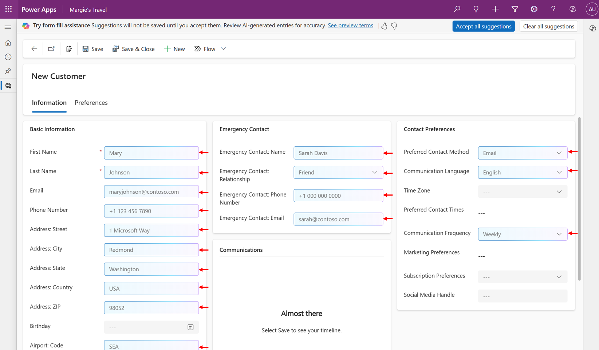
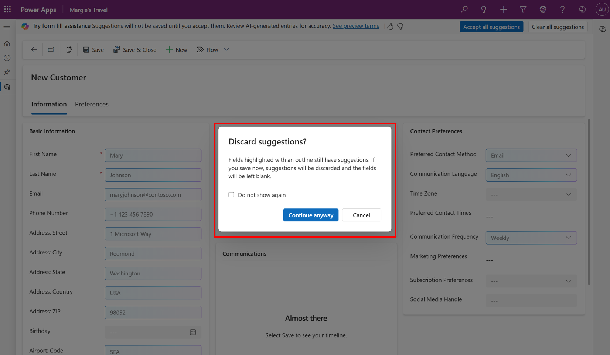

# Copilot assistance for filling forms for app users in model-driven apps

With Copilot assistance for filling forms for model-driven apps, users receive suggestions generated by AI for fields in main forms. This feature makes it easier and faster to enter data. These suggestions are based on the user’s usage of the app, what information is already available in the form, and their frequently used data. The suggestions are entirely optional, and don't get saved until the user accepts them. 

## Enable form filling assistance

Copilot assistance is available in English only for model-driven apps on the web with [New look](modern-fluent-design.md) enabled. Suggestions are generated for fields in main forms only. 

This feature is rolling out gradually, which means some users have access before others.

Follow these steps to enable form filling assistance: 

1. Enable one of the following options: 
   - Turn on [Monthly release channel](../maker/model-driven-apps/channel-change.md). This feature is part of the February release.
   - Turn on [Early access](/power-platform/admin/opt-in-early-access-updates) for 2024 Release Wave 1. 
2. Enable [Copilot setting](../maker/model-driven-apps/add-ai-copilot.md#enable-copilot-for-model-driven-apps-feature-for-your-environment) in Power Platform Admin Center.

## Disable form fill assistance

The way you disable form fill assistance depends on how you enabled it. Make one of the following changes:

- Disable [Copilot setting](../maker/model-driven-apps/add-ai-copilot.md#enable-copilot-for-model-driven-apps-feature-for-your-environment) in Power Platform Admin Center. 
- Disable [Early access](/power-platform/admin/opt-in-early-access-updates) for 2024 Release Wave 1.
- Switch out of [Monthly release channel](../maker/model-driven-apps/channel-change.md).

You need to contact Microsoft support to only disable form fill assistance without disabling any of the features listed above.

## Use form fill assistance 

Copilot assistance for filling forms generates suggestions for text, numeric, options, and date fields in main forms in model-driven apps. Suggestions are generated only for the tab that is open and are presented inline in the form. 

> [!div class="mx-imgBorder"] 
> 

Suggestions are entirely optional, and aren't saved in the app until you accept them. 

To accept a specific suggestion, hover of the field and then select **Accept** or select the field and press the enter key. 

> [!div class="mx-imgBorder"] 
> 

To accept all suggestions in the open tab of the form, on the notification bar, select **Accept All**.

> [!div class="mx-imgBorder"] 
> 

To replace a suggestion with a different value, select the field and start typing to overwrite the suggestion. Or, select the field and press the backspace or delete key and then start typing. 

If you have unsaved suggestions in a form and try to navigate away, you get a prompt asking if you want to discard those suggestions. The suggestions are only saved when you accept them. You can continue navigating away or stay on the form to review your pending suggestions. You can also select **Do not show again** to avoid being prompted in the future.

> [!div class="mx-imgBorder"] 
> 
