# Create and manage personal views on a grid page (preview)

[!INCLUDE [cc-beta-prerelease-disclaimer](../includes/cc-beta-prerelease-disclaimer.md)]

In model-driven apps, views define the data that's displayed in tabular form on a grid page. System views are views that are created by your administrator and shared with you. You typically can't modify them. However, you can create and manage personal views.

A view consists of the following elements:

- The columns to display, including the order they appear in and their width
- The default sort order
- Filter conditions to show rows that match specific criteria, if needed

For more information, see [Understand model-driven app views](../maker/model-driven-apps/create-edit-views.md).

## Column editor

1. Select **Edit columns** to remove, reorder, or add columns to get a clearer view of your data.

  :::image type="content" source="./media/column-editor.png" alt-text="A screenshot of the view column editor on a grid page.":::

    - To remove a column, hover over the column name, select **…**, and then select **Remove**.
    - To change the order of the columns, select **…**, and then select **Move up** or **Move down**. Or, drag the column to the desired position in the list.
    - To add columns to the view:
        1. Select **Add columns**, and then do one or more of the following:

          - Select a column from the default set of system columns in the table.
          - Select **Default**, then select **All** or **Custom**, and then select from the set of additional columns in the table.
          - Type a column name in the **Search** box to find a specific column, and then select it.
      
              :::image type="content" source="./media/column-editor-add-column.png" alt-text="A screenshot of the list of default columns that are available to add to a view.":::
  
          - To add columns from other tables, select the **Related** tab. Expand the table that contains the column you want to add, and then select the column. When you're done adding columns, select **Close** .
  
              :::image type="content" source="./media/column-editor-add-column-related.png" alt-text="A screenshot of the list of columns in related tables that are available to add to a view.":::

1. Select **Apply** to see your changes to the view on the grid page.

To undo changes to the view's columns at any time, select **Reset to default**. 

## Filter editor

Use the filter editor on the grid page to view the set of conditions in the current view. You can also add more or remove conditions from the filtered data.

> [!div class="mx-imgBorder"]
>

1. To remove a condition, select the More commands button (**…**) next to a row and then select, **Delete**.

2. Follow these steps to add a conditions:

   - To add a single condition, select **Add row**. Select a column, an operator, and a value to create a condition.
     
     > [!div class="mx-imgBorder"]
     > 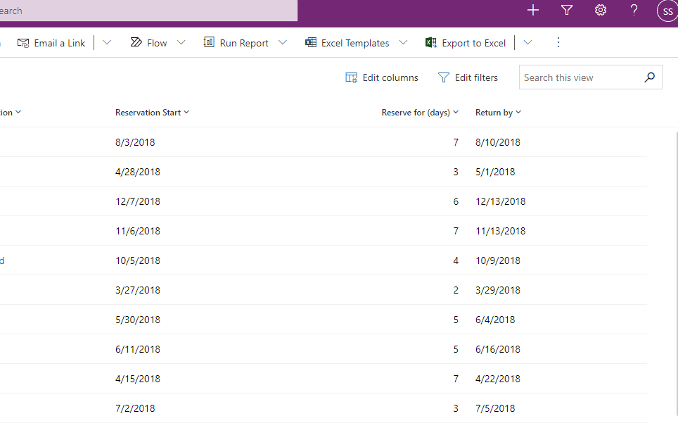

   - To add a group of conditions, select **Add group**. You can create multiple sub-conditions and group them using AND or OR operators to create an expression.

     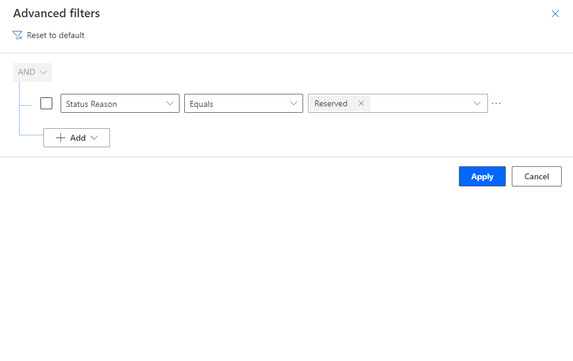

   - To add condition on a column from a related table select, **Add related entity**. Then choose the related table you want to filter on and add conditions to it.

     > [!div class="mx-imgBorder"]
     > 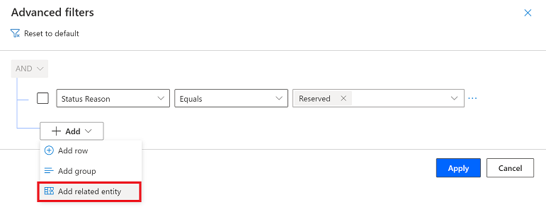
    
     > [!NOTE]
     > **Contains data** is the only conditional operator that can be used with a related table in a view filter.

   - You can group conditions by first selecting a condition using the check box and then selecting the More commands button (**…**) next to a row, and then select **Make group**.   At any point, you can reset the conditional expression back to original state by choosing the **Reset to default** option.

     > [!div class="mx-imgBorder"]
     > 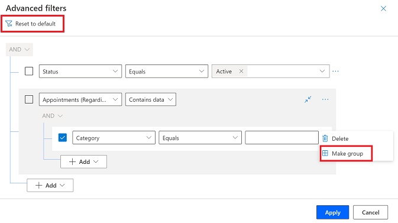
   
3. When you have reviewed the changes you made, select **Apply** to see changes to the view data on the grid page.

## Create personal views

When you edit a view definition and haven't save it yet, you'll see asterisk next to the view name indicating the view isn't saved.

> [!div class="mx-imgBorder"]
> 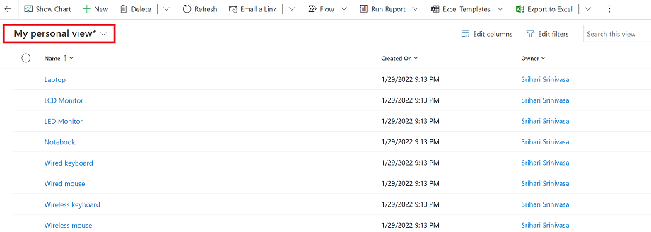

To save a view, follow these steps:

- If you made changes to a system view or a personal view that you don't have *Write* permission to, then you can only save the view as a personal view. On the command bar select, the More commands button > **Create view** >, **Save as new view**.

  > [!div class="mx-imgBorder"]
  > 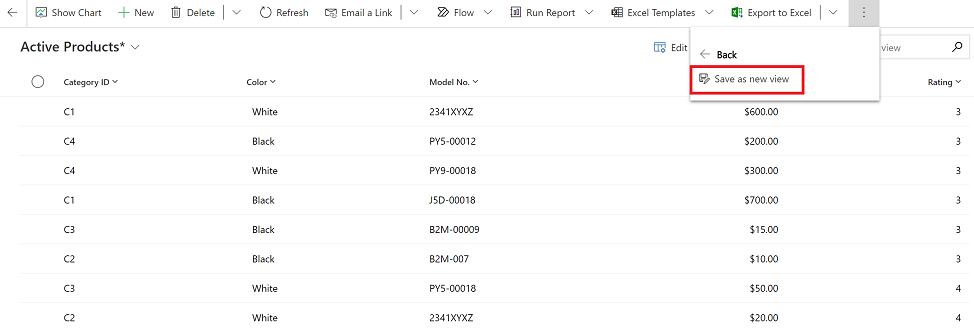

- To save changes to one of your personal views that you have *write* permission to, on the command bar select, the More commands button > **Create view** > **Save changes to current view**. 

  > [!div class="mx-imgBorder"]
  > 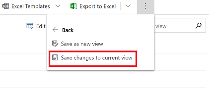

### Modern advanced find

When your administrator has enabled the [modern advanced find experience](/power-platform/admin/settings-features), then you can create a personal view directly from the view selector.

- If you made changes to a system view or a personal view that you don't have *Write* permission to, then you can only save the view as a personal view. To save the view, select the view selector and then choose, **Save as a new view**.

  > [!div class="mx-imgBorder"]
  > 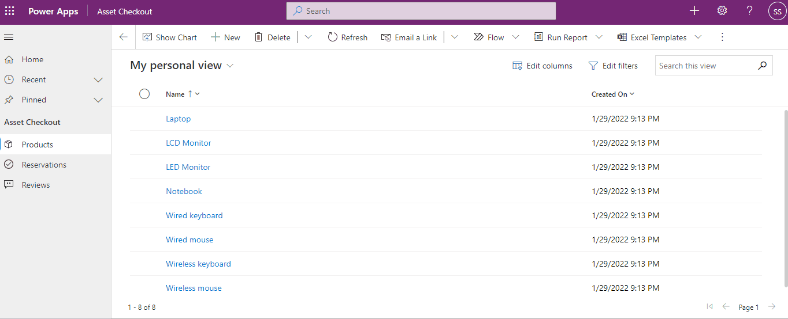

- To save changes to a personal view that you have *Write* permission to, select the view selector, and then choose **Save changes to current view**. 

  > [!div class="mx-imgBorder"]
  > 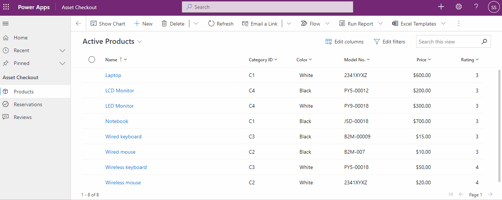

## Set default view

Each table in your app has a default view that's set by your administrator. The default view for a table is indicated by the **Default** label in the view selector.

> [!div class="mx-imgBorder"]
> 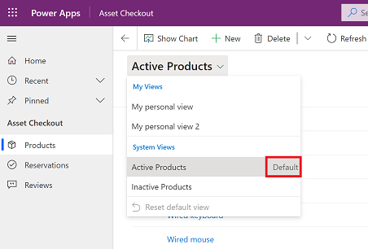

To make another view your default view, select the view and then select, **Set current view as my default**. You will only see the **Set current view as my default** option when the view is saved when the selected view isn't already set as the default view.

> [!div class="mx-imgBorder"]
> 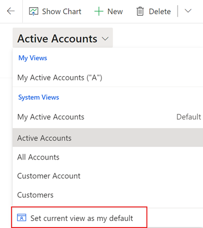

To reset the default view to the original view set by your administrator, select **Reset default view**.

> [!NOTE]
> - You'll see the **Reset default view** option only when the current default view for the table is not the one set by the system administrator.
> - The options at the bottom of the view selector are always visible, even if the list of views is longer than the available vertical screen space.

> [!div class="mx-imgBorder"]
> 

   
## Manage and share personal views

When your administrator has enabled the [modern advanced find experience](/power-platform/admin/settings-features), then you will see the **Manage and share views** option in the view selector. The **Manage and share views** options lets you share views with your organization and manage your views.

> [!div class="mx-imgBorder"]
> 

### Change sort order

By default, the list of views in the view selector is grouped by personal views and system views. Both view type are listed in alphabetical order. 

1. To change the sort order, select the view selector and then select, **Manage and share views**. Then choose from one of these sort options:

   > [!div class="mx-imgBorder"]
   > 

    - **Personal before system, A to Z**: This is the default. All personal views are ordered alphabetically and appear above all system views that are also ordered alphabetically.

    - **System before personal, A to Z**: All system views are ordered alphabetically appear above all personal views that are also ordered alphabetically.

    - **A to Z**: All views (system and personal) appear in alphabetic in the view selector.

     > [!NOTE]
     > - Personal views have a user user icon next to the view name:  
     > - To see if the view is a personal view or a system view, hover over the info icon:  

### Hide views

You can hide views from showing in the view selector by using the **Hide** option in the view management panel. Hover over the view and then select **Hide**. You can also select **View commands** and then select **Hide**.

> [!div class="mx-imgBorder"]
> 

#### What is view hiding?

Hiding a view is a way to personalize the view list and reduce clutter by making views not be visible in the view selector. A view may be needed for a specific purpose periodically or a view could be shared with you that you may not need it anymore. In such instances, hiding enables you to manage your view list by seeing only the views that are most important for you.

Once a view is hidden, it will not appear in the view list for that table in all model-driven apps on all devices for you. If a view is shared with you and other team members, hiding that view will only hide the view for you in the view selector; it will not be hidden for everyone else who has access to the view.

   > [!NOTE]
   > - By default personal views can be hidden. You can hide system views only if the administrator has enabled the setting in Power Platform Admin Center.
   > - The default view of a table cannot be hidden.
   > - A view that is hidden cannot be set as default.

If a view is hidden, then you will see the option to make it visible. Hover over the view and then select **Show**. You can also select **View commands** and then select **Show**.

### Other view management tasks

| Option | Use |
| - | - |
| **Set as default** | <ul> <li> Make a view the default view for that table across all model-driven apps in the environment. </li> <li> **Set as default view** option does not appear on a hidden view or on a view that is already default.</li></ul> |
| **Reset default** | Reset the default view of a table across all model-driven apps in the environment. |
| **Share** | <ul> <li>Share the view with other members of your organization by selecting the team/user to share it with and defining permissions. For information: [Share rows with a user or team](share-row.md). </li> <li> Appears only on personal views for which you have share permission.  </li></ul>|
| **Edit info** | <ul> <li>Edit the name and description of the view </li> <li> Appears only on personal views for which you have Write permission. </li></ul>|
| **Assign** | <ul> <li>Assign view ownership to another user to team in your organization </li> <li> Appears only on personal views that you own. </li></ul>|
| **Delete** | <ul> <li>Delete the view </li> <li> Appears only on personal views for which you have Delete permission.</li> <li> Deleting a personal view will delete the view for all users who have shared access to it.</li></ul>|
| **Deactivate/Activate** | <ul> <li>Deactivate/activate the view </li> <li> Appears only on personal views for which you have Write permission.</li> <li> Deactivating/activating a personal view will make it inactive/active for all users who have shared access to it.</li></ul>|

[!INCLUDE[footer-include](../includes/footer-banner.md)]
