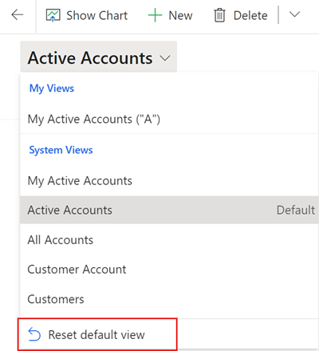
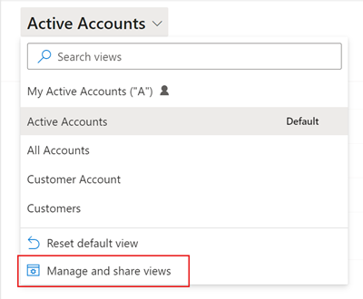
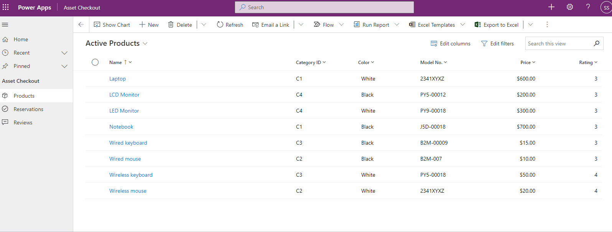
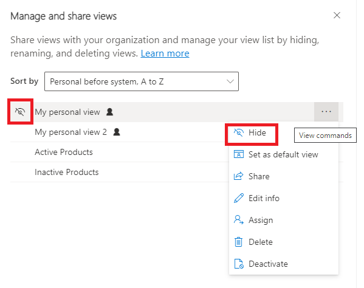

# Create and manage personal views on a grid page (preview)

[!INCLUDE [cc-beta-prerelease-disclaimer](../includes/cc-beta-prerelease-disclaimer.md)]

In model-driven apps, views define the data that's displayed in tabular form on a grid page. System views are views that are created by your administrator and shared with you. You typically can't modify them. However, you can create and manage personal views. Personal views are only available to you unless you share them.

A view consists of the following elements:

- The columns to display
- Default sorting options
- Filters to show rows that match specific criteria, if needed

For more information, see [Understand model-driven app views](../maker/model-driven-apps/create-edit-views.md).

## Select columns in the column editor

1. Select **Edit columns** to remove, reorder, or add columns to get a clearer view of your data.
1. Select **Apply** to see your changes on the grid page.

  :::image type="content" source="./media/column-editor.png" alt-text="A screenshot of the view column editor on a grid page.":::

  The following actions are available in the column editor:

- To remove a column, hover over the column name, select **…**, and then select **Remove**.
- To change the order of the columns, select **…**, and then select **Move up** or **Move down**. Or, drag the column to the desired position in the list.
- To add columns to the view, select **Add columns**, and then do one or more of the following:

  - Select a column from the default set of system columns in the table.
  - Select **Default**, then select **All** or **Custom**, and then select from the set of additional columns in the table.
  - Type a column name in the **Search** box to find a specific column, and then select it.

    :::image type="content" source="./media/column-editor-add-column.png" alt-text="A screenshot of the list of default columns that are available to add to a view.":::

  - To add columns from other tables, select the **Related** tab. Expand the table that contains the column you want to add, and then select the column. When you're done adding columns, select **Close** .

    :::image type="content" source="./media/column-editor-add-column-related.png" alt-text="A screenshot of the list of columns in related tables that are available to add to a view.":::

To undo changes to the view's columns at any time, select **Reset to default**.

## Select filter conditions in the filter editor

Use the filter editor to view or change the query that underlies the data in the current view.

:::image type="content" source="./media/filter-editor.png" alt-text="A screenshot of the view filter editor icon on a grid page.":::

- To change a condition, select the column, operator, or value and edit as needed.

- To remove a condition, select More commands (**…**) next to the row, and then select **Delete**.

    :::image type="content" source="./media/filter-editor-delete-condition.png" alt-text="A screenshot of the view filter editor, showing the row delete icon.":::

1. To add one or more conditions, select **Add**.

    :::image type="content" source="./media/filter-editor-add-condition.png" alt-text="A screenshot of the view filter editor, showing the row addition options.":::

    - To add a condition, select **Add row**, and then select a column, an operator, and a value.

        :::image type="content" source="./media/filter-editor-add-condition-row.png" alt-text="A screenshot of the view filter editor, showing an added row.":::

    - To add a group of conditions, select **Add group**. You can create multiple sub-conditions and group them using AND or OR operators to create an expression.

        :::image type="content" source="./media/filter-editor-add-condition-group.png" alt-text="A screenshot of the view filter editor, showing an added group of conditions.":::

        To add a single condition to a group, select the condition checkbox, then select **…**, and then select **Make group**.

        To separate a group of conditions, select the group's checkbox, then select **…*, and then select **Ungroup**.

        :::image type="content" source="./media/filter-editor-add-condition-group-ungroup.png" alt-text="A screenshot of the view filter editor, showing a condition group's Ungroup option.":::

    - To add a condition based on a column in a related table, select **Add related entity**, and then select a table. **Contains data** is the only conditional operator that can be used with a related table in a view filter. Then, select a column in the related table, an operator, and a value.

        :::image type="content" source="./media/filter-editor-add-condition-related.png" alt-text="A screenshot of the view filter editor, showing a condition added from a related table.":::

1. When you're finished editing the view filters, select **Apply** to see your changes on the grid page.

To undo changes to the view filter at any time, select **Reset to default**.

## Sort the data

Select a column heading, and then select how the view should sort data in the column. You can sort on one column at a time.

Sorting options depend on the type of data. Alphanumeric columns can be sorted in A to Z (ascending) or Z to A (descending) order. Date columns can be sorted in older to newer (ascending) or newer to older (descending) order. An arrow to the right of the column name indicates the view is sorted on that column and what order has been applied, ascending or descending.

## Save your view

An asterisk beside the view name indicates you edited the view and haven't saved it. If you switch to another view, or leave the page and come back, the view will revert to its original definition. To keep your changes and add the new view to the list of views available to you, be sure to save it.

### Save your edits as a new view

If you want to keep the original view, save your edited version as a new view with a different name. If you made changes to a view you don't have *Write* permission to, whether it's a system view or a personal view, then you can only save it as a new view.

1. On the command bar, select **More commands** (**⁝**) > **Create view** > **Save as new view**.

    :::image type="content" source="./media/save-as-new-view.png" alt-text="A screenshot of a grid page, showing the Create view option on the More commands menu.":::

1. Enter a new name for the view, and a description if you like, and then select **Save**.

:::image type="content" source="./media/save-as-new-view-name.png" alt-text="A screenshot of the Save as new view options.":::

> [!NOTE]
> If you want to keep the original view, be sure to give your edited view a different name. If you don't, your changes will overwrite the existing view without confirmation, even though you selected to save it as a new view.

### Change the definition of an existing view

If you don't want to keep the original view, you can replace it with your edited version. You'll need *Write* permission to the view to overwrite the original definition with your changes.

On the command bar, select **More commands** (**⁝**) > **Create view** > **Save changes to current view**.

:::image type="content" source="./media/save-as-new-view-options.png" alt-text="A screenshot of a grid page, showing the option to overwrite an existing view with the current changes.":::

### Manage views in modern advanced find

If your administrator has turned on [modern advanced find](/power-platform/admin/settings-features), you can create and manage views directly from the view selector.

:::image type="content" source="./media/save-as-new-view-modern.png" alt-text="A screenshot of a grid page, showing the view management options in modern advanced find.":::

## Change the default view

The default view for a table is indicated by the **Default** label in the view selector. Your administrator sets a default view for each table in your app. However, you can set a different view as the default.

<!-- I stopped after creating screenshots for set-default and reset-default in the classic experience. I need to turn on modern advanced find and get the same screenshots, then fix the text below. -->

Select the view and then select, **Set current view as my default**. You will only see the **Set current view as my default** option when the view is saved when the selected view isn't already set as the default view.

:::image type="content" source="./media/set-default-view.png" alt-text="A screenshot of the view selector on a grid page, showing the option to set a new default view.":::

To reset the default view to the original view set by your administrator, select **Reset default view**.

> [!NOTE]
> - You'll see the **Reset default view** option only when the current default view for the table is not the one set by the system administrator.
> - The options at the bottom of the view selector are always visible, even if the list of views is longer than the available vertical screen space.

> [!div class="mx-imgBorder"]
> 

   
## Manage and share personal views

When your administrator has enabled the [modern advanced find experience](/power-platform/admin/settings-features), then you will see the **Manage and share views** option in the view selector. The **Manage and share views** options lets you share views with your organization and manage your views.

> [!div class="mx-imgBorder"]
> 

### Change sort order

By default, the list of views in the view selector is grouped by personal views and system views. Both view type are listed in alphabetical order. 

1. To change the sort order, select the view selector and then select, **Manage and share views**. Then choose from one of these sort options:

   > [!div class="mx-imgBorder"]
   > 

    - **Personal before system, A to Z**: This is the default. All personal views are ordered alphabetically and appear above all system views that are also ordered alphabetically.

    - **System before personal, A to Z**: All system views are ordered alphabetically appear above all personal views that are also ordered alphabetically.

    - **A to Z**: All views (system and personal) appear in alphabetic in the view selector.

     > [!NOTE]
     > - Personal views have a user user icon next to the view name:  
     > - To see if the view is a personal view or a system view, hover over the info icon:  

### Hide views

You can hide views from showing in the view selector by using the **Hide** option in the view management panel. Hover over the view and then select **Hide**. You can also select **View commands** and then select **Hide**.

> [!div class="mx-imgBorder"]
> 

#### What is view hiding?

Hiding a view is a way to personalize the view list and reduce clutter by making views not be visible in the view selector. A view may be needed for a specific purpose periodically or a view could be shared with you that you may not need it anymore. In such instances, hiding enables you to manage your view list by seeing only the views that are most important for you.

Once a view is hidden, it will not appear in the view list for that table in all model-driven apps on all devices for you. If a view is shared with you and other team members, hiding that view will only hide the view for you in the view selector; it will not be hidden for everyone else who has access to the view.

   > [!NOTE]
   > - By default personal views can be hidden. You can hide system views only if the administrator has enabled the setting in Power Platform Admin Center.
   > - The default view of a table cannot be hidden.
   > - A view that is hidden cannot be set as default.

If a view is hidden, then you will see the option to make it visible. Hover over the view and then select **Show**. You can also select **View commands** and then select **Show**.

### Other view management tasks

| Option | Use |
| - | - |
| **Set as default** | <ul> <li> Make a view the default view for that table across all model-driven apps in the environment. </li> <li> **Set as default view** option does not appear on a hidden view or on a view that is already default.</li></ul> |
| **Reset default** | Reset the default view of a table across all model-driven apps in the environment. |
| **Share** | <ul> <li>Share the view with other members of your organization by selecting the team/user to share it with and defining permissions. For information: [Share rows with a user or team](share-row.md). </li> <li> Appears only on personal views for which you have share permission.  </li></ul>|
| **Edit info** | <ul> <li>Edit the name and description of the view </li> <li> Appears only on personal views for which you have Write permission. </li></ul>|
| **Assign** | <ul> <li>Assign view ownership to another user to team in your organization </li> <li> Appears only on personal views that you own. </li></ul>|
| **Delete** | <ul> <li>Delete the view </li> <li> Appears only on personal views for which you have Delete permission.</li> <li> Deleting a personal view will delete the view for all users who have shared access to it.</li></ul>|
| **Deactivate/Activate** | <ul> <li>Deactivate/activate the view </li> <li> Appears only on personal views for which you have Write permission.</li> <li> Deactivating/activating a personal view will make it inactive/active for all users who have shared access to it.</li></ul>|

[!INCLUDE[footer-include](../includes/footer-banner.md)]
