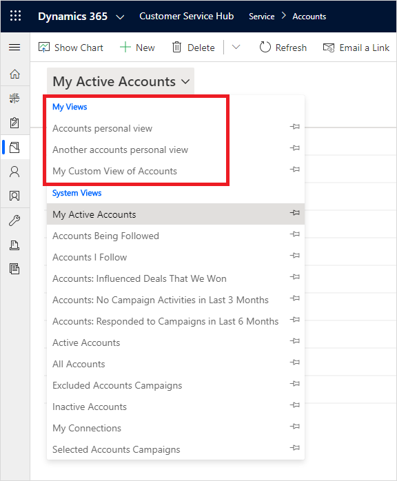
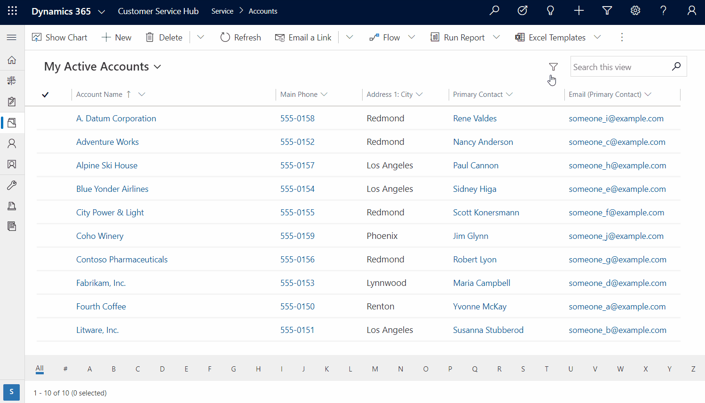
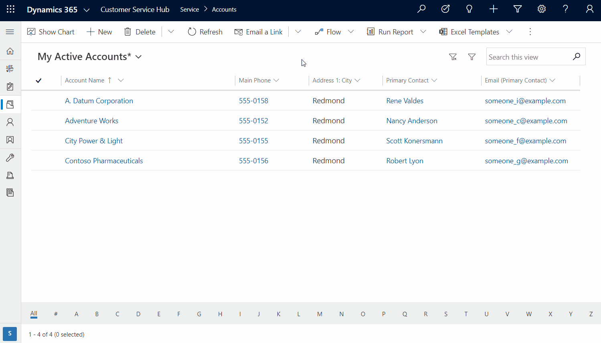
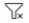
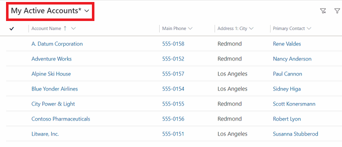
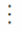
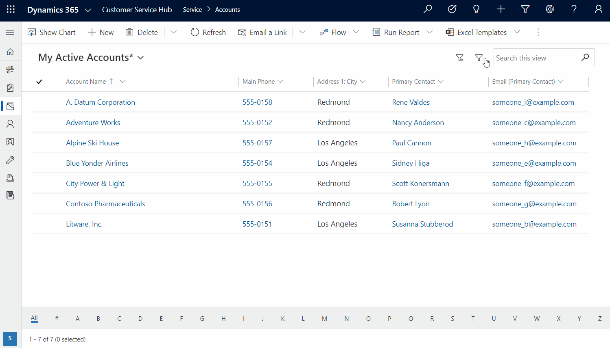

# Edit or create personal views using advanced grid filters 

Use the advanced filter options to create a personal view to see the rows that are important to you. The advanced filter options let you create a wide range of views from simple to complex. It also lets you add grouped and nested conditions to the filters.

> [!NOTE]
> - The advanced filter option is available only in English language versions. We plan to support more languages in future releases.
> - The advanced filter option on the Queues table does not work and displays this error message: We are unable to display the filter conditions for this view.
> - In Unified Interface, grids do not prepopulate column filters based on the current view definition.
> - Public views created in Power Apps that include **Contains data** or **Does not contain data** filters will not appear in the list of saved views in Advanced Find.

When you create and save a personal view, it appears in your list of personal views under **My Views**.

> [!div class="mx-imgBorder"]
> 

## See the current view definition

To see which filters were applied to the current view, select a view and then select **Filter** . This opens expression builder and displays the default view definition.

> [!div class="mx-imgBorder"] 
> 

## Add conditions to filters

1. To edit the current view and add more filters, select a view and then select **Filter** .
2. On the **Advanced filters** screen, use the expression builder to add conditions to filters. For more information on how to add conditions, see [Add conditions to a filter](../maker/model-driven-apps/create-edit-view-filters.md#add-conditions-to-a-filter).
3. When you're done, select **Apply**. 

   > [!div class="mx-imgBorder"] 
   > 

### Add grouped or nested conditions

To drill down further into your data, you can add grouped or nested conditions to the filters. For more information, see [Add a group condition to a filter](../maker/model-driven-apps/create-edit-view-filters.md#add-a-group-condition-to-a-filter).

   > [!div class="mx-imgBorder"] 
   > 

### Clear filters

To clear filters that were applied and reset the view back to the original definition, select **Clear filter** .

### Save your personal view

An asterisk next to a view name indicates the view has not been saved. 

   > [!div class="mx-imgBorder"] 
   > 

1. To save a personal view, on the command bar select **More** . 
2. Select **Create view** > **Save filter as new view**.
3. On the **Save as new view** dialog box, type in a name and description for the view and then select **Save**.
4. The view will appear in your list of personal views under **My Views**.

   > [!div class="mx-imgBorder"] 
   > 

## Set a default view

You can set a system view or choose one of your views and set it as the default view.

1. Select the table that you want to set the view for, such as Accounts.
2. From the list of views, select the view that you want to set as the default view.
3. Select the view again and then select **Set current view as my default**.

   

[!INCLUDE[footer-include](../includes/footer-banner.md)]
