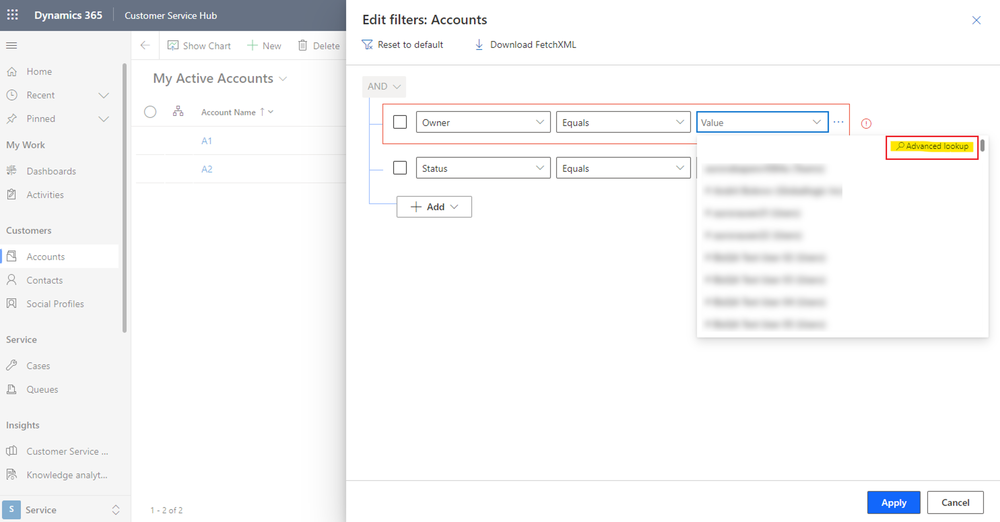
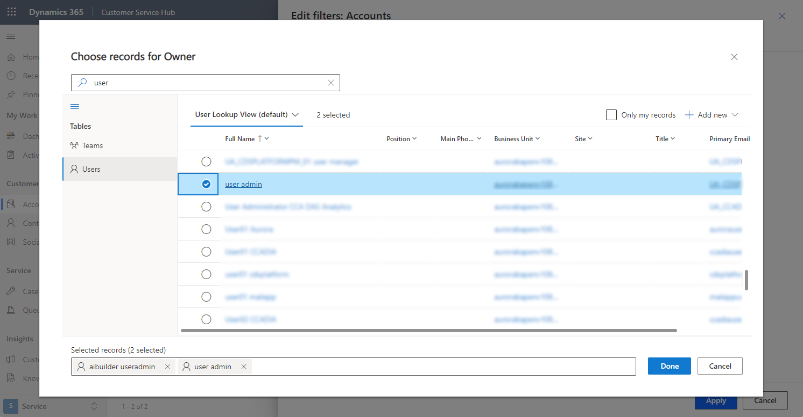

# Create and manage personal views on a grid page 

In model-driven apps, views define the data that's displayed in tabular form on a grid page. System views are views that are created by your administrator and shared with you. You typically can't modify them. However, you can create and manage personal views. Personal views are available to you only unless you share them.

A view consists of the following elements:

- The columns to display
- Default sorting options
- Filters to show rows that match specific criteria, if needed

For more information, see [Understand model-driven app views](../maker/model-driven-apps/create-edit-views.md).

## Select columns in the column editor

1. Select **Edit columns** to remove, reorder, or add columns to get a clearer view of your data.
1. Select **Apply** to see your changes on the grid page.

    :::image type="content" source="./media/column-editor.png" alt-text="A screenshot of the view column editor on a grid page.":::

  The following actions are available in the column editor:

- To remove a column, hover over the column name, select **…**, and then select **Remove**.
- To change the order of the columns, select **…**, and then select **Move up** or **Move down**. Or, drag the column to the desired position in the list.
- To add columns to the view, select **Add columns**, and then do one or more of the following:

  - Select a column from the default set of system columns in the table.
  - Select **Default**, then select **All** or **Custom**, and then select from the set of columns in the table.
  - Type a column name in the **Search** box to find a specific column, and then select it.

    :::image type="content" source="./media/column-editor-add-column.png" alt-text="A screenshot of the list of default columns that are available to add to a view.":::

  - To add columns from other tables, select the **Related** tab. Expand the table that contains the column you want to add, and then select the column. When you're done adding columns, select **Close**.

    :::image type="content" source="./media/column-editor-add-column-related.png" alt-text="A screenshot of the list of columns in related tables that are available to add to a view.":::

To undo changes to the view's columns at any time, select **Reset to default**.

## Select filter conditions in the filter editor

Use the filter editor to view or change the query that underlies the data in the current view.

:::image type="content" source="./media/filter-editor.png" alt-text="A screenshot of the view filter editor icon on a grid page.":::

### Edit or delete a condition

- To change a condition, select the column, operator, or value and edit as needed.

- To remove a condition, select More commands (**…**) next to the row, and then select **Delete**.

  :::image type="content" source="./media/filter-editor-delete-condition.png" alt-text="A screenshot of the view filter editor, showing the row delete icon.":::

### Add conditions

1. To add one or more conditions, select **Add**.
1. When you're finished editing the view filters, select **Apply** to see your changes on the grid page.

The following options are available when you add conditions in the filter editor:

:::image type="content" source="./media/filter-editor-add-condition.png" alt-text="A screenshot of the view filter editor, showing the row addition options.":::

- To add a condition, select **Add row**, and then select a column, an operator, and a value.

    :::image type="content" source="./media/filter-editor-add-condition-row.png" alt-text="A screenshot of the view filter editor, showing an added row.":::
    
    If you're adding a condition to a column with lookups, you can look up the record in the **Value** field. In the lookup drop-down menu, you can choose **Advanced lookup** to see more fields and search for records within a specific view.
    
    
    
    
    
- To add a group of conditions, select **Add group**. You can create multiple subconditions and group them using AND and OR operators to create an expression.

    :::image type="content" source="./media/filter-editor-add-condition-group.png" alt-text="A screenshot of the view filter editor, showing an added group of conditions.":::

- To add a single condition to a group, select the condition checkbox, then select **…**, and then select **Make group**.

- To separate a group of conditions, select the group's checkbox, then select **…**, and then select **Ungroup**.

    :::image type="content" source="./media/filter-editor-add-condition-group-ungroup.png" alt-text="A screenshot of the view filter editor, showing a condition group's Ungroup option.":::

- To add a condition based on a column in a related table, select **Add related entity**, and then select a table. **Contains data** is the only conditional operator that can be used with a related table in a view filter. Then, select a column in the related table, an operator, and a value.

    :::image type="content" source="./media/filter-editor-add-condition-related.png" alt-text="A screenshot of the view filter editor, showing a condition added from a related table.":::

To undo changes to the view filter at any time, select **Reset to default**.

> [!TIP]
> If you have the security privilege **Enable Download Fetch XML**, found under Miscellaneous Privileges section of the **Customization** tab within the security role definition page, you can download the FetchXML expression for a view. Contact your administrator if you need this capability.

## Sort the data

Select a column heading, and then select how the view should sort data in the column. You can sort on one column at a time.

Sorting options depend on the type of data. Alphanumeric columns can be sorted in A to Z (ascending) or Z to A (descending) order. Date columns can be sorted in older to newer (ascending) or newer to older (descending) order. An arrow to the right of the column name indicates the view is sorted on that column. The direction the arrow is pointing indicates whether the column is sorted in ascending or descending order.

## Edit column width

If your administrator has turned on [modern advanced find](/power-platform/admin/settings-features), you can drag the vertical column separator bar to change the **minimum** width of a column. When you change the width of a column, as asterisk appears besige the view name to indicate that you edited the view and haven't saved it. See [Save your edits to as a new view](/power-apps/user/grid-filters-advanced#save-your-edits-as-a-new-view) to learn more about different options to save a view.

> [!TIP]
> Since the column width edits change the **minimum** width of the column, you may see column widths getting adjusted after the view is saved, to fill the available horizontal screen space.

## Save your view

An asterisk beside the view name indicates you edited the view and haven't saved it. If you switch to another view or leave the page, the view will revert to its original definition. To keep your changes and add the new view to the list of views available to you, be sure to save it.

### Save your edits as a new view

To keep the original view, save your edited version as a new view with a different name. If you made changes to a view you don't have *Write* permission to, whether it's a system view or a personal view, then you can only save it as a new view.

1. On the command bar, select **More commands** (**⁝**) > **Create view** > **Save as new view**.

    :::image type="content" source="./media/save-as-new-view.png" alt-text="A screenshot of a grid page, showing the Create view option on the More commands menu.":::

1. Enter a new name for the view, and a description if you like, and then select **Save**.

    :::image type="content" source="./media/save-as-new-view-name.png" alt-text="A screenshot of the Save as new view options.":::

> [!NOTE]
> If you want to keep the original view, be sure to give your edited view a different name. If you don't, your changes will overwrite the existing view without confirmation, even though you selected to save it as a new view.

### Change the definition of an existing view

If you don't want to keep the original view, you can replace it with your edited version. You'll need *Write* permission to the view to overwrite the original definition with your changes.

On the command bar, select **More commands** (**⁝**) > **Create view** > **Save changes to current view**.

:::image type="content" source="./media/save-as-new-view-options.png" alt-text="A screenshot of a grid page, showing the option to overwrite an existing view with the current changes.":::

### Save changes to views in modern advanced find

If your administrator has turned on [modern advanced find](/power-platform/admin/settings-features), you can create and manage views directly from the view selector.

:::image type="content" source="./media/save-as-new-view-modern.png" alt-text="A screenshot of a grid page, showing the view management options in modern advanced find.":::

## Change the default view

The default view for a table is indicated by the **Default** label in the view selector. Your administrator sets a default view for each table in your app. However, you can set a different view as your personal default.

In the following example, the administrator set the view *My Active Accounts* as the default for the Accounts table. To change your default view to *Active Accounts*:

1. In the view selector, select **Active Accounts** to apply the view to the grid page.
1. Open the view selector again and select **Set current view as my default**.

    :::image type="content" source="./media/set-default-view.png" alt-text="A screenshot of the view selector on a grid page, showing the option to set a new default view.":::

To change your personal default view back to the view that was set by your administrator, select **Reset default view** in the view selector.

:::image type="content" source="./media/reset-default-view.png" alt-text="A screenshot of the view selector on a grid page, showing the option to change the default view back to what the administrator set.":::

> [!NOTE]
> If you don't see **Reset default view**, it means the current default view for the table is the one set by the administrator.

### Change the default view in modern advanced find  

If your administrator has turned on [modern advanced find](/power-platform/admin/settings-features), you can change and reset the default view directly from the view selector.

:::image type="content" source="./media/set-default-view-modern.png" alt-text="A screenshot of a grid page, showing the default view management options in modern advanced find.":::

## Manage and share personal views

If your administrator has turn on [modern advanced find](/power-platform/admin/settings-features), you can share, hide, rename, and delete views.

1. In the view selector, select **Manage and share views**.

    :::image type="content" source="./media/manage-share-views.png" alt-text="A screenshot of the view selector, showing the option to manage and share views.":::

2. Select View commands (…) and then choose your option.

    :::image type="content" source="./media/edit-delete-views.png" alt-text="A screenshot of the view selector, showing the option to share, edit, or delete a view.":::

### Change the order of views in the view selector

By default, the view selector lists views in two groups, personal views and system views, each ordered alphabetically. You can change the sort order within groups, or remove the grouping entirely and order the entire list alphabetically.

1. In the view selector, select **Manage and share views**.
1. Change the view selector sort order, and then select **Apply**.

    :::image type="content" source="./media/sort-views.png" alt-text="A screenshot of the Manage and share views pane, showing the view selector sorting options.":::

The following sorting options are available:

- **Personal before system, A to Z**: This is the default. Both groups are ordered alphabetically. Personal views appear above system views.

- **System before personal, A to Z**: Both groups are ordered alphabetically. System views appear above personal views.

- **A to Z**: The grouping is removed. All views (system and personal) are presented in alphabetical order.

  > [!NOTE]
  > If your administrator has turned on the [modern advanced find experience](/power-platform/admin/settings-features), the list of views isn't divided. To easily tell which kind of view you're looking at, personal views have a user icon . You can also hover over the information icon  to see the view type.

### Hide views

You can hide views in the view selector to personalize the list and reduce clutter. You should keep some things in mind:

- When you hide a view, it's hidden from that table's views in all model-driven apps on all devices.
- If the view is shared with you and other team members, hiding it only hides the view for you. It's not hidden for everyone else who has access to the view.
- You can hide your personal views by default. You can hide system views only if the administrator has allowed it.
- You can't hide a table's default view. If you want to hide the default view, set another view as the default first.
- You can't set a hidden view as the default view for a table.

To hide a view:

1. In the view selector, select **Manage and share views**.
1. Hover over the view and select **Hide**. Or, select **View commands** (**…**) to the right of the view, and then select **Hide**.
1. Select **Apply**.

    :::image type="content" source="./media/hide-views.png" alt-text="A screenshot of the Manage and share views pane on a grid page, showing the view hiding options.":::

To restore a hidden view:

1. In the view selector, select **Manage and share views**.
1. Hover over the view and select **Show**. Or, select **View commands** (**…**) to the right of the view, and then select **Show**.
1. Select **Apply**.

    :::image type="content" source="./media/hide-views-unhide.png" alt-text="A screenshot of the Manage and share views pane on a grid page, showing the options to restore a hidden view.":::

### Other view management tasks

- **Set as default**: Makes a view the default view for that table across all model-driven apps in the environment. This option doesn't appear on a hidden view or on a view that's already the default.
- **Reset default**: Changes the default view of a table back to what the administrator set, across all model-driven apps in the environment.
- **Share**: Shares the view with other members of your organization. This option appears only on personal views that you have *Share* permission to. For more information, see [Share rows with a user or team](share-row.md).
- **Edit info**: Change the view name and description. This option appears only on personal views that you have *Write* permission to.
- **Assign**: Assigns ownership of the view to another user or team in your organization. This option appears only on personal views that you own.
- **Delete**: Deletes the view. If you delete a personal view, the view is deleted for everyone who has access to it. This option appears only on personal views you have *Delete* permission to.
- **Deactivate/Activate**: Deactivates or activates the view. If you deactivate or activate a personal view, the view becomes inactive or active for everyone who has access to it. This option appears only on personal views you have *Write* permission to.
- **Download Fetch XML**: Download the FetchXML expression for the view. This capability is enabled by an administrator with the security privilege **Enable Download Fetch XML**, found under Miscellaneous Privileges section of the **Customization** tab within the security role definition page.

[!INCLUDE[footer-include](../includes/footer-banner.md)]
