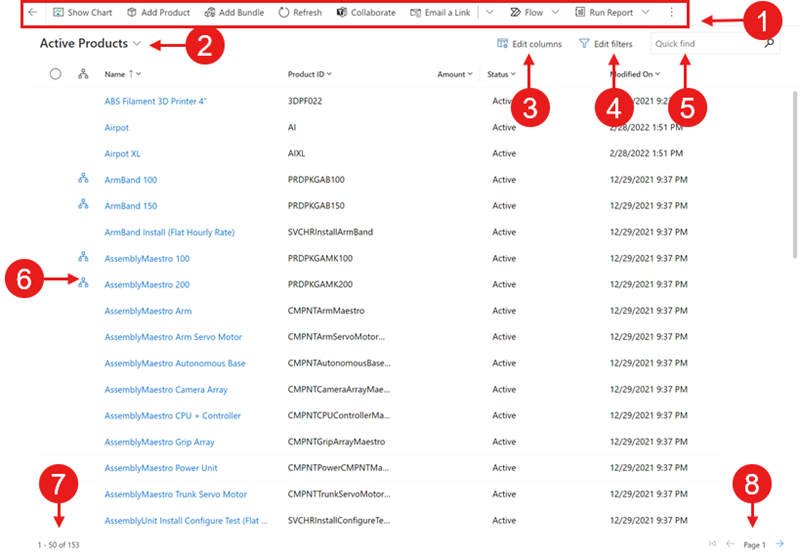
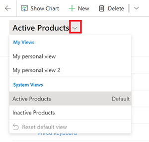
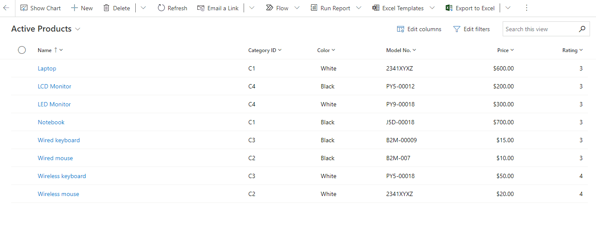
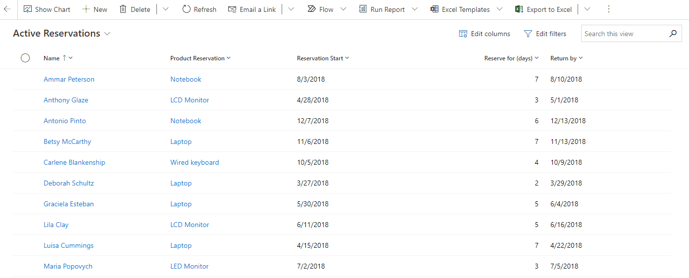

# Explore data in a view on a grid page

[!INCLUDE [cc-beta-prerelease-disclaimer](../includes/cc-beta-prerelease-disclaimer.md)]

In model-driven apps, the read-only grid is the default control used to represent rows of data in tabular form. In the sitemap, when there's a table in the subarea, the default layout of that subarea is called, **the grid page**. 

   > [!div class="mx-imgBorder"]
   > 

Legend

1. **Command bar**: Shows the commands available for the grid page.
2. **View selector**: Select to change views.
3. **Edit columns**: Select to edit the view by adding, removing, or recording columns in the grid view.
4. **Edit filters**: Select to edit the view with advanced filter queries.
5. **Search this view**: Enter text in the search column above the list to show only those rows in the current view that contain your text.

## Navigation

You can easily navigate to a record from the grid page by selecting a cell in the primary column. The grid page also remembers your filters, including the sort order and the state the page was in, when you navigate away and come back to the page. A grid page also works the same way when data is filtered through search, column filtering, or pagination.

   > [!div class="mx-imgBorder"]
   > 

On a table's grid page that support a hierarchy relationship, you can select the hierarchy icon to navigate to the hierarchy view.

   > [!div class="mx-imgBorder"]
   > 

You can also right-click a cell value in the primary column or a lookup column and open it in a new tab or window.

   > [!div class="mx-imgBorder"]
   > 

## View selector
  
The view selector contains all the views for the table, that you have access to. By default, the list of views are grouped by **My Views**, these are your personal views that you created. The **System Views** are views that your administrator has created. Each view type is ordered alphabetically.

   > [!div class="mx-imgBorder"]
   > 

### Modern advanced find

When your administrator enables the [modern advanced find experience](/power-platform/admin/settings-features), the list of views in the view selector aren't grouped, by your personal views vs. system views. So, how do you tell what type of view you're looking at? To easily differentiate between the two types of views, personal views have a user icon . You can also hover over the info icon,  to see the view type.

By default, personal views are listed first and then system views. Both views are ordered alphabetically. You can also change the order that the views are listed in. For more information, see [Change sort order](grid-filters-advanced.md#change-sort-order).

Use the search box at the top of the view selector to quickly find a view. 

> [!div class="mx-imgBorder"]
> 

Each table in your app has a default view, that your administrator sets. The default view is indicated by the **Default** label in the view selector. For more information, see [Set default view](grid-filters-advanced.md#set-default-view).

## Column editor

Use the column editor to add, remove, or reorder columns. For more information, see [Column editor](grid-filters-advanced.md#column-editor).

## Filter editor

Use the filter editor on the grid page to see the set of conditions in the current view. You can also add more conditions or remove conditions in the filtered data. For more information, see [Filter editor](grid-filters-advanced.md#filter-editor).

## Grid search

The search box on a grid page can have two different searches experience, depending on how it's configured by your administrator.

### Option 1: Search this view (default experience)

When you use the **Search this view** option on a grid page, the system searches for data in the view that you're currently in. In the following example, you perform a search on the **Contacts** grid.

1. Go to the **Contacts** grid, and then select **My Active Contacts** from the list of views.

    > [!div class="mx-imgBorder"]
    > 

2. Select **Search this view** to search for data in the view you're in.

    > [!div class="mx-imgBorder"]
    > 

The system searches for data in the **My Active Contacts** view and displays search results by using the same set of columns that are used in your current view.

   > [!div class="mx-imgBorder"]
   > 

### Option 2: Quick find 

If your administrator has enabled quick find view for a table, then you will see the **Quick find** search option on the grid page. When you run a quick find search, the system searches for data in the quick find view of the table. The search results are displayed in the columns of the quick find view and not in the current view. 

## Column filters
  
You can choose from many different filter options for a column in a grid. The type of data in the column determines what filter options are available. For example, the **Full Name** column in the **Contacts** grid page has different filter options than the **Activity Type** column in the **Activities** grid page.
 
> [!IMPORTANT]
> In Unified Interface, grids don't prepopulate column filters based on the current view definition.

   > [!div class="mx-imgBorder"]
   > 

### Filtering on a lookup column
 
When you filter data on a lookup column, you can select from a list of rows to filter by rather than manually typing in the information. For example, on a **Primary Contact** lookup column, you can select the contact name from the list of rows to filter by.

The filter on a lookup column helps you complete the search by suggesting results inline. These results are based the table being looked up and will include all rows with no filter.

   > [!div class="mx-imgBorder"]
   > 

### Filtering on a date column

The robust **Date** filter includes many different values to choose from, such as **On** to search by an exact date, or **Next X fiscal year** or **In fiscal period** to search by year or quarter.

   > [!div class="mx-imgBorder"]
   > 
  
### Filtering activities

You can filter the list of activities to only the ones you're interested in. For example, you can limit the activities that you see in a view by using the activity type filter. The activity type filter allows you to filter activities based on the type, such as email, task, and phone call.

   > [!div class="mx-imgBorder"]
   > 

## Jump bar
The jump bar on a grid page lets you access rows whose name start with a particular letter. The jump bar acts on the first sorted column in the view. If no change has been made to the sort order, the jump bar uses the primary column.
 
   > [!div class="mx-imgBorder"]
   > 

[!INCLUDE[footer-include](../includes/footer-banner.md)]
