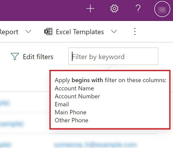
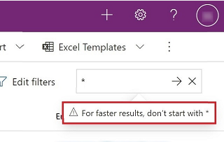

# Explore data on a grid page

In model-driven apps, the default control that's used to show data in tabular form is the read-only grid. When a subarea contains a table, the subarea's default layout in the app sitemap is called the grid page.

:::image type="content" source="./media/grid-page-1.png" alt-text="A screenshot of a grid page in a model-driven app.":::

Legend:

1. **Command bar**: The commands available for the page
1. **View selector**: Select to change views
1. **Edit columns**: Select to add, remove, or reorder columns
1. **Edit filters**: Select to filter the view with advanced queries
1. [**Filter by keyword** or **Quick find**](#grid-search): Show only the rows in the current view that match your search criteria
1. **Hierarchy icon**: Indicates the record is part of a hierarchy
1. **Record counter**: The position of this page of records in the total number of records that are shown in the view
1. **Page navigation**: Move forward or backward by page in the set of records that are shown in the view

## Navigation

To view the details of a record, select the link in the first column. To open the record details in a new tab or a new window, right-click the link in the column and select **Open link in new tab** or **Open link in new window**.

If a record is in a hierarchy relationship, select the hierarchy icon to open the hierarchy view.

:::image type="content" source="./media/grid-page-hierarchy-view.png" alt-text="A screenshot of a record hierarchy view.":::

 If you navigate away from the grid page and come back, the view retains your filters, sort order, and the state the page was in, including the grid control you had last chosen from the **Show as** menu.

## View selector
  
The view selector lists the views that are available for the table. By default, the list is divided into two groups:

- **My Views**: Personal views that you created
- **System Views**: Views that your administrator created and shared with you

:::image type="content" source="./media/view-selector.png" alt-text="A screenshot of the view selector on a grid page.":::

Personal views are listed before system views by default. Both lists are sorted alphabetically. You can [change the order](./grid-filters-advanced.md#sort-the-data) the views are listed in.

> [!NOTE]
> If your administrator has turned on the [modern advanced find experience](/power-platform/admin/settings-features), the list of views isn't divided. To easily tell which kind of view you're looking at, personal views have a user icon . You can also hover over the information icon  to see the view type.

To quickly find a view in a long list, use the search box at the top of the view selector.

:::image type="content" source="./media/search-view.png" alt-text="A screenshot of the view selector on a grid page, showing the search box and personal view icons.":::

Every table in your app has a [default view](./grid-filters-advanced.md#change-the-default-view) that's set by your administrator. The  **Default** label in the view selector identifies which view is the default for the table.

## Column editor

Use the [column editor](./grid-filters-advanced.md#select-columns-in-the-column-editor) to add, remove, or reorder columns.

## Filter editor

Use the [filter editor](./grid-filters-advanced.md#select-filter-conditions-in-the-filter-editor) to see or modify the query that selected the records in the view.

## Grid search

Grid search enables you to filter the current view based on a keyword. When you choose the search box, an information tooltip appears indicating the list of columns on which a begins-with match is applied.

> 

The search box can offer two different experiences, depending on how your administrator has configured search.

> [!NOTE]
> If your app is configured to be offline by default, the search box will utilize **Quick find** regardless of the grid search configuration in place.  

### Filter by keyword

**Filter by keyword** is the default experience. When you enter text in the **Filter by keyword** box, the system filters the current view. It displays the results in the same columns that are used in the current view.

### Quick find

If your administrator has turned on quick find, then the search box shows **Quick find**. When you enter text in the **Quick find** box, the system filters the table's quick find view. It displays the results in the columns of the quick find view rather than the current view.

> [!NOTE]
> Grid search keywords that begin with an asterisk (\*) will display a warning informing you that the search might be slower. If your administrator has turned on the [Prevent slow keyword filter for quick find terms on view pages](/power-platform/admin/settings-features) setting, then you cannot perform a search on keywords that begin with an asterisk (\*). 
>
> 
  

## Column filters
  
To focus on records that meet particular criteria, you can filter a view by column. The type of data in the column determines the filter options you can select.

>[!IMPORTANT]
>In Unified Interface, grids don't pre-populate column filters based on the current view definition.

### Filtering on a lookup column

When you filter data on a lookup column, you can select from a list of values rather than typing. For example, to filter a view by **Primary Contact**, you can select a name from the list that appears when you select the filter text box.

If you start typing, the filter suggests matching results to help you complete the search. The results include all rows that aren't otherwise filtered out.

:::image type="content" source="./media/lookup-filter.png" alt-text="A screenshot of the Primary Contact column filter that shows search completion.":::

### Filtering on a date column

When you filter on a date column, you can select from many different ways to specify a date or a time frame. For example, you can search **On or after** an exact date, **Next fiscal year**, or **Last week**.
  
### Filtering activities

Use the activity type filter to show only the activities you're interested in, such as appointments or email.

:::image type="content" source="./media/activity_filter.png" alt-text="A screenshot of the activity type filter that shows several types of activities selected.":::

## Jump bar

The jump bar is a quick way to filter out records based on letters of the alphabet. To see only records that start with the letter *S*, for instance, select **S** in the jump bar.

The jump bar acts on the first sorted column. If the sort order hasn't changed, the jump bar uses the primary column.

:::image type="content" source="./media/jumpbar-filter-on-sorted-column.png" alt-text="A screenshot of the jump bar that's used to filter records by letter.":::

<!-- I don't see the jump bar in my demo environment. I did some Binging and found that the jump bar was removed in the latest wave. You can bring it back, but it involves using the classic settings and seems kind of involved. Would it be better to remove the section on the jump bar instead? -->

## Show as

While the default read-only grid is initially used to show data, if multiple dataset controls are configured for the table view, you can switch between these controls using the **Show as** menu in the command bar, which is typically found under the **More commands** action. Once you've switched to a different display of the data, that control is remembered for future sessions on that device.

:::image type="content" source="./media/show-as-navigation.png" alt-text="A screenshot of the Show as button in the command bar.":::

[!INCLUDE[footer-include](../includes/footer-banner.md)]
