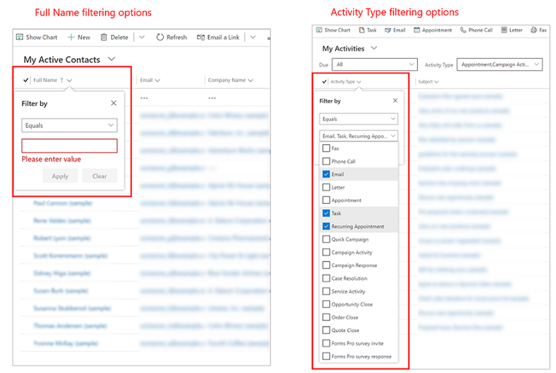
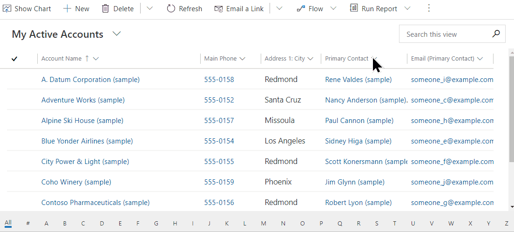
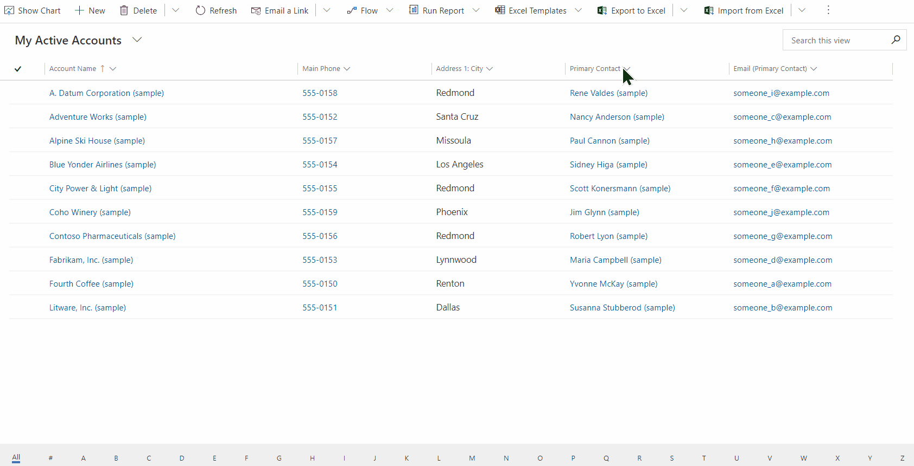
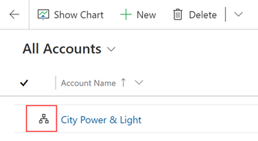
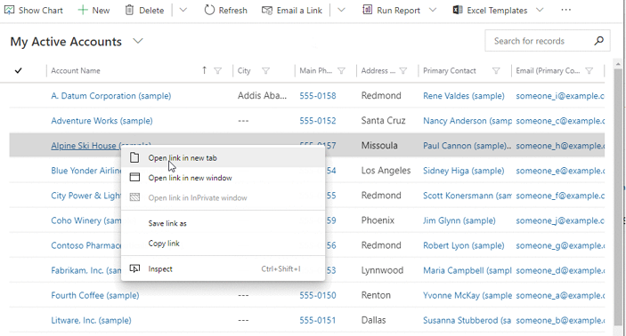
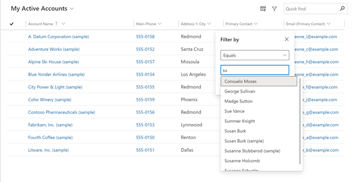
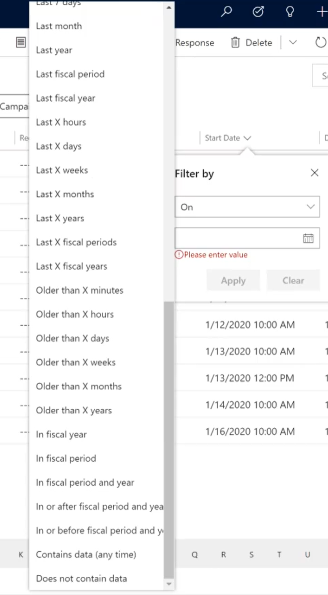
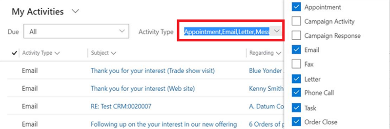
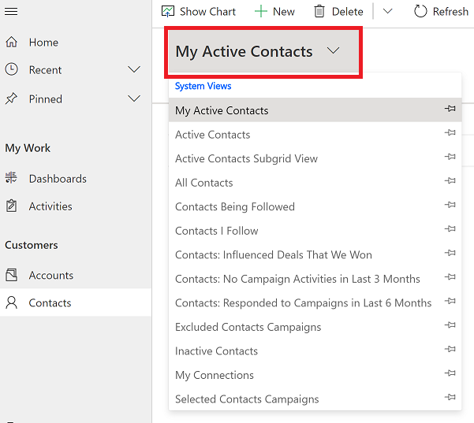
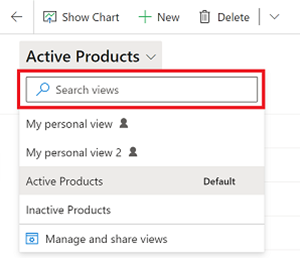

# Use grid filters 

Grids in Unified Interface have been improved to increase the amount of data you can see on your screen. Now you can choose from many different filtering options for a column; the type of data in the column determines which filter options are available. For example, the **Full Name** column in the **Contacts** grid has different filter options than the **Activity Type** column in the **Activities** grid.

Public views created in Power Apps that include **Contains data** or **Does not contain data** filters will not appear in the list of saved views in Advanced Find. 

> [!IMPORTANT]
> In Unified Interface, grids don't prepopulate column filters based on the current view definition.

   > [!div class="mx-imgBorder"]
   > 
   

## Grid and filter navigation

When you filter data on a grid, the main grid page remembers the filter, sort order, and the page state when you navigate away and then return to the page. This works the same when data is filtered on quick find, column filtering, page number, and more. 

   > [!div class="mx-imgBorder"]
   > 

The page jump bar uses the first sorted column. If no change has been made to the sort order, the jump bar uses the primary column.

   > [!div class="mx-imgBorder"]
   > 
  
When you select the hierarchy icon, you navigate to the hierarchy view.

   > [!div class="mx-imgBorder"]
   > 

You can also open primary column and lookup columns in a new tab or window.

   > [!div class="mx-imgBorder"]
   > 
  
  
## Lookup column 

When you filter on a lookup column, you can select from a list of rows to filter by rather than manually typing in the data. For example, on a **Primary Contact** lookup column, you can select the contact name from the list of rows to filter by.

The filter on a lookup column helps you complete the search by suggesting results inline. These results are based the table being looked up and will include all rows with no filter.

   > [!div class="mx-imgBorder"]
   > 

## Date filter

The robust **Date** filter includes many different values to choose from, such as **On** to search by an exact date, or **Next X fiscal year** or **In fiscal period** to search by year or quarter.

   > [!div class="mx-imgBorder"]
   > 

## Filter the list of activities

You can filter the list of activities to see only the ones you're interested in. For example, you can further limit the activities you are seeing in a view by using the activity type filter. The activity type filter allows you to filter activities based on the type, such as email, task, phone call, and so on.

   > [!div class="mx-imgBorder"]
   > 

### Known issue 

If you change the default display format for number, currency, time, or date and then filter data on a grid, the filter won't show your selected display format. The filters will still be displayed in the system default format, and in some cases filtering might not work at all. 

To fix the issue, set the display format for number, currency, time, and date back to the default setting. 

1. In the upper-right corner, select the gear icon , and then select **Personalization Settings**.

2. On the **Formats** tab, change the number, currency, time, and date value back to the default setting.

    > [!div class="mx-imgBorder"] 
    > 
    
We're working on this issue, please check back for information about the availability of a fix.

  
## Use search on a grid

When you use the **Search this view** option on a grid page, the system searches for data in the view that you're currently in. In the following example, you perform a search on the **Contacts** grid.

1. Go to the **Contacts** grid, and then select **My Active Contacts** from the list of views.

    > [!div class="mx-imgBorder"]
    > 

2. Select **Search this view** to search for data in the view you're in.

    > [!div class="mx-imgBorder"]
    > 

The system searches for data in the **My Active Contacts** view and displays search results by using the same set of columns that are used in your current view.

   > [!div class="mx-imgBorder"]
   > 

## Use the quick-find search experience

To switch back to the old quick-find search experience that uses a table's quick-find view definition to perform searches, you'll need admin permissions.

1. In the upper-right corner, select the gear icon , and then select **Advanced Settings**.

2. Go to **Settings** > **Administration** > **System Settings**.

3. On the **General** tab, under **Set up Quick Find**, select **Yes** for **Use quick find view of a table for searching on grids and sub-grids**.

## Use the column options in a view or grid (preview)

If the app you're using has the [Power Apps grid control](../maker/model-driven-apps/power-apps-grid-control.md), you can view and open records in views and sub-grids. Additionally, you can add or remove columns in the view or sub-grid.

1. From a model-driven app view, select the **Column options** icon.
   :::image type="content" source="media/column-options.png" alt-text="Select column option to change how your view appears":::
1. From the **Edit columns** pane you can select from the following actions:
   - Select **Add columns** to add a column to the view.
   - Drag and drop a column to move the column order.
   - Select **...** next to a column you want to remove from the view, and then select **Remove**.
   :::image type="content" source="media/column-options-2.png" alt-text="Choose the options you want to change your view":::
1. Select **Apply** to save your changes.

[!INCLUDE[footer-include](../includes/footer-banner.md)]