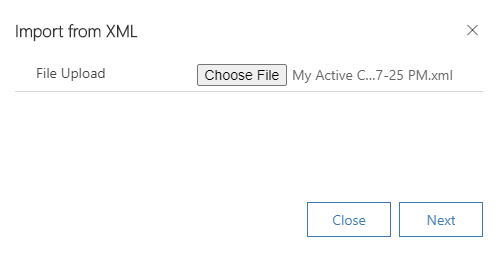
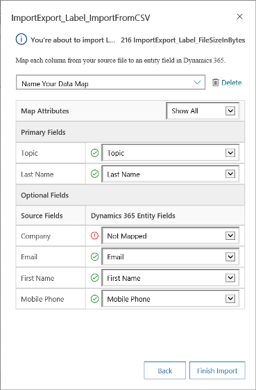
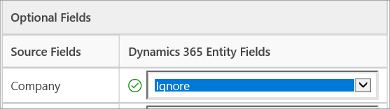
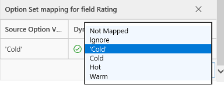

# How to import data

Whether your data is stored in a spreadsheet, on your phone, or in an email program, here’s how to import the data to your app. For example, you might want to import your customer contact list from an Excel spreadsheet into the app so you can keep track of all your customer information in one place.
  
## Step 1: Get your import file ready  
First, export your data into an Excel file. These file formats are supported:
 - Excel workbook (.xlsx)
 - Comma-separated values (.csv)
 - XML Spreadsheet 2003 (.xml)
  
The maximum file size allowed for .zip files is 32 MB. For the other file formats, the maximum file size allowed is 8 MB.  
  
### Export data from an email program  
  
1.  Export your data into a comma-separated values file (.csv).  
  
     To find specific steps to export contacts from your email program, open the program’s Help, and search for “export.” Look for topics that include “exporting contacts” or “exporting your address book” or “export wizard” in the title.  
  
2.  Save the file in a location where you can easily find it later.  
  
### Export data from a spreadsheet  
  
1.  Open the spreadsheet.  
  
2.  If necessary, edit any column name in the spreadsheet to exactly match the corresponding name shown here.  
  
    > [!WARNING]
    > If the spreadsheet doesn’t include all the column names listed, that’s OK. However, if a column name does exist, it must match exactly with the corresponding name in the list or the import won’t work. Spaces are required. Note that the word “Email” doesn’t contain a hyphen.  

    |**Column Name in Spreadsheet (spelling must match exactly)**|
    |---------|
    |First Name|  
    |Middle Name|  
    |Last Name|  
    |Business Phone|  
    |Mobile Phone|  
    |Job Title|  
    |Business Street|  
    |Business City|  
    |Business State|  
    |Business Postal Code|  
    |Business Country/Region|  
    |Email Address|  
  
3.  Save the file.  
  
### Export data from your phone  

Use a USB cable or an app to export your data such as contacts from your phone to your computer.
  
To find specific steps to export contacts for your brand of phone, search for “export contacts from my phone” in your favorite search engine (like Bing).  
  
To find an app, search your phone’s online store.  

## Step 2: Import the file 
  
1. On the command bar, select **Import from Excel**,  **[Import from CSV](#import-from-xml-or-csv-file)**, or **[Import from XML](#import-from-xml-or-csv-file)**.

   > [!div class="mx-imgBorder"]
   > 
  
2. Browse to the folder where you saved the file that contains the export of your contacts. Select the file, select **Open**, and then select **Next**.  
  
   > [!TIP]
   > You can import only one file at a time. To bring in more files, run the wizard again later.
   
3. Review the file name and verify that the column and data delimiters are correct using the **Review Mapping** option. If everything looks good, select **Finish Import**.  

### Import from XML or CSV file

>[!NOTE]
>In the below process, we are importing an XML file. Similarly, you can follow the process to import CSV file.

1. On the **Import from XML** pane, select **Choose file** and browse to the folder where you saved the file that contains the export of your data. Select the file and then select **Open**.

   > [!div class="mx-imgBorder"]
   > 

2. Select **Next**.

3. (Optional) If you have to update the existing rows in your app through import XML file, use the alternate key. Select it from the **Alternate Key** drop-down list. This option is available only when an alternate key is defined for the table.

    The alternate key is used to uniquely identify and update rows during import. More information: [Define alternate keys to reference Dynamics 365 rows](https://docs.microsoft.com/previous-versions/dynamicscrm-2016/administering-dynamics-365/dn949335(v=crm.8)?redirectedfrom=MSDN).

   > [!div class="mx-imgBorder"]
   > 

4. Select **Review Mapping** option and then on the **Review Mapping** page, review how your column headings are mapped to the columns in your app.

   > [!div class="mx-imgBorder"]
   > 

    - On the left side, by default the **Primary Columns** section of the **Review Mapping** page shows all the required columns for the table that must be mapped for the data to be imported successfully.
    - If you've selected an alternate key, all the columns of the alternate key also become required columns and must be mapped.
    - If the column headings of your source file match the column display names, these columns will be automatically mapped. All the mapped columns will be shown with a green check mark.
    - If the column headings don't match, the unmapped columns will be shown with a red exclamation point. Select a column to map to the unmapped column heading of your file.
    - To quickly filter on only the unmapped columns, select **Unmapped** from the **Map Columns** drop-down list.

5.  In the **Optional Columns** section of the **Review Mapping** page, the left side shows the column headings in your source file. If the column headings match the column display names, the columns will be automatically selected in the corresponding drop-down lists.

    - If the column headings don't match, the unmapped columns will be shown with a red exclamation point.
    - Select a column to map to the unmapped column heading of your file.
    - You can also choose **Ignore** from the drop-down list for one or more optional columns. Data from ignored columns won't be imported into your app.
    - A column set to be ignored during import.

    > [!div class="mx-imgBorder"]
    > 

6. If any column in your source file includes a fixed set of values, you must map the column to a column of type **Option Set**. A column of this type has values such as "Yes" or "No," or "Hot," "Warm," or "Cold." To do this, select the  button next to the option set column. The **Choice mapping** section opens:

    > [!div class="mx-imgBorder"]
    > 

    - For each **Source Option Values** item, select an item from the **Dynamics 365 Option Values** list to map it, and then select **OK**.
    - The Dynamics 365 Option Values drop-down list combines the values available in the incoming file with those already in the Dynamics 365 database. For example:
        - **Values in import file**: Low, High
        - **Values already in Dynamics 365**: Cold, Warm, Hot
        - **Resulting target values**: Cold, Warm, Hot, Low, High
    - After import, the import wizard will add all mapped values to Dynamics 365, but will drop unmapped values from the import file that aren't yet in Dynamics 365. For example, you could map the "Low" source value to the "Cold" target value, but map the "High" source value to the (new) "High" target value. Based on these mappings, the import wizard creates "High" as a Dynamics 365 target value. It does not create "Low" as a Dynamics 365 target value because you didn't map any source to this target value.

    >[!NOTE]
    >You can also map a column in your source file to a column of type "Two Options" and "Multiselect Option Set" (where a column can have multiple values). You must map each **Source Option Values** to the items in the **Dynamics 365 Option Values** list. When mapping to a column of type "Multiselect Option Set," if your source file includes values that aren't available in Dynamics 365 Sales, new values won't be created in Dynamics 365 Sales.

7. If some data in your source file references other existing rows in Dynamics 365 Sales, you must map the column in the source file to a lookup column of Dynamics 365 Sales.

    For example, you might want to import a file named Leads.csv, which contains customer rows. The **Customer** column in Leads.csv contains the associated account or contact data. To map this, select the **Lookup Reference** button next to the lookup column. The **Lookup Reference** section opens and lists the tables related to the current table.

    > [!div class="mx-imgBorder"]
    > 

    For each table, select the columns to search during import to retain the relationships between the rows, and then select **OK**.

8. To save your mapping settings for next time, enter a name in the **Name your data map** box. This way, the next time you need to import a similar set of data, you'll be able to use this mapping again.

    > [!div class="mx-imgBorder"]
    > 

9. When you're ready to continue, select **Finish Import** to import that data by using your mappings.

## Step 3: Check that the import is successful

After the wizard finishes, check your data (for example, list of contacts) to make sure they imported correctly.  
  
1. From the main menu, go to **Contacts**.
  
2. Scroll through the contact list. Check that each person is listed and verify the contents of the columns for accuracy.

>[!NOTE]
>To verify the status of the imported rows, view import logs. To view the import logs, go to **Settings** > **System** > **Data management** > **Imports**.

## Import double-byte characters 

If you are importing data that includes double-byte characters for east asian languages, make sure the file is encoded as UTF-8 BOM. Plain UTF-8 may not be enough.

1. Open the CSV file using Visual Studio Code.
2. In the bottom bar, click the label **UTF-8** (pop-up opens). 
3. Select **Save with encoding**. 

You can now pick UTF-8 BOM encoding for that file.

[!INCLUDE[footer-include](../includes/footer-banner.md)]