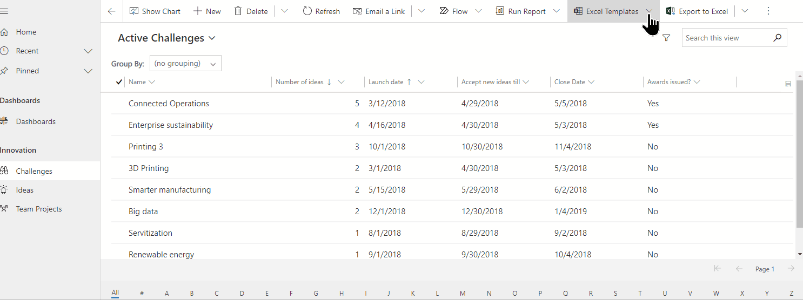
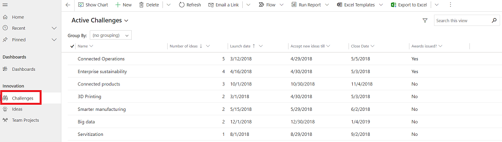
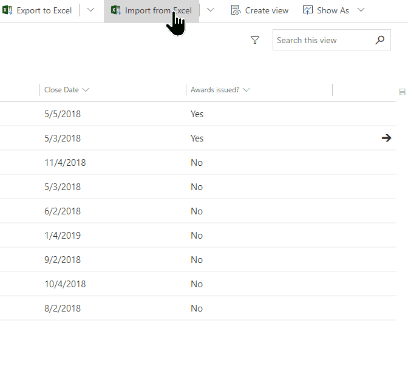
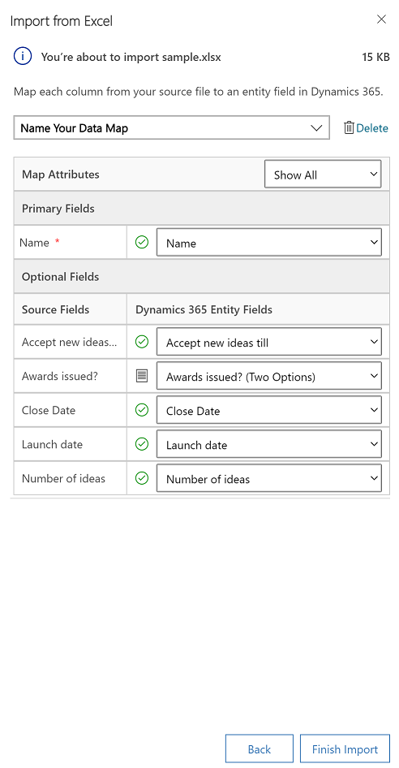
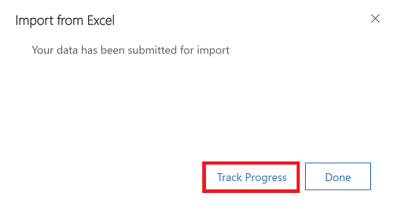
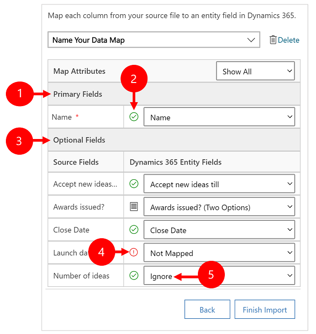
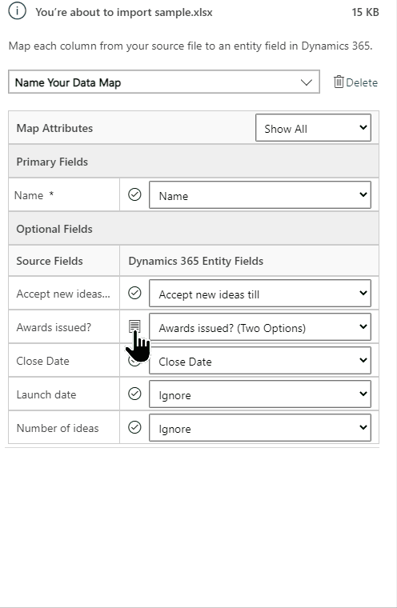
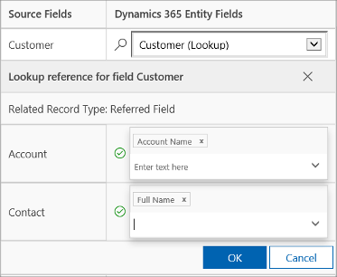
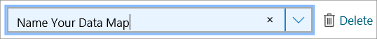

# How to import data

Import data stored somewhere else into your model-driven app using the import feature in Power Apps. 

Every table requires columns that must exist in your input file. You should download an Excel template, add your data, and then import the file to your app. The template saves time and effort. Don't add or modify columns in the template to avoid issues during the import.

Before you import a file, make sure the column headings match the column names in your app. During the import process, the system tries to map the column names from your input file to the column names in the app. If they don't match, then you have to manually map the fields or you might run into issues during the import process.

If you're an advanced user and know the required columns for a given Dataverse table, define your own Excel, CSV, or XML source file and then follow the steps in this article on how to [import data](import-data.md#import-your-data) to your app. These file formats are supported:

 - Excel workbook (.xlsx)
 - Comma-separated values (.csv)
 - XML Spreadsheet 2003 (.xml)
 
The maximum file size allowed for .zip files is 32 MB. For the other file formats, the maximum file size allowed is 8 MB.   

## Download an Excel template

To avoid mapping issues, you should use an Excel template that you can download from your app. Once the template is downloaded, add your data and then import the file back to your app. Remember don't add or modify columns in the template to avoid issues during the import process.

1. Open your app and from the left nav select a table.

2. On the command bar, select **Excel Templates** > **Download Template**.

3. Select the table type and view to download or select **Edit Columns** and choose the rows to include in the template.

5. Select **Download**. 
 
   > [!div class="mx-imgBorder"]
   > 

## Import your data

Use the template that you downloaded in the previous step (modified with your data) and import the file to your app. 

1. Open an app and from the left nav select a table.
 
   > [!div class="mx-imgBorder"]
   > 

3. On the command bar, select the file type to import from:

   - **Import from Excel**: Select **Import from Excel** if you're using an Excel template.
   - **Import from CSV**
   - **Import from XML**

   > [!div class="mx-imgBorder"]
   > 
  
2. Select **Choose File** and browse to the folder where the file is saved. Select the file, select **Open**, and then select **Next**.  
  
   > [!TIP]
   > You can only import one file at a time. To bring in more files, run the wizard again.
   
3. Select whether to **Allow Duplicates** or not. More information, see [Set up duplicate detection rules to keep your data clean](/power-platform/admin/set-up-duplicate-detection-rules-keep-data-clean).

4. For CSV and XML files (skip this step if you're importing an Excel file): 

   - For a CSV file: Select the drop-down list and select the data delimiter and field delimiter that's used for the CSV file.
   
   - For CSV or XML file: If you have an alternate key defined, select it from the alternate Key drop-down list. The alternate key is used to uniquely identify and update rows during import. More information: [Define alternate keys to reference rows](../maker/data-platform/define-alternate-keys-reference-records.md).

     > [!div class="mx-imgBorder"]
     >  
   
5. Select **[Review Mapping](import-data.md#review-mapping)** and verify the columns (fields) are mapped correctly. If everything looks good, select **Finish Import**.  

   > [!div class="mx-imgBorder"]
   > 

4. Select **Track Progress** to see the progress of the import.

   > [!div class="mx-imgBorder"]
   > 
   
## Review mapping

When you import a file, it's important to review the column headings and verify that they match the columns (fields) in your app.

> [!div class="mx-imgBorder"]
> 

Legend:

1. **Primary Fields**: Shows all the required columns for the table that must be mapped for the data to be imported successfully. If the column headings of your source file match the column display names, these columns are automatically mapped. 

2. **Mapped columns**: Correctly mapped columns are shown with a green check mark.

3. **Optional Fields**: These are optional column headings in your source file. If the column headings match the column display names, the columns are automatically selected in the corresponding drop-down lists. 

4. **Unmatched columns**: If the column headings don't match, the unmapped columns are shown with a red exclamation point. To map the column correctly, select a column to map to the unmapped column heading of your file. 

5. **Ignore** (For **Optional Fields** only): Choose **Ignore** from the drop-down list. Data from ignored columns aren't imported into your app.

### Option set

If any column in your source file includes a fixed set of values, you must map the column to a column of type **Option Set**. A column of this type has values such as **Yes** and **No** or  **Low** and **High**.

To do this, select the  button next to the option set column, select the values, and then select **OK**. 

   > [!div class="mx-imgBorder"]
   > 

The option values drop-down list combines the values available in the incoming file with those already in your app. For example:

- **Values in import file**: Low, High
- **Values already in your app**: Cold, Warm, Hot
- **Resulting target values**: Cold, Warm, Hot, Low, High
 
After import, the import wizard will add all mapped values in your app, but will drop unmapped values from the import file that aren't yet in your app. For example, you could map the "Low" source value to the "Cold" target value, but map the "High" source value to the (new) "High" target value. Based on these mappings, the import wizard creates "High" as a target value in your app. It doesn't create "Low" as a target value in your app because you didn't map any source to this target value.

>[!NOTE]
>You can also map a column in your source file to a column of type "Two Options" and "Multiselect Option Set" (where a column can have multiple values). You must map each **Source Option Values** to the items in the **Dynamics 365 Option Values** list. When mapping to a column of type "Multiselect Option Set," if your source file includes values that aren't available in your app, new values won't be created in your app.

### Map lookup columns

If some data in your source file references other existing rows in your app, you must map the column in the source file to a lookup column in your app.

For example, you might want to import a file named Leads.csv, which contains customer rows. The **Customer** column in Leads.csv contains the associated account or contact data. To map this, select the **Lookup Reference** button next to the lookup column. The **Lookup Reference** section opens and lists the tables related to the current table.

> [!div class="mx-imgBorder"]
> 

For each table, select the columns to search during import to retain the relationships between the rows, and then select **OK**.

### Save mapping settings

To save the mapping settings for next time, enter a name in the **Name your data map** box. This way, the next time you import a similar set of data, you'll be able to use the same mapping.

> [!div class="mx-imgBorder"]
> 

## Open the import log

After you initiate an import, you can monitor the status of the import job and view results in the import log. 

In the last step of the import wizard, select **Track Progress** to view the progress of the import job.

:::image type="content" source="media/track-progress.png" alt-text="Screenshot of the last step in the import wizard.":::

If you missed this step, append the following code to your app URL: `&newWindow=true&pagetype=entitylist&etn=importfile&viewid=a2927069-e4dc-4e8f-8fb1-d2f6c40c427e&viewType=1039`.

For example, if your app URL is `https://org12345.crm.dynamics.com/main.aspx?appid=00001111-aaaa-2222-bbbb-3333cccc4444`, then the URL to view the import log is `https://org12345.crm.dynamics.com/main.aspx?appid=00001111-aaaa-2222-bbbb-3333cccc4444&newWindow=true&pagetype=entitylist&etn=importfile&viewid=a2927069-e4dc-4e8f-8fb1-d2f6c40c427e&viewType=1039`.

### View the status of an import, and correct errors

After the import is complete, you can view the records that were successfully imported, failed to import, or were partially imported.

1. [Open the import log](#open-the-import-log).

1. On the **My Imports** page, monitor the progress of the import.

   The **Status** column shows the status of the import. The status progresses through these values:

   - **Submitted**
   - **Parsing**  
   - **Transforming**
   - **Importing**
   - **Completed**

1. After the import is complete, the **Success**, **Failures**, and **Partial Failures** columns show the number of records that were successfully imported, failed to import, or were partially imported.

1. Select an import job to view the records that didn't import or were partially imported.
   :::image type="content" source="media/import-data-log.svg" alt-text="Screenshot of the import record with the **Success**, **Failures**, and **Partial Failures** columns.":::

1. Select appropriate tabs to see information about failures, success, or partial failure of records during import.

1. On the **Failures** tab, export rows that failed to import to a new file. Select **Export Error Rows**.
1. Correct the errors in this file, and then import it.

### Delete imported records

You can delete the import file and imported records if you want to reimport the data or you don't need the data for some reason.

1. [Open the import log](#open-the-import-log).

2. Select the import file that you want to delete, followed by one of the following actions:

    - **Delete import source file**. This option deletes the import log file and its details.

    - **Delete imported records**. This option deletes all records that were imported from the selected file.

    - **Delete All**. This option deletes the import file along with the records that were imported from the import file.

### Limitations

- Excel Import isn't supported with [Virtual tables](../maker/data-platform/limits-tshoot-virtual-tables.md#general-limitations) or [Elastic tables](../maker/data-platform/create-edit-elastic-tables.md#features-currently-not-supported-with-elastic-tables)
- Excel import only updates fields from the primary table and ignores fields from related tables

### See also

[Download a template for data import](/power-platform/admin/download-template-data-import)
