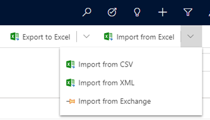

# Import data

Whether your data is stored in a spreadsheet, on your phone, or in an email program, here’s how to import the data to your app. For example, you might want to import your customer contact list from an Excel spreadsheet into the app so you can keep track of all your customer information in one place.
  
## Step 1: Get your import file ready  
First, export your data into an Excel file. These file formats are supported:
 - Excel workbook (.xlsx)
 - Comma-separated values (.csv)
  
The maximum file size allowed for .zip files is 32 MB. For the other file formats, the maximum file size allowed is 8 MB.  
  
### Export data from an email program  
  
1.  Export your data into a comma-separated values file (.csv).  
  
     To find specific steps to export contacts from your email program, open the program’s Help, and search for “export.” Look for topics that include “exporting contacts” or “exporting your address book” or “export wizard” in the title.  
  
2.  Save the file in a location where you can easily find it later.  
  
### Export data from a spreadsheet  
  
1.  Open the spreadsheet.  
  
2.  If necessary, edit any column name in the spreadsheet to exactly match the corresponding name shown here.  
  
    > [!WARNING]
    > If the spreadsheet doesn’t include all the column names listed, that’s OK. However, if a column name does exist, it must match exactly with the corresponding name in the list or the import won’t work. Spaces are required. Note that the word “Email” doesn’t contain a hyphen.  

    |**Column Name in Spreadsheet (spelling must match exactly)**|
    |---------|
    |First Name|  
    |Middle Name|  
    |Last Name|  
    |Business Phone|  
    |Mobile Phone|  
    |Job Title|  
    |Business Street|  
    |Business City|  
    |Business State|  
    |Business Postal Code|  
    |Business Country/Region|  
    |Email Address|  
  
3.  Save the file.  
  
### Export data from your phone  

Use a USB cable or an app to export your data such as contacts from your phone to your computer.
  
To find specific steps to export contacts for your brand of phone, search for “export contacts from my phone” in your favorite search engine (like Bing).  
  
To find an app, search your phone’s online store.  
  
## Step 2: Import the file 
  
1. On the command bar, select **Import from Excel** or **Import from CSV**.

   > [!div class="mx-imgBorder"]
   > 
  
2. Browse to the folder where you saved the file that contains the export of your contacts. Select the file, select **Open**, and then select **Next**.  
  
   > [!TIP]
   > You can import only one file at a time. To bring in more files, run the wizard again later.
   
3. Review the file name and verify that the field and data delimiters are correct using the **Review Mapping** option. If everything looks good, select **Finish Import**.  
 
## Step 3: Check that the import is successful

After the wizard finishes, check your data (for example, list of contacts) to make sure they imported correctly.  
  
1. From the main menu, go to **Contacts**.
  
2. Scroll through the contact list. Check that each person is listed and verify the contents of the fields for accuracy.

