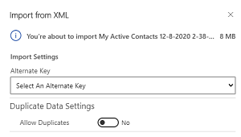
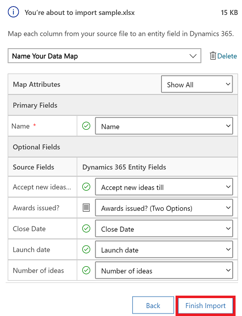

# How to import data

Import data that's stored somewhere else into your model-drvien app using the import feature in Power Apps. You can import data using different file types such as, Excel workbook (.xlsx), Comma-separated values (.csv), and XML Spreadsheet 2003 (.xml).

Every table has required columns that must exist in your input file. When you create you're own file, make sure the column headings match the table names in your app. During the import process the system will try to map table names from your input file to table names in the app. If they don't match then you need to manually map these fields.

To avoid mapping issue, we recommend that you create a template. The easiest way to do this is to go to your app and export data from an existing table. Use the same file (modified with your data) to import data into the table. This template saves time and effort. You won't have to account for the required columns for each table. For information on how to export data, see [Export data to Excel](https://docs.microsoft.com/powerapps/user/export-data-excel).

If you're an advanced user and know the required columns for a given table for Dataverse tables, define your own Excel, CSV, or XML source file and then follow the step in this article on how to import data into your app. These file formats are supported:

 - Excel workbook (.xlsx)
 - Comma-separated values (.csv)
 - XML Spreadsheet 2003 (.xml)
  
The maximum file size allowed for .zip files is 32 MB. For the other file formats, the maximum file size allowed is 8 MB.  
  
  
1. Open an app and from the left nav select a table.
 
   > [!div class="mx-imgBorder"]
   > 

3. On the command bar, select the file type that you want to import from:

   - **Import from Excel**
   - **Import from CSV**
   - **Import from XML**

   > [!div class="mx-imgBorder"]
   > 
  
2. Select **Choose File** and browse to the folder where you saved the file that contains the export file. Select the file, select **Open**, and then select **Next**.  
  
   > [!TIP]
   > You can import only one file at a time. To bring in more files, run the wizard again.
   
3. Select whether you want to **Allow Duplicates** or not. More information, see [Set up duplicate detection rules to keep your data clean](https://docs.microsoft.com/power-platform/admin/set-up-duplicate-detection-rules-keep-data-clean).

4. For CSV and XML files: 

   - For CSV file: Select the drop-down list and select the data delimiter and field delimiter that you’ve used your CSV file.
   
   - If you have an alternate key defined, select it from the alternate Key drop-down list. The alternate key is used to uniquely identify and update rows during import. More information: [Define alternate keys to reference rows](https://docs.microsoft.com/powerapps/maker/data-platform/define-alternate-keys-reference-records).

    > [!div class="mx-imgBorder"]
    > 
    
   
5. Review the file name and verify that the column and data delimiters are correct using the **[Review Mapping](import-data.md#review-mapping)** option. If everything looks good, select **Finish Import**.  

   > [!div class="mx-imgBorder"]
   > 

4. Select **Track Progress** see the progress of the import.

   > [!div class="mx-imgBorder"]
   > 
   
## Review mapping

When you import a file one of the main steps is to review how your column headings are mapped to the columns in your model-driven app.

> [!div class="mx-imgBorder"]
> 

Legend:

1. **Primary Fields**: Shows all the required columns for the table that must be mapped for the data to be imported successfully. If the column headings of your source file match the column display names, these columns will be automatically mapped. 

2. **Mapped columns**: All the mapped columns will be shown with a green check mark.

3. **Optional Fields**: Shows the column headings in your source file. If the column headings match the column display names, the columns will be automatically selected in the corresponding drop-down lists

4. **Unmatched columns**: If the column headings don't match, the unmapped columns will be shown with a red exclamation point. To map the column correctly, select a column to map to the unmapped column heading of your file. 

5. **Ignore**: You can also choose **Ignore** from the drop-down list for one or more **Optional Fields**. Data from ignored columns won't be imported into your app.

### Option set

If any column in your source file includes a fixed set of values, you must map the column to a column of type **Option Set**. A column of this type has values such as "Yes" or "No". 

To do this, select the  button next to the option set column, select the values, and then select **OK**. 

   > [!div class="mx-imgBorder"]
   > 

The option values drop-down list combines the values available in the incoming file with those already in your app. For example:

- **Values in import file**: Low, High
- **Values already in your app**: Cold, Warm, Hot
- **Resulting target values**: Cold, Warm, Hot, Low, High
 
After import, the import wizard will add all mapped values in your app, but will drop unmapped values from the import file that aren't yet in your app. For example, you could map the "Low" source value to the "Cold" target value, but map the "High" source value to the (new) "High" target value. Based on these mappings, the import wizard creates "High" as a target value in your app. It does not create "Low" as a target value in your app because you didn't map any source to this target value.

>[!NOTE]
>You can also map a column in your source file to a column of type "Two Options" and "Multiselect Option Set" (where a column can have multiple values). You must map each **Source Option Values** to the items in the **Dynamics 365 Option Values** list. When mapping to a column of type "Multiselect Option Set," if your source file includes values that aren't available in your app, new values won't be created in your app.

If some data in your source file references other existing rows in your app, you must map the column in the source file to a lookup column in your app.

For example, you might want to import a file named Leads.csv, which contains customer rows. The **Customer** column in Leads.csv contains the associated account or contact data. To map this, select the **Lookup Reference** button next to the lookup column. The **Lookup Reference** section opens and lists the tables related to the current table.

> [!div class="mx-imgBorder"]
> 

For each table, select the columns to search during import to retain the relationships between the rows, and then select **OK**.

### Save mapping settings

To save your mapping settings for next time, enter a name in the **Name your data map** box. This way, the next time you need to import a similar set of data, you'll be able to use this mapping again.

> [!div class="mx-imgBorder"]
> 

[!INCLUDE[footer-include](../includes/footer-banner.md)]
