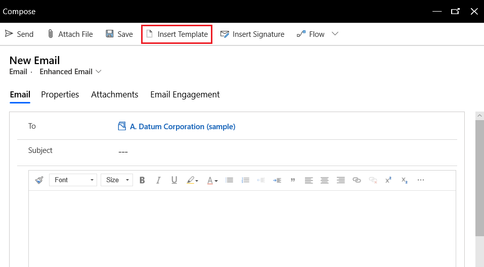
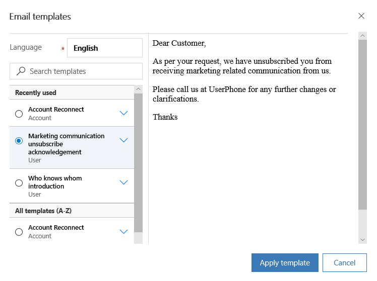
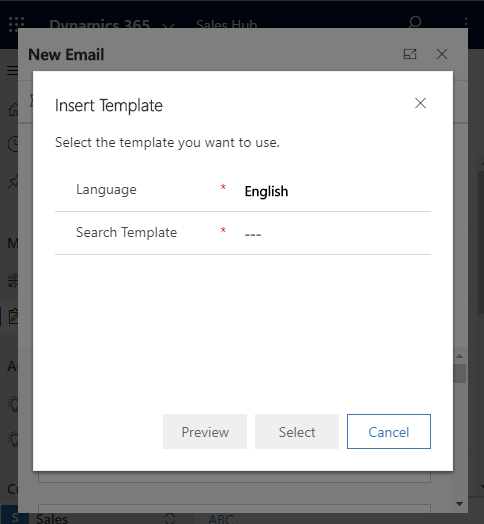

# Insert an email template

You can use an email template—a preformatted email message—to quickly create and send email messages. You can insert the template while composing an email by selecting **Insert Template** on the command bar. The list of available templates is displayed in the **Email templates** window. In the **Recently used** section, the four most recently used templates by you are displayed. The **All templates** section displays a list of all out-of-the-box email templates (global and table specific), in alphabetical order. Global templates are shown as the type User. If you've created a custom email template, it will also be available here. For information about creating a custom email template, see [Create templates for email](/power-platform/admin/create-templates-email).

You can see templates of a particular language by selecting a language from the **Language** list. You can either search for a template or browse through the list and select it. When you select an email template, a preview is displayed on the right side of the window. The preview shows you the content so you can pick the template that best meets your needs. After inserting an email template, you can modify the content as needed, and then send the email.

> [!NOTE]
> The search does not support regular expressions and it works on the template name only.

**To insert an email template**

1.	In the email editor, select **Insert Template** on the command bar.

     > [!div class="mx-imgBorder"]
     >  

    The **Email templates** window opens.

2.	To see templates of a different locale, select a language from the **Language** list. The templates are loaded as per the selected language.	

3.  Browse for the template you want. Select the template, and preview the content of the template.

4.	Optionally, you can select the down arrow on the name of the template to see a description of its content.

5.	Select **Apply template** to insert the content in the email.

     > [!div class="mx-imgBorder"]
     > 

If you try to insert an email template on a device with smaller screen size, you'll only see an option to search and select a template.

> [!div class="mx-imgBorder"]
>  

### See also

[Set up enhanced email](/power-platform/admin/system-settings-dialog-box-email-tab) 
[Compose and send email using the enhanced email experience](enhanced-email.md)

[!INCLUDE[footer-include](../includes/footer-banner.md)]