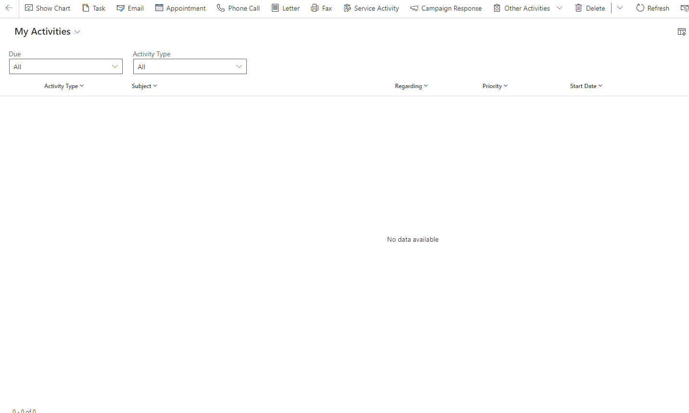
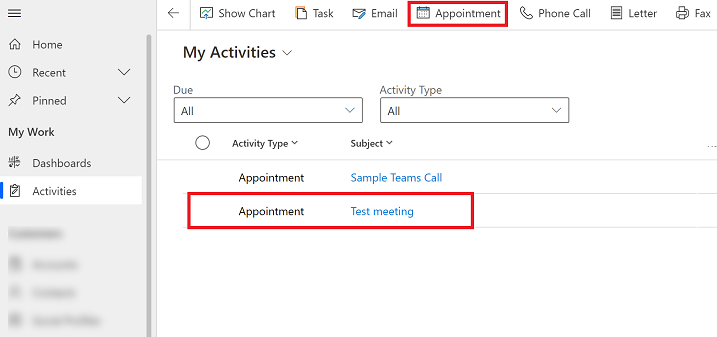
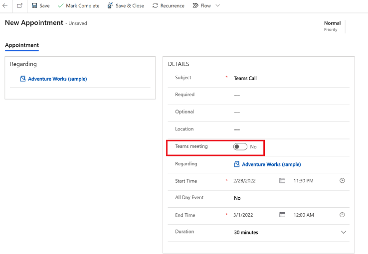
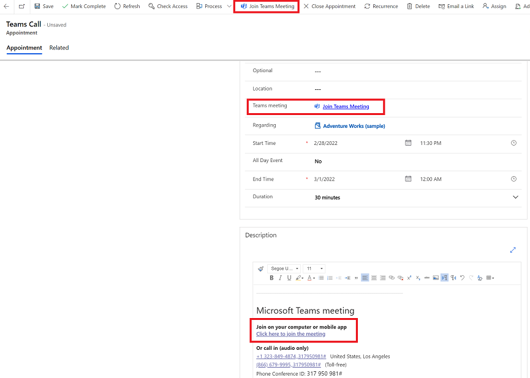
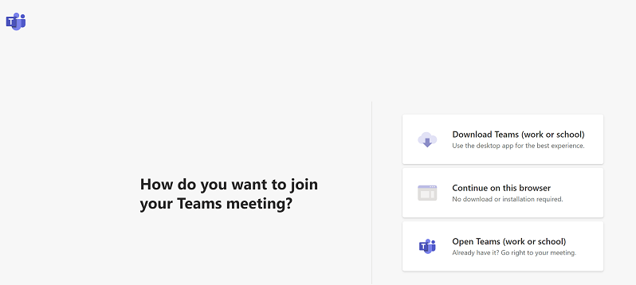

# Create and join a Teams meeting from an appointment 

Now you can create and join a Teams meeting from an appointment in your model-driven app.

> [!div class="mx-imgBorder"] 
> 

## Add a Teams meeting to an appointment 

1. From the left navigation pane, select **Activities**.
2. From the list of activities, select an existing appointment or select **Appointment** on the command bar to create a new one.
   > [!div class="mx-imgBorder"] 
   >    
3. Enter the required information and in the **Details** section, set the **Teams meeting** toggle to, **Yes**.
> [!IMPORTANT]
> For the join link to be created successfully, the user enabling the meeting for Teams needs to be the meeting organizer. The organizer field is not exposed by default on the appointment form but the value defaults to the user who creates the meeting.

   > [!div class="mx-imgBorder"] 
   >   
4. When you're done, select **Save**.
> [!NOTE]
> It may take a couple of minutes for the meeting to sync with Outlook and for the meeting link to appear in the appoitnment.

## Join a Teams meeting from an appointment

1. Open an appointment activity. 
2. Choose one of the following ways to join the meeting:
     - On the command bar select, **Join Teams Meeting**.
     - From the **Details** section, select the **Join Teams Meeting** link. 
     - Scroll down the **Description** section of the appointment and select, **Click here to join the meeting**.
     
       > [!div class="mx-imgBorder"] 
       >   

3. Follow the instructions on your screen and choose how you want to join the Teams meeting. 
   > [!div class="mx-imgBorder"] 
   >   

> [!NOTE]
> For the meeting to synchronize from Dynamics 365 to the user's calendar in Microsoft Outlook and Teams, the user needs to be configured for [appointment, contact, and task synchronization](/power-platform/admin/choose-records-synchronize-dynamics-365-outlook-exchange). 

