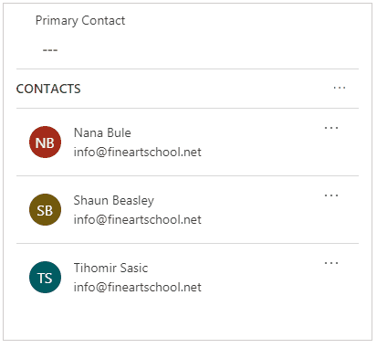
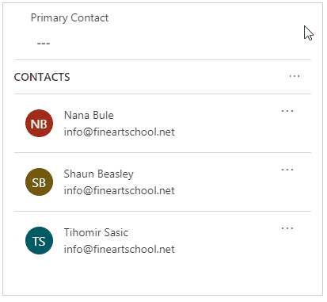

#  Use the lookup field on a record

Lookup helps you to choose records from a related entity. When you select a related entity and enter search criteria, such as a name or email address, lookup automatically begins to resolve the partial text and displays any matching records. If no records are displayed after you have typed the full text of your search criteria, a message is displayed specifying that there are no records.

To browse a lookup, when you see the list of results, press Enter.

  > [!div class="mx-imgBorder"]
  >   
 
The list of records shows an image to help disambiguate between record types.

  > [!div class="mx-imgBorder"]
  >   

When you select the lookup icon (magnifying glass) or the text box, it shows the same list of most recently used records.

  > [!div class="mx-imgBorder"]
  >   
  
  
When results span multiple record types, you can now see how many types of records there are and select them from a list.

  > [!div class="mx-imgBorder"]
  >   
