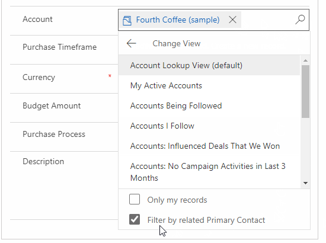

#  Use the lookup field on a record

Lookup helps you to choose records from a related entity. When you select a related entity and enter search criteria, such as a name or email address, lookup automatically begins to resolve the partial text and displays any matching records. If no records are displayed after you have typed the full text of your search criteria, a message is displayed specifying that there are no records.

For example, you might search for the name **Adrian Dumitrascu**. When you type **ad**, possible matching records are automatically populated and displayed.

  > [!div class="mx-imgBorder"]
  > 
  
>[!NOTE] 
>An administrator can define the criteria that lookup uses for resolving partial search text.

Also, you can create a new record by selecting the **New** button. You must have sufficient permissions to view the **New** button and create a record. When you select the lookup field, the five most recently used records are displayed along with five favorite records. Which records are displayed depends on your view history and the favorites you’ve pinned. 

For example, if you have only three records in your history, lookup will display those three,
along with seven of your favorite records. If you have not pinned any favorites, only the most recently viewed records will be displayed.

## Types of lookups

Lookups are classified into the following: 

- **Simple lookup:** Select a single record in a field from a single entity. 

- **PartyList-type fields:** Use to select multiple records from multiple entities in a lookup. Use partylist-type fields to select multiple records. This allows you to add each record by performing a new search, multiple times. Every time you select a record, you will be able to perform a new search for another record.
  
- **Regarding-type fields:** Use to select a single record from multiple entities in a lookup. 

## Search in a lookup field 
To search a lookup, select the textbox and type your search criteria. If recent records are enabled for your lookup, your recent records will be displayed when you select the textbox.

  > [!div class="mx-imgBorder"]
  >   
  
>[!NOTE]   
> The default search result for lookup search is, **begins with**. This means results include records that begin with a specific word. For example, if you want to search for **Alpine Ski House**, type **alp** in the search box; if you type **ski**, the record will not show up in the search result.
>
> For a wildcard search use asterisks: For example, type \*ski or \*ski\*.

## Browse in a lookup field
To browse a lookup, select the lookup icon (magnifying glass). A full list of items will be shown in the dropdown.

  > [!div class="mx-imgBorder"]
  >   
 
## Most recently used record type images
The most recently used list of records shows an image to help distinguish between record types.

>[!NOTE] 
>Recent records are not filtered by search term or selected view.

  > [!div class="mx-imgBorder"]
  >   
  
## Record type selection list  
When results span multiple record types, you can see how many types of records there are and select them from the list.

  > [!div class="mx-imgBorder"]
  >   
  
## Create a new record if you don’t find an existing record

If you do not find a record, select **New** in the lookup area to create a new record.

### Replace an existing record from a lookup field

You can replace an existing record while using simple and regarding-type lookups. Search for a record. Then select the record, and replace it with a new record.

### Change a view in a lookup field 

Selecting **Change View** lets you determine:
 - How you want to view records such as **Contacts Being Followed**, **Contacts Lookup View**, or **Active Contacts**.
 - What you want to view in the records, such as name, email, or telephone number. For example, if you want to view only the contacts that you follow, select
    **Change View** \> **Contacts being followed**. Only the contacts that you are following will be displayed, as illustrated here. 

    

### Only my records, related records filtering

To apply extra filters, in the **Change View** menu, select **Only my records** or **Filter by related Primary Contact**.

### Choose from multiple records

When lookup has more records in a field than can fit in the available display area, the display area is collapsed—that is, the records that do fit the display area are shown next to the number of records that are not shown. To view all records, select the number. The following images show the difference between collapsed and non-collapsed fields.

**Collapsed:**

**Non-collapsed:**

