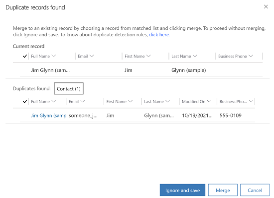
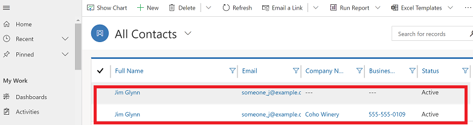
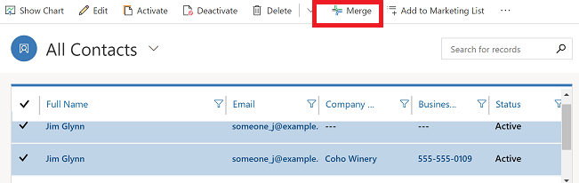
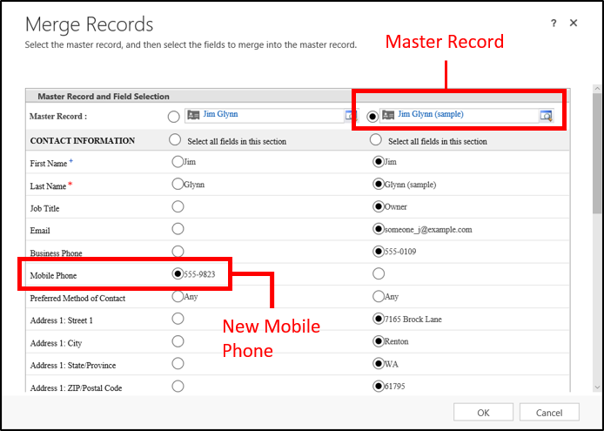

# Merge duplicate rows 

Duplicate rows can creep into your data when you or others enter data manually or import data in bulk. Microsoft Dataverse helps you address potential duplicates by providing duplicate detection for active rows such as, accounts and contacts. When you merge a row any related or child rows will also be merged. Your administrator may also set up duplicate detection rules for other situations.  
  
For example, let's say you enter a contact row, Jim Glynn,  along with a mobile phone number.  The duplicate detection rule discovers that you already have a similar row, and displays this dialog box.  
  
 > [!div class="mx-imgBorder"] 
 >   
  
 You're not sure if this is a new row (one that happens to have the  same name as an existing contact) or a duplicate, so you select **Ignore And Save**.  
  
 Next, you go to the **All Contacts** list and see that now you have two rows with the same name. After reviewing the rows,  you  determine that they're duplicates that need to be merged.  
 
 > [!div class="mx-imgBorder"] 
 >   
 
Dataverse includes duplicate detection rules for accounts and contacts. These rules are automatically turned on, so you don’t have to do anything to set up duplicate detection for these row types.  
  
> [!NOTE]
>  If available on your system, you may also be able to check for duplicates of other row types, in addition to contacts and accounts. Check with your system administrator. [Find your administrator or support person](find-admin.md)  
  
### How to merge duplicate rows  
  
1. Select the duplicate rows, and then select **Merge**.  
  
   > [!div class="mx-imgBorder"] 
   >   
  
2. In the **Merge Rows** dialog box, select the master row (the one you want to keep), and then select any columns in the new row that you want to merge into the master row. Data in these columns may override the existing data in the master row. Select **OK**.  
  
     
   > [!div class="mx-imgBorder"] 
   >   
  

There are a few situations when duplicates may be found:  

- When a row is created or updated.  
- When  you're using Dynamics 365 for Outlook and you go from offline to online.  
- When you import data using the Import Data wizard.  
- Duplicates aren't detected when you merge rows, save an activity as completed, or change the status of a row, such as activating or reactivating a row.

> [!IMPORTANT]
>  If a column or control matches any of the following conditions, it will not show up in the merge dialog:  
>   - The field or containing section is invisible in form descriptor or form XML regardless whether the section shows up in runtime. It is possible to show it using the client API.
>   - The control does not have a class property.
>   - The column's metadata `ValidForUpdate` is False.
>   - The control is **Quick Form Collection Control** or **Reference Panel Quick Form Collection Control**.
>   - The column's metadata `ValidForUpdate` is False. 
>   - The column is `Choice` or `MultiSelectPickList` and it has either a parent choice or child choice column.
>   - The column is `parentaccountid` on the Account table; this is a system setting and cannot be changed. 
>   - The column is `parentcustomerid` on the  Contact Table; this is a system setting and cannot be changed

[!INCLUDE[footer-include](../includes/footer-banner.md)]
