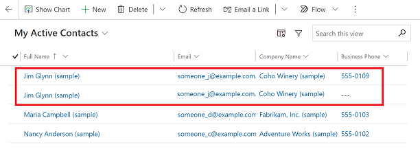
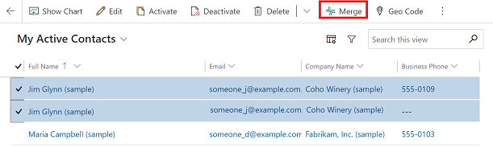
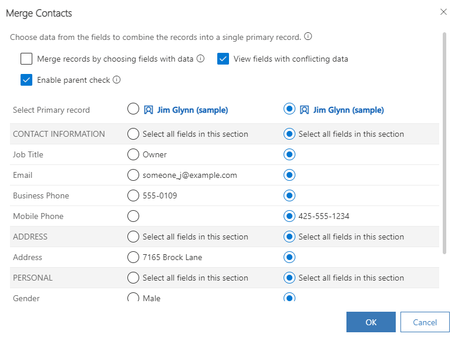

# Merge duplicate rows 

Duplicate rows can creep into your data when you or others enter data manually or import data in bulk. Microsoft Dataverse helps you address potential duplicates by providing duplicate detection for active rows, such as accounts and contacts. When you merge a row, any related or child rows are also merged. Your administrator may also set up duplicate detection rules for other situations.  

There are a few situations when duplicates might be found:  

- When a row is created or updated.  
- When you're using Dynamics 365 for Outlook and you go from offline to online.  
- When you import data using the Import Data wizard.  
- Duplicates aren't detected when you merge rows, save an activity as completed, or change the status of a row. For example, when activating or reactivating a row.
  
For example, let's say you enter a contact row, Jim Glynn, along with a mobile phone number. The duplicate detection rule discovers that you already have a similar row, and displays this dialog box.  
  
 > [!div class="mx-imgBorder"] 
 >   
  
 You're not sure if this is a different person that has the same name as an existing contact, so you select **Ignore And Save**.  
  
 Next, you go to the **My Active Contacts** list and see that now you have two rows with the same name. After reviewing the rows, you determine that they're duplicates that need to be merged.  
 
 > [!div class="mx-imgBorder"] 
 >   
 
Dataverse includes duplicate detection rules for accounts and contacts. These rules are automatically turned on, so you don’t have to do anything to set up duplicate detection for these row types.  
  
> [!NOTE]
>  If available on your system, you may also be able to check for duplicates of other row types, in addition to contacts and accounts. Check with your system administrator. [Find your administrator or support person](find-admin.md)  

> [!NOTE]
>  To modify the columns that are visible for the current record in the duplicate detection dialog, administrators can modify the **Advanced Find View** for that entity. 
  
### How to merge duplicate rows

1. Select the duplicate rows from the view page in your model-driven app, and then select **Merge** in the command bar at the top of the page.  
  
   > [!div class="mx-imgBorder"] 
   >   
  
2. In the **Merge Contacts** dialog box, select the primary row (the one you want to keep) and then select any columns in the new row that you want to merge into the primary row. Data in these columns may override the existing data in the primary row. Select **OK**.  

   > [!NOTE]
   > If you run into issues during the merge process, uncheck **Enable parent check**. If files are deleted during the merge process, you can skip the parent check. This allows your merge to continue even if someone deletes a row from the set while the job is running in the background. For more information, see [Asynchronous processing of cascading transactions](/power-platform/admin/async-cascading#troubleshooting-file-deletion-issues-during-cascade-merge).
  
   > [!div class="mx-imgBorder"] 
   >   

### Limitations

- You can merge rows only from Account, Contact, and Lead tables. Other out-of-box Dataverse tables and custom tables aren't supported.
- You can only merge two records at a time.
- File and image columns can't be previewed. They show as base64 text. Go to the original records to view the file or image.
- If a column or control for the column matches any of the following conditions, it doesn't appear in the merge dialog:  
  - The column or containing section is [hidden by default in column or section properties](../maker/model-driven-apps/add-move-or-delete-fields-on-form.md#configure-column-properties-on-a-form). Hidden columns and sections can be forced to appear using Client API functions, but they still aren't be eligible for merging.
  - The column's `ValidForUpdate` property is `False`.
  - The column is **Choice** or **Choices** type and it has either a parent choice or child choice column.
  - The column is `parentaccountid` on the Account table.
  - The column is `parentcustomerid` on the Contact table.
  - The column is **Owner** type (example: `ownerid`).
  - The control for the column does not have a class property.
  - The control for the column is **Quick Form Collection Control** or **Reference Panel Quick Form Collection Control**.
- Merging records with a SharePoint documents library merges only the records, not the documents libraries. Learn more in [Collaborate using SharePoint](collaborate-using-sharepoint.md).

[!INCLUDE[footer-include](../includes/footer-banner.md)]
