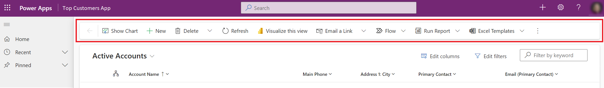
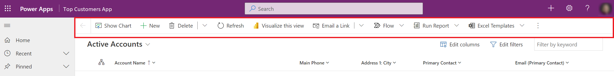

# Modern, refreshed look for model-driven apps (preview)

[This topic is pre-release documentation and is subject to change.]

Model-driven apps have a modern, refreshed look when the **Try the new look and feel (preview)** feature has been turned on by makers of the apps.  This new look provides updated styling including fonts, colors, borders, shadows, and more that align to the latest [Microsoft Fluent design system](https://react.fluentui.dev/?path=/docs/concepts-introduction--page). The updated look makes model-driven apps easy-to-use so that users can accomplish their goals quickly and efficiently.

The Fluent design system provides consistency, quality, and Microsoft-wide platform coherence. It also provides a solid foundation for extensibility and allows support for dark mode in the future. 

> [!IMPORTANT]
> - This is a preview feature.
> - [!INCLUDE[cc_preview_features_definition](../includes/cc-preview-features-definition.md)]

## What’s included with the new look
After the **Try the new look and feel (preview)** feature has been enabled for a model-driven app, you'll see the new, modern interface in the app. Forms and view pages have updated styling for colors, fonts, elevation, rounded corners, and more. The Power Apps grid replaces the read-only grid. New Fluent-based field controls are also used in many forms.

With the new look, Power Apps and Dynamics 365 apps are moving away from the classic theme customizations and will introduce a new theming capability in the future that builds on the Fluent design system.  

### Command bar
The updated visuals make use of several new patterns across the app and page types. Drop shadows and brighter background colors are used to create elevation, which aids in the separation of sections and focuses attention on the primary content. The floating command bar style aligns with the Microsoft 365 commanding experience and has consistent spacing, rounded corners, and elevation. For example, notice the new look of the command bar in the following image.

As a comparison, the command bar wasn't in a separate section in previous versions of the user interface, as shown in the following image.

### View pages
View pages have a refreshed appearance in model-driven apps. The command bar and grid area take advantage of the elevation changes to help draw the user’s attention. The biggest change on view pages is the switch from the read-only grid to the [Power Apps grid control (preview)](../maker/model-driven-apps/the-power-apps-grid-control.md), which utilizes infinite scrolling, by default, to give the user a modern data browsing experience. When the **Try the new look and feel (preview)** feature is enabled, this grid will also appear for subgrids and associated grids in main forms, but isn't yet supported in dashboards. As the Power Apps grid control also supports inline editing via the **Enable filtering** property, makers may also consider manually configuring their editable grids to use the Power Apps grid control.  

### Form pages
Form pages are aligned to the modern, refreshed look. They utilize the new command bar and refreshed elements like the form header, tabs, sections, flyouts, and business process flows. Their fonts, elevations, rounded corners, color, and other style properties are based on the latest Fluent properties and have been extended to quick views and card forms. Header, sitemap, and timeline controls are refreshed and align to styles derived from Fluent theme tokens.  

### Field controls
The modern, refreshed look for model-driven apps include new field controls. Text input, action input (email, phone, ticker, URL), lookup, and check box controls are built and designed using Fluent components. More field controls will be modernized using Fluent design and will be incrementally made available when the **Try the new look and feel (preview)** feature is [enabled](modern-fluent-design.md#enable-the-new-look).

Field sections, which are containers for the fields on a form, have been updated with more streamlined designs. Icons have been moved from the left to the right-hand side of the field label. Some of the redundant icons have been removed for a cleaner layout. For example, the explicit lock icon isn't shown for read-only fields. The style of inputs and error messages has also been refreshed based on Fluent design. 

## Enable the new look
Makers can enable the new look for existing and new model-driven apps in the app designer by turning on the **Try the new look and feel (preview)** feature for each model-driven app. Model-driven apps that are part of the preview, will automatically get incremental enhancements on a weekly basis. For more information about enabling the modern, refreshed look, see [Manage model-driven app settings in the app designer](../maker/model-driven-apps/app-properties.md#upcoming).

## Provide feedback on the new look
After enabling the **Try the new look and feel (preview)** feature and using your model-driven apps, you can provide feedback on the new look on the [Power Apps Custom Page Feedback discussion thread](https://powerusers.microsoft.com/t5/Building-Power-Apps/Power-Apps-Custom-Page-Feedback-discussion-thread/m-p/1203993#M315697) web page.

## Known limitations
Be aware of the following limitations for the modern, refreshed look for model-driven apps:

- The mobile app, Mail app, and Embedded Teams mode do not suppot the modern, refreshed look and are not part of the preview.
- Dynamics 365 applications are not fully tested. Please do not enable this preview in any production applications.

