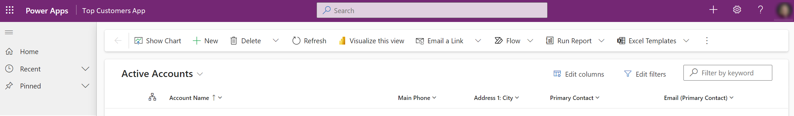
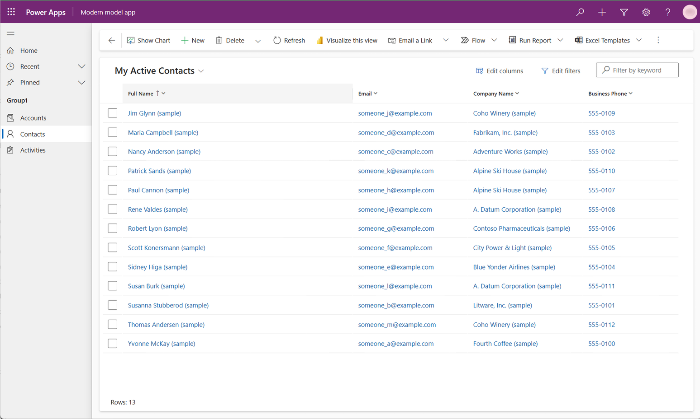
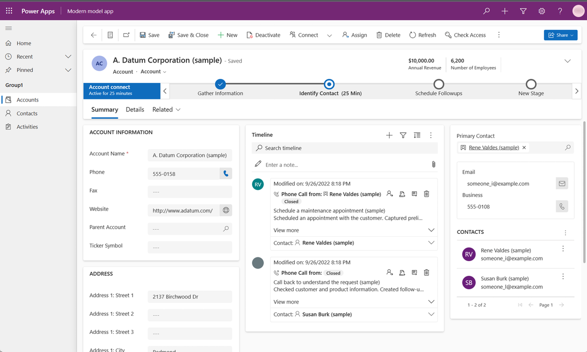
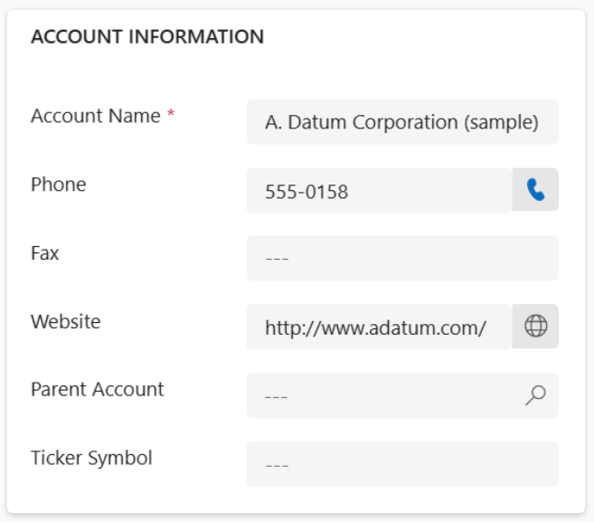

# Modern, refreshed look for model-driven apps (preview)

[This article is prerelease documentation and is subject to change.]

Model-driven apps have a modern, refreshed look when the **Try the new look and feel (preview)** feature has been [turned on by makers](modern-fluent-design.md#turn-on-the-new-look) of the apps.  This new look provides updated styling including fonts, colors, borders, shadows, and more that align to the latest [Microsoft Fluent design system](https://react.fluentui.dev/?path=/docs/concepts-introduction--page). The updated look makes model-driven apps easier to use so that users can accomplish their goals quickly and efficiently.

The Fluent design system provides consistency, quality, and Microsoft-wide platform coherence. It also provides a solid foundation for extensibility and allows support for dark mode in the future. 

> [!IMPORTANT]
> - This is a preview feature.
> - [!INCLUDE[cc_preview_features_definition](../includes/cc-preview-features-definition.md)]

## What’s included with the new look
Here's what you can expect in the modern, refreshed experience:

- Updated styling in forms and view pages, including the use of drop shadows and brighter background colors to create an elevated or "floating" appearance, which helps to visually separate sections and focuses attention on primary content
- New Fluent-based controls in forms, business process flows, and dialogs
- A new Power Apps grid in place of the read-only grid in view pages

### Command bar
The "floating" command bar aligns with the Microsoft 365 experience, with consistent spacing, rounded corners, and elevation. Notice how the command bar is in a separate section at the top of the page in the following example.

### View pages
View pages use the new command bar and have updated grid areas that take advantage of the elevation changes to help draw the user’s attention. 

The biggest change on view pages is the switch from the read-only grid to the [Power Apps grid control (preview)](../maker/model-driven-apps/the-power-apps-grid-control.md), which features infinite scrolling for a modern, data browsing experience. This grid also appears in subgrids and associated grids in main forms, but isn't yet supported in dashboards. The Power Apps grid control also supports inline editing using the **Enable filtering** property. Makers may manually configure their editable grids to use the Power Apps grid control. 

The following example shows a view page with the modern, refreshed look.

### Form pages
Form pages use the new command bar and have refreshed headers, tabs, sections, and business process flows. Quick views, card forms, headers, sitemaps, and timeline controls also feature updating styling.

The following example shows a form page with the modern, refreshed look.

### Field controls
Field controls such as text input, action input, lookup, and check box controls are built and designed using Fluent components. More field controls will be modernized using Fluent design in future updates.

Field sections, which are containers for the fields on a form, have a more streamlined design. Icons have been moved to the right side of the field labels. Some redundant icons have been removed for a cleaner layout. For example, recommended icons have been removed for simplicity. Input and error message styling has also been refreshed based on Fluent design. 

The following example shows a set of fields with the modern, refreshed look.

## Turn on the new look
The modern look is disabled by default. Makers can enable the new look for existing and new model-driven apps in the app designer by turning on the **Try the new look and feel (preview)** feature for each model-driven app. 

Model-driven apps that are part of the preview automatically get incremental enhancements weekly. For more information about enabling the modern, refreshed look, see [Manage model-driven app settings in the app designer](../maker/model-driven-apps/app-properties.md#upcoming).

## Provide feedback on the new look
After using the modern, refreshed look in your model-driven apps, tell us what you think about it in the [Power Apps community forum](https://go.microsoft.com/fwlink/?linkid=2221574).

## Known limitations
The modern, refreshed look for model-driven apps has some limitations:

- The mobile app, mail app, and embedded Teams mode don't support the modern, refreshed look, and aren't part of the preview.
- The modern, refreshed look isn't validated for Dynamics 365 applications at this time. Don't try out the preview in any production, Dynamics 365 applications.
- With the new look, Power Apps is moving away from the classic theme customizations. This means that the app header and colors for business process flows can't be customized yet. 
- The SharePoint document grid doesn't support the modern, refreshed look.  

## Frequently asked questions (FAQs)

### Can I enable the new look for all model-driven apps?
The **Try the new look and feel (preview)** feature is available for any model-driven apps that run in the cloud. We recommended that you evaluate the feature in a test environment before using it in a production environment. 

### Can I revert to the old UI?
Yes, you can go back to the old UI by turning off the **Try the new look and feel (preview)** setting.

### Do any of my existing applications get the new look by default?
During the preview period, the new look will only be seen if the **Try the new look and feel (preview)** setting is turned on by app makers.

### Is the new look enabled on other surfaces, like the Power Apps mobile app and the Outlook web app?
The new look isn't yet supported on these surfaces.

### Does the app designer preview display the new look?
Live preview doesn't display the new look yet. To see the new look, you’ll need to publish the app and select the **Play** button.

### Can I switch to a different theme or enable dark mode?
Switching themes or enabling dark mode isn't yet supported.

### Is the new look available for custom pages or code components?
No, but we're actively working on bringing the new look to these areas.

### How can I validate and test the new look?
Review the documentation for the details on the new controls being enabled in the preview, and focus on those for validation. Execute your end user scenarios as normal. Some field controls and grid capabilities are updated, and the experience might be little different.

### Do Dynamics 365 applications support the new look?
We're working on extending the new look across applications based on model-driven Power Apps.
