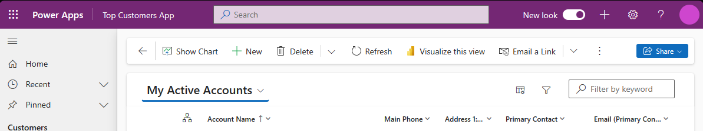
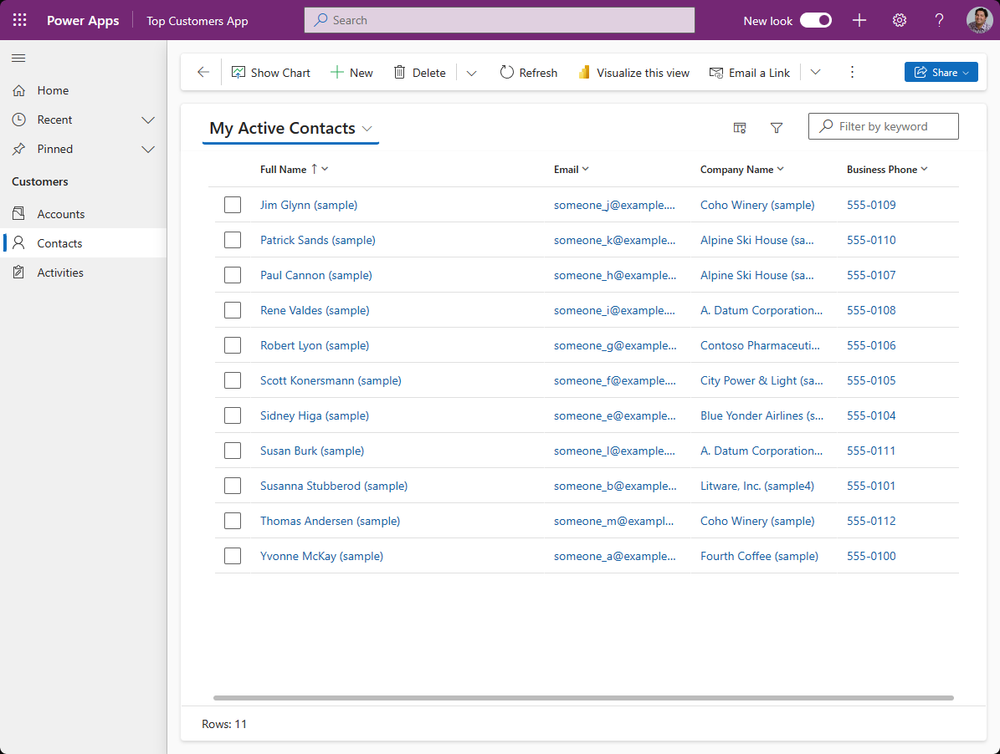
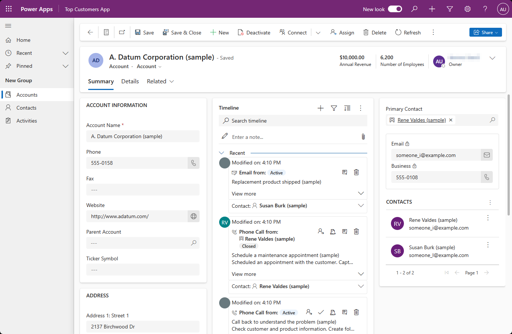

# Modern, refreshed look for model-driven apps

Model-driven apps have a modern, refreshed look when the **Try the new look** feature has been [turned on by end users](modern-fluent-design.md#turn-on-the-new-look). This new look provides updated styling including fonts, colors, borders, shadows, and more that align to the latest [Microsoft Fluent design system](https://react.fluentui.dev/?path=/docs/concepts-introduction--page). The updated look makes model-driven apps easier to use so that users can accomplish their goals quickly and efficiently. This feature is transitioning from preview to generally available, learn more about this process [here](modern-fluent-design.md#preview-to-generally-available-rollout). 

The Fluent design system provides consistency, quality, and Microsoft-wide platform coherence. It also provides a solid foundation for extensibility and allows support for dark mode in the future. 

## What’s included with the new look
Here's what you can expect in the modern, refreshed experience:

- Updated styling in form, view and dashboard pages, including the use of drop shadows and brighter background colors to create an elevated or "floating" appearance, which helps to visually seperate sections and focuses attention on primary content.
- New Fluent-based controls in forms, business process flows, and dialogs.
- A new Power Apps grid in place of the read-only grid in view and standard dashboard pages.
- End user switch to enable the modern experience.

### Command bar
The "floating" command bar aligns with the Microsoft 365 experience, with consistent spacing, rounded corners, and elevation. Notice how the command bar is in a separate section at the top of the page in the following example.

### View pages
View pages use the new command bar and have updated grid areas that take advantage of the elevation changes to help draw the user’s attention. 

The biggest change on view pages is the switch from the read-only grid to the [Power Apps grid control (preview)](../maker/model-driven-apps/the-power-apps-grid-control.md), which features infinite scrolling for a modern, data browsing experience. This grid also appears in subgrids and associated grids in main forms, but isn't yet supported in dashboards. The Power Apps grid control also supports inline editing using the **Enable filtering** property. Makers may manually configure their editable grids to use the Power Apps grid control. 

The following example shows a view page with the modern, refreshed look.

### Form pages
Form pages use the new command bar and have refreshed headers, tabs, sections, and business process flows. Quick views, card forms, headers, sitemaps, and timeline controls also feature updating styling.

The following example shows a form page with the modern, refreshed look.

### Field controls
Field controls such as text input, action input, lookup, and check box controls are built and designed using Fluent components. More field controls will be modernized using Fluent design in future updates.

Field sections, which are containers for the fields on a form, have a more streamlined design. Icons have been moved to the right side of the field labels. Some redundant icons have been removed for a cleaner layout. For example, the recommended icons have been removed for simplicity. Input and error message styling has also been refreshed based on Fluent design. 

The following example shows a set of fields with the modern, refreshed look.

## Turn on the new look
End users can enable the new look for their model-driven apps in the app by enabling the **Try the new look** switch in the header of their app.

## Provide feedback on the new look
After using the modern, refreshed look in your model-driven apps, tell us what you think about it in the [Power Apps community forum](https://go.microsoft.com/fwlink/?linkid=2221574).

## Known limitations
The modern, refreshed look for model-driven apps has some limitations:

- The mobile app, mail app, and embedded Teams mode don't support the modern, refreshed look and aren't part of the preview or general availability.
- With the new look, Power Apps are moving away from the classic theme customizations. This means that the app header and colors for business process flows can't be customized yet.

## Frequently asked questions (FAQs)

### Preview to generally available rollout
Model driven apps modern experience is generally available in Monthly Channel and will be generally available in Semi-annual Channel as of 2023 Release Wave 2. Once generally available end users will be presented with a toggle switch to enable the modern experience and they can switch back at anytime.

### Can I revert to the old UI?
Yes, end users can switch back to the old UI by turning off the **Try the new look** switch.  Makers can also disable the new look by updating the app setting.
For more information about disabling the modern, refreshed look, see [Manage model-driven app settings in the app designer](https://review.learn.microsoft.com/en-us/power-apps/maker/model-driven-apps/app-properties#features). 

Admins can disable the **Try the new look** across all apps in an org by using the solution explorer to set **Try the new look** value to no.

1. Create a new solution
1. Click **Add Existing** > **More** > **Setting**
1. Search for “Try”
1. Select “Try the new look” 

> [!NOTE]
> There are two settings "Try the new look" and "Try the new look and feel (preview)".

5. Click “Add” to add it to the solution
1. Click “Try the new look” from the solution explorer
1. Update “Setting Environment Value” to NO
1. Click Save
1. Publish All Customizations

### Is the new look enabled on additional surfaces, like the Power Apps mobile app and the Outlook web app?
The new look is not yet supported on these surfaces.

### Does the app designer preview display the new look?
Yes, once enabled, the app designer preview will show the new look.

### Can I switch to a different theme or enable dark mode?
Switching themes or enabling dark mode is not yet supported.

### Is the new look available for custom pages or code components?
No, but we are actively working on bringing the new look to these areas.

### Do Dynamics 365 applications support the new look?
Dynamics 365 applications have extended the new look across applications based on model-driven Power Apps.
