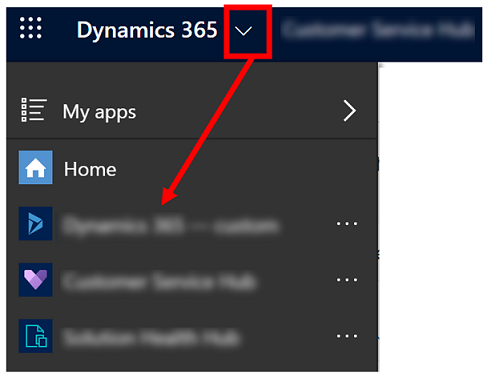
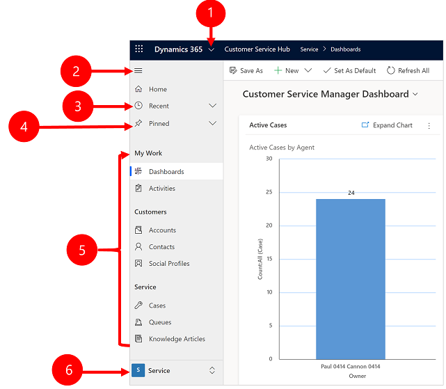
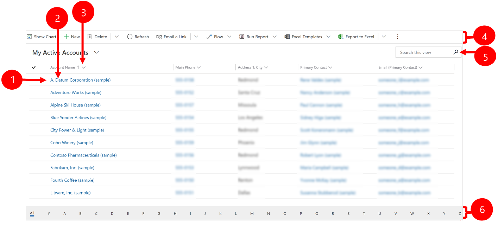
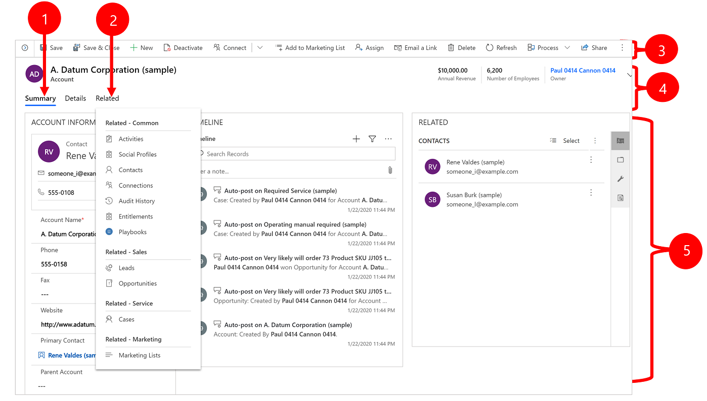
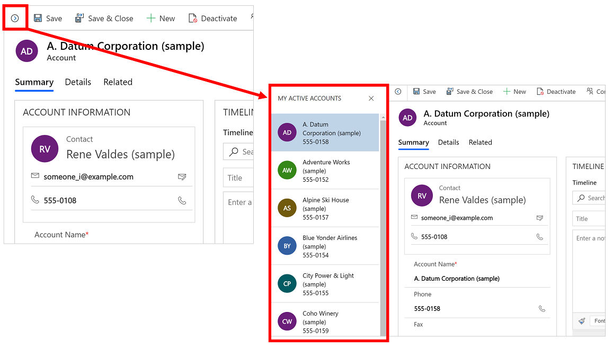

#  Basic navigation in a model-driven app 

This introduction explains how to find and open an app, and how to work with its common user interface elements including lists, forms, and business processes.

## Navigating among apps, areas, and entities

A model-driven app is built out of applications (apps), areas, and entities.

- *Apps* provide a collection of functionalities for accomplishing a specific class of activity, such as managing your accounts and contacts. Use the app-selector menu to navigate between the apps that are available to your organization.

- A *work area* is a subdivision of an app, dedicated to a specific feature. Each work area provides a targeted collection of entities for working in that area. In some cases, the same entity appears in more than one area (or even more than one app). The Contact and Account entities, for example, appear in a variety of apps and work areas. Use the work-area menu to navigate between work areas for your current app.

- *Entities* represent a specific type of data, such as a contacts and accounts. Entities use a structured data format, which defines the collection of fields available to the entity. Each entity consists of a collection of individual records. For example, for the Contact entity, each record describes a single person, and each record includes a collection of fields such as first name, last name, and email address. Entities normally present two views: a list view, which is typically a table listing available records; and a form view, which shows all available data and settings for a single record. Use the side navigator to move between entities in your current work area.

### Move between apps

Use the app-selector menu to switch between apps.

The apps you see listed in your app-selector menu will depend on which apps you have access to. 

### Move between entities, records, and work areas

It's easy to get around and get back to your favorite or most-used records. The following illustration shows the primary navigation elements.

Legend:

1. **App selector**: Open this menu to move between apps.
1. **Collapse/expand button**: Select this to collapse the navigator to allow more room for the main part of the page. If the navigator is already collapsed, select this button to expand it again.
1. **Recent records**: Expand this entry to view a list of records you were recently using. Select a record here to open it. Select the push-pin icon next to a record listed here to add it to your favorites (pinned records).
1. **Favorite records**: Expand this entry to view and open your favorite (pinned) records. Use the **Recent records** list to add records here. Select the remove-pin icon next to a record listed here to remove it from this list.
1. **Entity navigator**: This area lists each entity and dashboard available for the current work area. Select any entry here to open the named dashboard or list view for that entity.
1. **Work-area selector**: Open this menu to move to another work area. The current work area is named here.

## Working with list views

Usually, when you first open an entity, you'll see the list view, which shows a list of records belonging to that entity, formatted as a table. For example, if you open the **Accounts** entity, you'll see a list of accounts.

Legend:

1. **Select records**: Select one or more records by placing a check mark in this column. Depending on where you're working, you might be able to apply a single operation to all the selected records at once by using buttons in the command bar.
2. **Open a record**: Select any record in the list to open its record view, which shows all the details about the record. Usually you select from the **Name** column to open a record from the current entity. Some entities provide links to records from related entities in other columns (such as a related contact).
3. **Sort or filter the list**: Select to sort the list by values in that column or filter the list by values in that column. An arrow in the column heading indicates which column is being sorted and in which direction. 
4. **Command bar**: Use the commands in the command bar to operate on records in the list and perform related actions. Some commands (such as **Delete**) require that you first select one or more target records by placing a check mark in the leftmost column, while others operate on the entire list. You can export the list to an Excel workbook (possibly based on a template), open charts and dashboards, and more, depending on the type of records you're working with.
5. **Search the view**: Enter text in the search field above the list to show only those records in the current view that contain your text.
6. **Filtering and paging**: Select a letter to show only those records whose names start with that letter. If the list contains more records than can be shown on one page, use the paging arrows at the bottom of the list to move forward and backward through the pages.

## Working with record views

Record views show all the details about a single record and sometimes also provide special features for working with it. Usually you'll open a record view by selecting a record that appears in a list view, but you can also open a record view by following a link from a related record.

Legend:

1. **Tabs**: Most record views are divided into tabs. Each tab provides a collection of related fields from the record. When tabs are available, they're listed below the record name. Select any tab name to go to that tab. The current tab is shown underlined.
2. **Related**: Nearly all types of records show a **Related** tab after you've saved them at least once. This tab is actually a drop-down list that you can use to find other types of records that use or reference the displayed record. 
When you choose an entity name from the **Related** drop-down list, a new tab named for that entity opens, showing a list of all related records of that type. The **Related** tab remains available, and you can still use it to find other types of records that reference the current one.
3. **Command bar**: Use the commands in the command bar to operate on the current record or perform a task related to the record. The available commands vary based on the record type, but you can typically use the command bar to save your changes, delete the record, refresh the page, email a link to the record, reassign the record owner, or export the record by using a Word template.
4. **Heading bar**: Some record views display a few especially important fields in the heading bar, opposite the record name. These are typically fields that are fundamental to working with records of the current type (such as a the record name or record owner).
5. **View and edit all field values**: In the main body of the record view, you'll find all of the fields related to the current tab, form view, and record type. Fields marked with a red asterisk are required, and you can't save the record without their having valid values. Fields marked with a blue plus sign are especially important or recommended, but aren't strictly required. Fields showing a lock icon are read-only and can't be edited.

## Record set navigation 

Navigate through multiple records by using preset views and queries. The record-focused navigation improves productivity by allowing users to jump from record to record in the list and easily navigate back without losing their working list.

> [!div class="mx-imgBorder"]
> 

## Reference panel

The reference panel is a great way to get work done without moving away from the screen you're on. You can look up other related items&mdash;such as cases or opportunities for an account&mdash;within the context of the record you're viewing, without having to navigate to other screens.

> [!div class="mx-imgBorder"]
> 

 Watch this video to learn more about the reference panel:

<iframe src="https://www.microsoft.com/videoplayer/embed/d8224c3f-6e20-4b8e-9d0d-b0f5602c7708" frameborder="0" allowfullscreen=""></iframe>

## Notifications 

There are three types of notifications that are shown on a form: informational, warning, and error. Notifications are always available at the top of the form, just above the header.

When you select the error notification, it will take you to the field on the form where the error occurred.

Legend:

1. **Info**: The notification is informational.
2. **Warn**: The notification is a warning. 
3. **Error**: The notification is an error. 

### Single notification

If there is only one notification, you'll see a single line.

### Multiple notifications

If there are multiple notifications, you'll see the number of notifications. Select the chevron to view each message.

