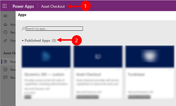
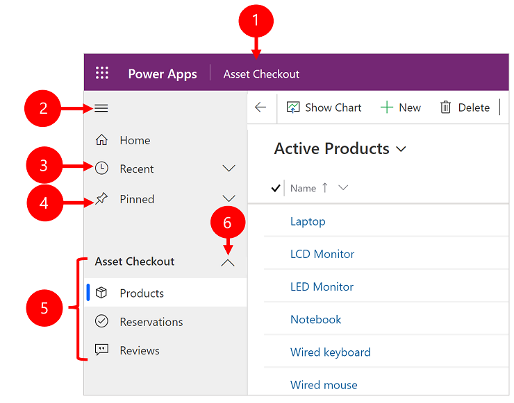
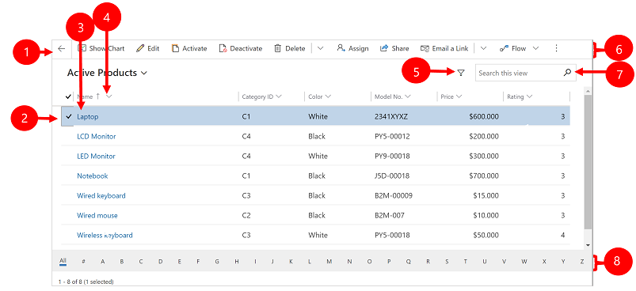
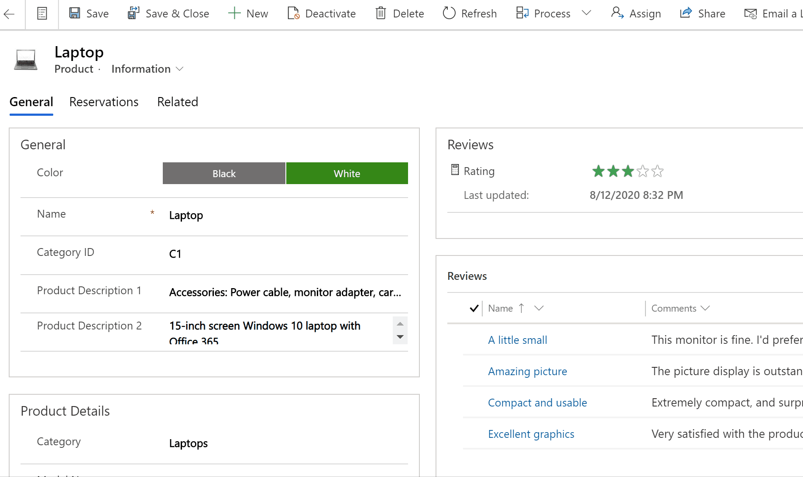
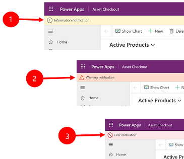
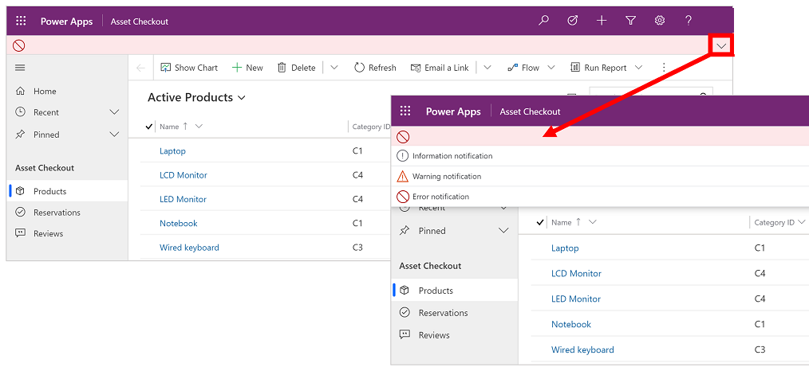

#  Basic navigation in a model-driven app 

[!INCLUDE[cc-data-platform-banner](../includes/cc-data-platform-banner.md)]

[!INCLUDE cc-beta-prerelease-disclaimer]

This introduction explains how to find and open an app, and how to work with its common user interface elements including lists, forms, and business processes.

## Navigating among apps, areas, and tables

A model-driven app is built out of applications (apps), areas, and tables.

- *Apps* provide a collection of functionalities for accomplishing a specific class of activity, such as managing your accounts and contacts. Use the app-selector menu to navigate between the apps that are available to your organization.

- A *work area* is a subdivision of an app, dedicated to a specific feature. Each work area provides a targeted collection of tables for working in that area. In some cases, the same table appears in more than one area (or even more than one app). The Contact and Account tables, for example, appear in a variety of apps and work areas. Use the work-area menu to navigate between work areas for your current app.

- *Tables* represent a specific type of data, such as a contacts and accounts. Tables use a structured data format, which defines the collection of columns available to the table. Each table consists of a collection of individual rows. For example, for the Contact table, each row describes a single person, and each row includes a collection of columns such as first name, last name, and email address. Tables normally present two views: a list view, which is typically a table listing available rows; and a form view, which shows all available data and settings for a single row. Use the side navigator to move between tables in your current work area.

### User info and sign out

Select the user menu to view your account information or sign out. Go to your account page by selecting the **View account** hyperlink.

> [!div class="mx-imgBorder"] 
>    

### Move between apps

Use the app-selector menu to switch between apps.

1. Select the current app name.
2. On the **Apps** page select an app. You will only see apps for your organization.

   > [!div class="mx-imgBorder"] 
   >    

### Move between pages and rows

It's easy to get around and get back to your favorite or most-used rows. The following illustration shows the primary navigation elements.

  

Legend
  
1. **Click to change app**: Select the current app name to change to a different app. 
2. **Collapse/expand site map**: Select this to collapse the navigator to allow more room for the main part of the page. If the navigator is already collapsed, select this button to expand it again. 
3. **Recent**: Expand this entry to view a list of rows you were recently using. Select a row here to open it. Select the push-pin icon next to a row listed here to add it to your pinned rows.
4. **Pinned**: Expand this entry to view and open your favorite pinned rows. Use the **Recent** list to add rows here. Select the remove-pin icon next to a row listed here to remove it from this list.
5.  **Page navigation**: This area lists each table and dashboard page available for the current work area. Select any entry here to open the named dashboard or list view for that table.
6.  **Collapsible groups**: If you're on [early access](/power-platform/admin/opt-in-early-access-updates), your app maker can enable collapsible groups. For information on how customize the navigation bar, see [Overview of the model-driven app designer](../maker/model-driven-apps/app-designer-overview).

### Early access: Hide or show the Home, Pinned, Recent, and collapsible groups

If you're on [early access](/power-platform/admin/opt-in-early-access-updates) your site map may look different. With 2021 release wave 2, an app maker can customize the navigation bar to show or hide the **Home**, **Recent**, **Pinned** buttons in the site map. An app maker can also make groups collapsible. For information on how customize the navigation bar, see [Overview of the model-driven app designer](../maker/model-driven-apps/app-designer-overview).

  

### Area switcher 

In the left-hand navigation pane, the area switcher appears at the bottom left only when a single model-driven app has more than one area in the sitemap definition. 

Open this menu to move to another work area. The current work area is named here.

## Go back 

Use the back button for form, view, and dashboard pages on the command bar to go back to the previous page.

To go back to the previous page, select the **Go back** button.

 

## Working with list views

Usually, when you first open a table, you'll see the list view, which shows a list of rows belonging to that table, formatted as a table. For example, if you open the **Products** table, you'll see a list of accounts.

Legend:

1. **Go back**: Select to go back to the previous page.
2. **Select rows**: Select one or more rows by placing a check mark in this column. Depending on where you're working, you might be able to apply a single operation to all the selected rows at once by using buttons in the command bar. Note, when you use the **Email a link** command on the command bar you can only select up to ten rows to send via email. 
3. **Open a row**: Select any row in the list to open its row view, which shows all the details about the row. Usually you select from the **Name** column to open a row from the current table. Some tables provide links to rows from related tables in other columns (such as a related contact).
4. **Sort or filter the list**: Select to sort the list by values in that column or filter the list by values in that column. An arrow in the column heading indicates which column is being sorted and in which direction. 
5. **Open advanced filtering panel**: See which filters are applied to the current view and add or modify view filters.
6. **Command bar**: Use the commands in the command bar to operate on rows in the list and perform related actions. Some commands (such as **Delete**) require that you first select one or more target rows by placing a check mark in the leftmost column, while others operate on the entire list. You can export the list to an Excel workbook (possibly based on a template), open charts and dashboards, and more, depending on the type of rows you're working with.
7. **Search the view**: Enter text in the search column above the list to show only those rows in the current view that contain your text.
8. **Jump bar and paging**: Select a letter to show only those rows whose names start with that letter. If the list contains more rows than can be shown on one page, use the paging arrows at the bottom of the list to move forward and backward through the pages.

## Working with row views

Row views show all the details about a single row and sometimes also provide special features for working with it. Usually you'll open a row view by selecting a row that appears in a list view, but you can also open a row view by following a link from a related row.

Legend:

1. **Tabs**: Most row views are divided into tabs. Each tab provides a collection of related columns from the row. When tabs are available, they're listed below the row name. Select any tab name to go to that tab. The current tab is shown underlined.
2. **Related**: Nearly all types of rows show a **Related** tab after you've saved them at least once. This tab is actually a drop-down list that you can use to find other types of rows that use or reference the displayed row. 
When you choose a table name from the **Related** drop-down list, a new tab named for that table opens, showing a list of all related rows of that type. The **Related** tab remains available, and you can still use it to find other types of rows that reference the current one.
3. **Command bar**: Use the commands in the command bar to operate on the current row or perform a task related to the row. The available commands vary based on the row type, but you can typically use the command bar to save your changes, delete the row, refresh the page, email a link to the row, reassign the row owner, or export the row by using a Word template.
4. **Heading bar**: Some row views display a few especially important columns in the heading bar, opposite the row name. These are typically columns that are fundamental to working with rows of the current type (such as a row name or row owner).
5. **View and edit all column values**: In the main body of the row view, you'll find all of the columns related to the current tab, form view, and row type. Columns marked with a red asterisk are required, and you can't save the row without their having valid values. Columns marked with a blue plus sign are especially important or recommended, but aren't strictly required. Columns showing a lock icon are read-only and can't be edited.

## Row set navigation 

Navigate through multiple rows by using preset views and queries. The row-focused navigation improves productivity by allowing users to jump from row to row in the list and easily navigate back without losing their working list.

The number of rows that you see in the row set navigation pane is based on the number of rows that your system administrator has defined for the subgrid.

1. To use row set navigation, open a page with a list of rows.
2. Open a row and then select **Open Row Set**  and then select a row from the list. 

   

## Reference panel

The reference panel is a great way to get work done without moving away from the screen you're on. You can look up other related items&mdash;such as reviews or reservations for a product&mdash;within the context of the row you're viewing, without having to navigate to other screens.

 Watch this video to learn more about the reference panel:

<iframe src="https://www.youtube.com/embed/ruAPEKY5vNc" frameborder="0" allowfullscreen=""></iframe>

## App message bar 

The app message bar shows three types of notifications: informational, warning, and error. 

When you select the error notification, it will take you to the column on the form where the error occurred.

   

Legend:

1. **Information notifications** : The notification is informational.
2. **Warning notifications** : The notification is a warning. 
3. **Error notifications** : The notification is an error. 

### Multiple notification

If there is only one notification, you'll see a single line. If there are multiple notifications, you'll see chevron button. Select the chevron to view each message.

[!INCLUDE[footer-include](../includes/footer-banner.md)]
