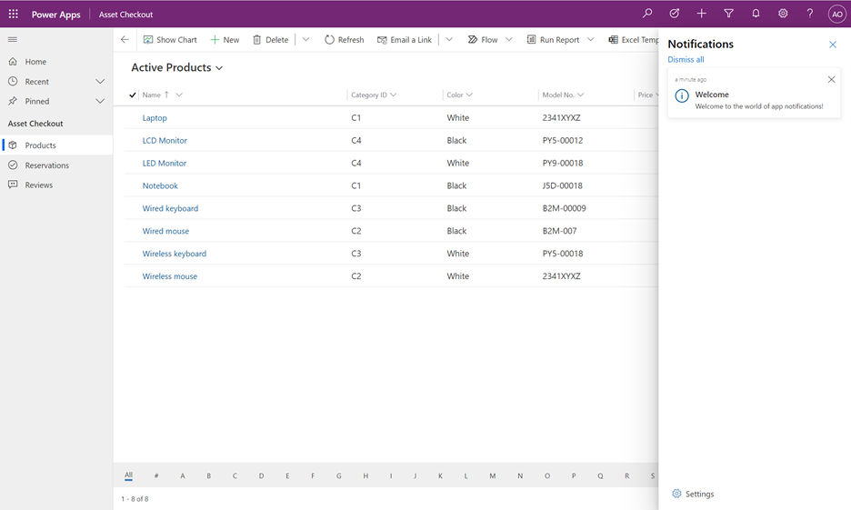

# Preview: How notifications work in model-driven apps 

[!INCLUDE [cc-beta-prerelease-disclaimer](../includes/cc-beta-prerelease-disclaimer.md)]

App notifications use the notification table to store notifications for each user. Your model-driven app will automatically check the system for new notifications and display them in the notification center. The notification sender or your system administrator can indicate if a toast is shown and how it can be dismissed. Notifications appear in notification center until you dismiss them or until they expire. By default, notification expire after 14 days but your administrator can override this time.

 > [!div class="mx-imgBorder"] 
 >   

> [!IMPORTANT]
> - This is a preview feature, and isn't available in all regions. Your administrator needs to enable [early access](/power-platform/admin/opt-in-early-access-updates) to use the new app notifications feature.
> - [!INCLUDE[cc_preview_features_definition](../includes/cc-preview-features-definition.md)]

## Toast notifications

1. To enable or disable toast notifications, in the notication pane, select to the **Settings** 

 > [!div class="mx-imgBorder"] 
 >   

2. To one of the following:

    - **To enable toast notifcations**: Move the toggle to **On** and then enter how many seconds the the toast will appear for. 
    - **To disable toast noficatoin**: Move the toggle to **Off**.
       > [!div class="mx-imgBorder"] 
       >   
   
   

## Notification center

You can access the notification center by selecting the bell icon in the app header. To dismiss and delete a notification select the close (**X**) button.

## See also

[Send in-app notifications-TBD](../maker/model-driven-apps/send-in-app-notifications.md)
