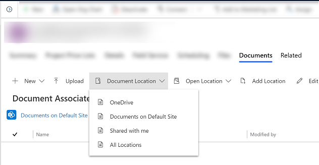

# Use OneDrive for Business 

Create and manage private documents from within Microsoft Dataverse apps by using OneDrive for Business. More information:  [What is OneDrive for Business?](https://support.office.com/article/What-is-OneDrive-for-Business-187f90af-056f-47c0-9656-cc0ddca7fdc2)

Before you can use OneDrive for Business, it must be enabled by your system administrator. More information:

-   [Find your administrator or support person](find-admin.md)  

-   [Enable OneDrive for Business](/power-platform/admin/enable-onedrive-for-business)  

## The first time you view your documents  

1. Open a row and go to the **Document Associated Grid** view. For example, open a contact row.

2.  On the open row, select the **Related** tab, and then select **Documents**.

     > [!div class="mx-imgBorder"]
     > 

3.  Select **Document Location** > **OneDrive**.

     > [!div class="mx-imgBorder"]
     > 

4. After OneDrive for Business is enabled, you'll see the following dialog box when you go to the **Documents** tab to view documents in Dataverse and upload a file to OneDrive, or when you attempt to create a new document or folder.  

    > [!div class="mx-imgBorder"]
    >   

5. Select **Change folder location** to pick a new location to store OneDrive documents, or select **Continue** to accept the default folder location.

  
## View existing OneDrive documents 
 
1. Open a row and go to the **Document Associated Grid** view. For example, open a contact row.

2. On the open row, select the **Related** tab, and then select **Documents**.
 
    > [!div class="mx-imgBorder"]
    > 
 
3. Select **Document Location** to filter the document list.

    > [!div class="mx-imgBorder"]
    > 

4.  Select a location as described in the following table.  

   |    Document Location      |  Description                                   |
   |---------------------------|------------------------------------------------|
   |      OneDrive             | Documents stored in OneDrive for Business      |
   | Documents on Default Site | Documents stored in your default SharePoint site  |
   | Shared with me            | Documents that others shared with you that are associated with this row<!--note from editor: Edit okay? I haven't seen an "app row" defined.-->    |
   |  All Locations            |     All document locations associated with this row     |

5. After you select a location, you'll see the documents saved in that location.

## Create a new document and save it to OneDrive

1. Open a row and go to the **Document Associated Grid** view. For example, open a contact row.

2. On the open row, select the **Related** tab, and then select **Documents**.
 
    > [!div class="mx-imgBorder"]
    > 

2. Select **Document Location**, and change the location to **OneDrive**.

3. Select **New**, and then choose a document type such as PowerPoint or Word. 

    > [!div class="mx-imgBorder"]
    > 

4. Enter a document name, and then select **Save**.  

## Things to consider 

Be aware of the following regarding OneDrive for Business in Dataverse:

- OneDrive storage folders are created in the user's current Dataverse language. If the language changes, new folders will be created in the new language. Old folders will remain in the previous language.  

- There might be a delay between when the documents are shared in OneDrive and when they're available to other users. 

[!INCLUDE[footer-include](../includes/footer-banner.md)]