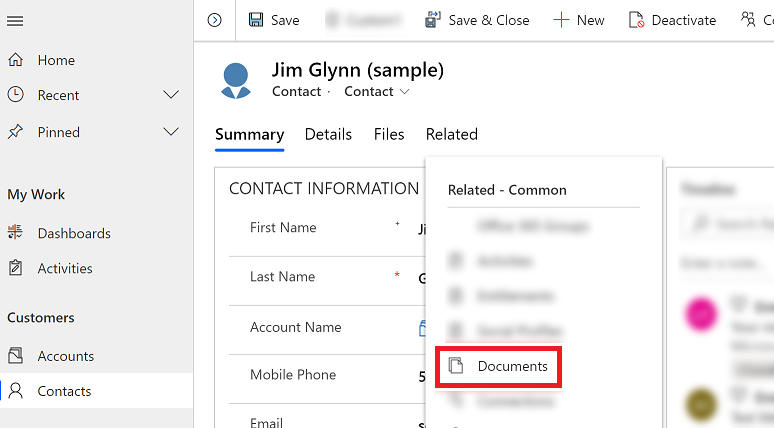
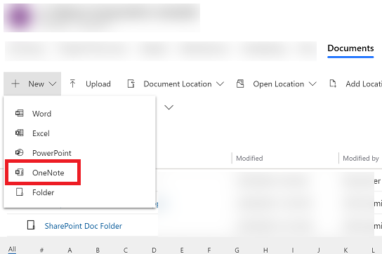
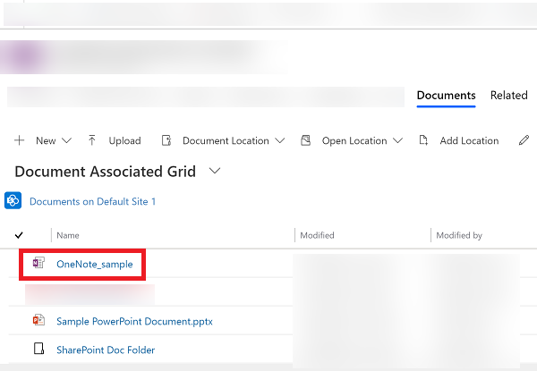

# Take notes by using OneNote 

Use OneNote to take or review notes, ideas, plans, and research from the **Document Associated Grid** view of a row in Microsoft Dataverse.

Before you can use OneNote, it must be enabled by your system administrator. More information:

-   [Find your administrator or support person](find-admin.md)  

-   [Set up OneNote integration](/power-platform/admin/set-up-onenote-integration-in-dynamics-365)  

## Start a new OneNote notebook

1. Open a row and go to the **Document Associated Grid** view. For example, open a contact row.

2. On the open row, select the **Related** tab, and then select **Documents**.
 
    > [!div class="mx-imgBorder"]
    > 

3. Select **Document Location**, and select the location where you want to save the notebook. For more information, see [View existing OneDrive documents](one-drive.md#view-existing-onedrive-documents).

4. Select **New**, and then select **OneNote**. 

    > [!div class="mx-imgBorder"]
    > 

5. Enter a name for the notebook, and then select **Save**. A new notebook is created and opened.

## Open an existing OneNote notebook

1. Open a row and go to the **Document Associated Grid** view. For example, open a contact row.

2. On the open row, select the **Related** tab, and then select **Documents**.
 
    > [!div class="mx-imgBorder"]
    > 

3. Select **Document Location**, and select the location of your notebook. For example, choose **OneDrive** if your notebook is stored on OneDrive. More information: [View existing OneDrive documents](one-drive.md#view-existing-onedrive-documents)

4. Select your notebook to start adding notes.
 
    > [!div class="mx-imgBorder"]
    > 

[!INCLUDE[footer-include](../includes/footer-banner.md)]