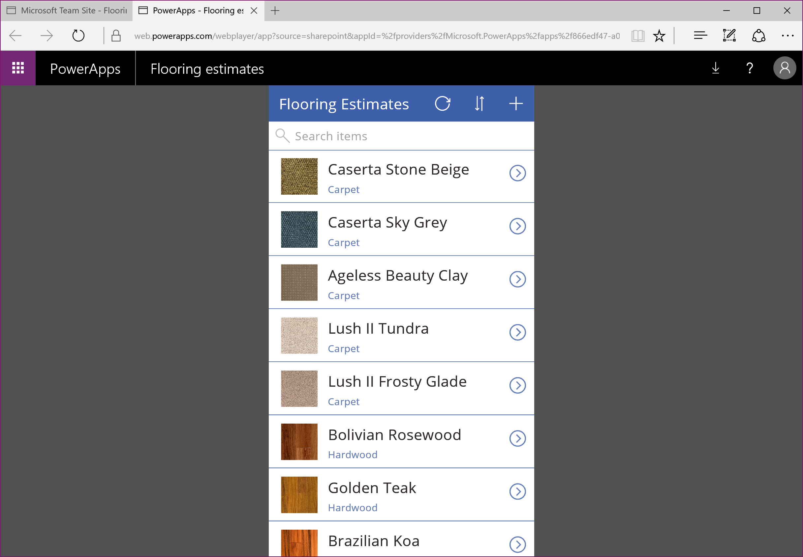
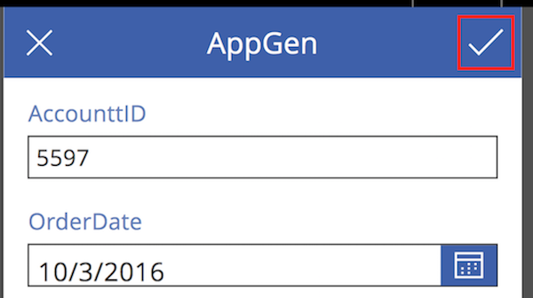
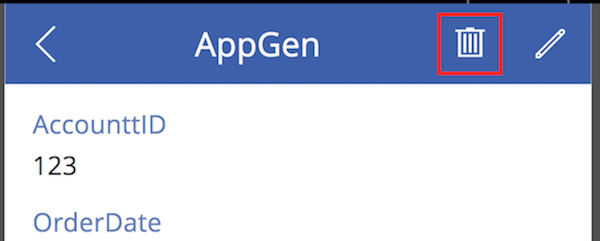

# Open app from a SharePoint Online list
You can open an existing app inside SharePoint Online and manage a list.

For information about what types of SharePoint data PowerApps supports, see [Known issues](../maker/canvas-apps/connections/connection-sharepoint-online.md#known-issues).

## Prerequisites
[Create an app in the SharePoint interface](../maker/canvas-apps/generate-app-from-sharepoint-list-interface.md).

## Open the app
1. Open your SharePoint Online list, and select an app from the list.
   
    
2. Click or tap **Open**.
   
    
   
    The app opens in a separate browser tab.
   
    

## Manage the list using the app
> [!NOTE]
> This topic describes how to open and run an app that is automatically generated from a SharePoint list. The more common scenario is where the generated app has been extensively customized to meet your organization's needs. In this case, usage may be more complex than what is described here.
> 
> 

1. Open the app as the previous procedure describes.
2. To add an item to the list, click or tap the "+" sign.
   
    
3. A form appears where you can enter values in the fields of the list. When done, click or tap the check mark.
   
    
4. To view details for an item, click or tap the arrow.
   
    
5. To edit the item, on the form that appears, click or tap the "pencil".
   
    
6. Make your changes, then click or tap the check mark.
   
    
7. To delete an item, from the detail view screen, click or tap the trash can.
   
    

