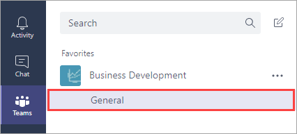
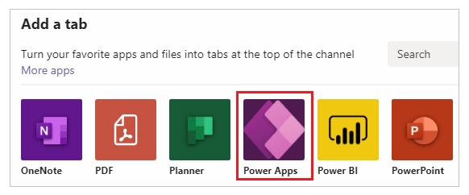
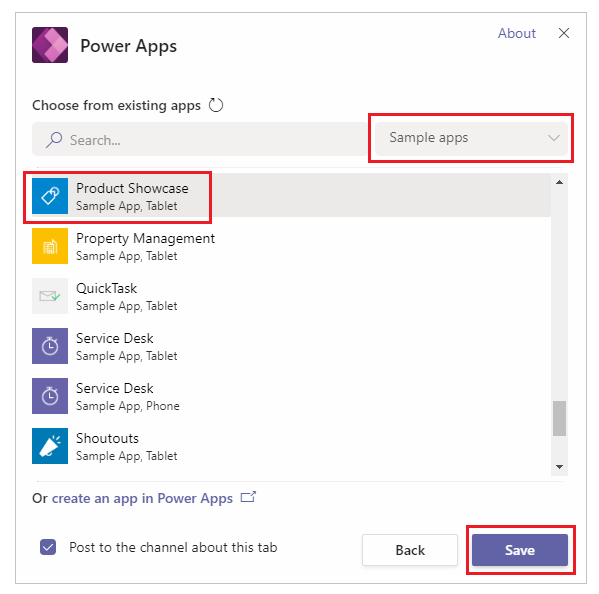

# Add an app to Microsoft Teams

Microsoft Teams is a chat-based collaboration platform built on Office 365 technologies. You can customize the Teams experience by adding PowerApps canvas apps to your channels in Teams. In this topic, you learn how to add the Product Showcase sample app to a Teams channel, and then open the app from that channel. 

If you're not signed up for PowerApps, [sign up for free](https://web.powerapps.com/signup?redirect=marketing&email=) before you begin.

## Prerequisites

To follow this procedure, you need an [Office 365 subscription](https://signup.microsoft.com/Signup?OfferId=467eab54-127b-42d3-b046-3844b860bebf&dl=O365_BUSINESS_PREMIUM&ali=1) and a [channel in Teams](https://www.youtube.com/watch?v=he2f1quaR7M).

## Sign in to PowerApps

Sign into PowerApps at [https://web.powerapps.com]([https://web.powerapps.com).

## Add an app

1. In Microsoft Teams, select a team, and a channel under that team. In this example, it's the **General** channel under the **Business Development** team.

    

2. Choose **+** to add a tab.

    

3. In the **Add a tab** dialog box, choose **PowerApps**.

    

4. Choose **Sample apps** > **Product Showcase** > **Save**.

    

    The app is now available to use in the channel.

    

> [!NOTE]
> You must [share](../maker/canvas-apps/share-app.md) your own apps before you add them to Teams (sample apps are shared by default).

## Open an app

1. In Microsoft Teams, choose the team and the channel that contains the app.

    

2. Choose the **Product Showcase** tab.

    

    The app opens in the channel.

    

## Known issues

In the desktop app for Microsoft Teams:

* Apps must load content such as images and .pdf files over a secure (https) connection.
* Not all sensors, such as **Acceleration**, **Compass**, and **Location**, are supported.
* Only these audio formats are supported: AAC, H264, OGG Vorbis, and WAV.

## Clean up resources

To remove the app from the channel, choose the **Product Showcase** tab > **Remove**.

## Next steps

In this topic, you added the Product Showcase sample app to a Teams channel, and then opened the app from that channel. To learn more about PowerApps, continue to the PowerApps tutorials.

> [!div class="nextstepaction"]
> [PowerApps Tutorials](../maker/canvas-apps/get-started-create-from-blank.md)
