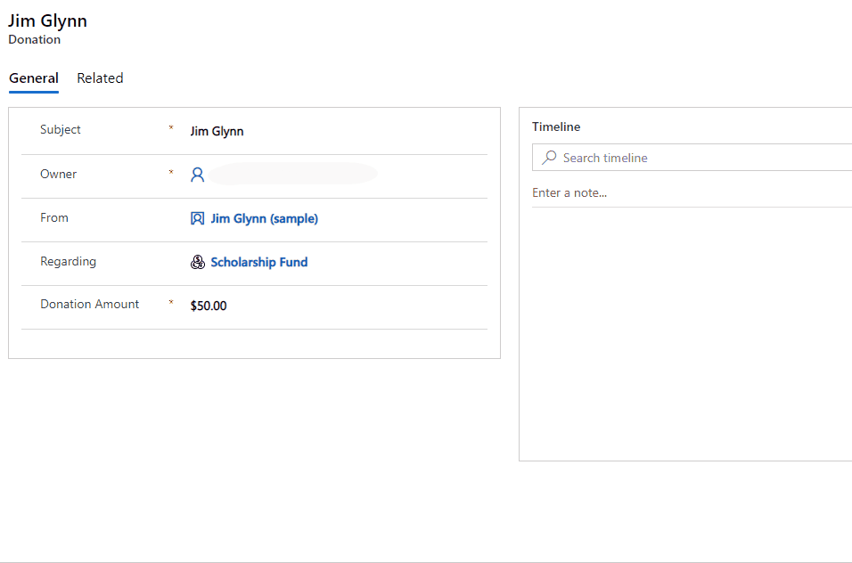

# View the profile card for a contact or user

When you select someone's name or picture in Outlook or other Office apps, you can find information related to them on their profile card. The profile card is also sometimes referred to as contact card or people card. In model-driven Power Apps, profile cards can be seen on contact and user records. You can only view them when they are in a lookup.

For more information about profile cards, see [Profile cards in Office 365](https://support.office.com/article/Profile-cards-in-Office-365-e80f931f-5fc4-4a59-ba6e-c1e35a85b501).

> [!NOTE]
>  - Profile cards are available on contacts and users in any Unified Interface app. For information, see [Enable viewing profile cards (for admins)](https://docs.microsoft.com/en-us/power-platform/admin/enable-profile-card).
>  - The profile card in Common Data Service is not displayed if multi-factor authentication is turned on for Office Delve service in Azure Active Directory.

## View a contact's profile

1.	Open a record and go a look up field for a contact or owner.
2.	Hover over the user name to view the prfile card.

    > [!div class="mx-imgBorder"] 
    > 

 ## FAQs
 
### Where can I see profile cards in Dynamics 365?
Profile cards can be seen on contact and user records. You can only view them when they are in a lookup.

### Where is information shown in the profile card coming from?
The information shown on the contact profile card is fetched from Common Data Service (and not Microsoft Exchange). 

The information shown on the user profile card is fetched from Office 365 (Azure Active Directory). For more information, see [Profile cards in Office 365 (admin section)](https://support.office.com/article/Profile-cards-in-Office-365-e80f931f-5fc4-4a59-ba6e-c1e35a85b501).

### How can I customize the fields shown on the profile card?
Currently, the list of fields displayed on the profile card are not open for customization.

### Why is the **Start chat** option on the profile card disabled (greyed out)?
The **Start chat** and the **Send Email** options on the profile card will open your default instant message and email apps. The **Start chat** option is enabled if the person you are trying to contact in the same Azure Active Directory environment as you or is a federated contact.

  
