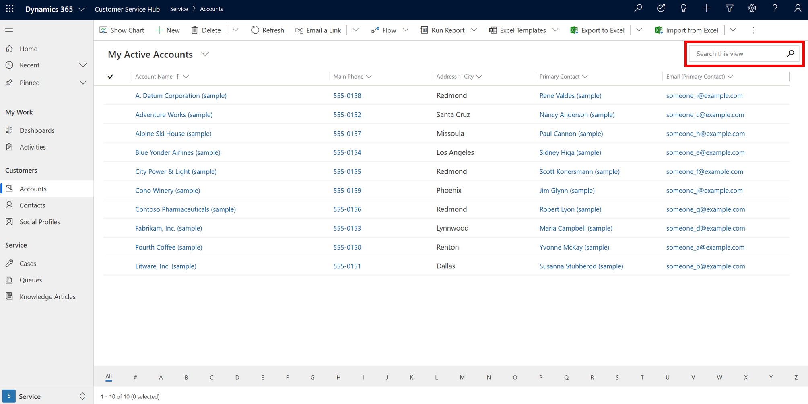

# Using Quick Find to search for records

## Single-entity Quick Find

Single-entity Quick Find is used to find records of one type only. This search option can be accessed from within a view:

   > [!div class="mx-imgBorder"]
   >  

## Multi-entity Quick Find (Categorized Search)

Multi-entity Quick Find is also known as Categorized Search. To start a Categorized Search:

1.  From the top nav bar, select the **Search** button.  

     > [!div class="mx-imgBorder"]
     >    
  
2.  Type your search words in the search box and then select **Search** button. Categorized Search returns results grouped by entity types, such as accounts or contacts.

     > [!div class="mx-imgBorder"]
     >  

With Categorized Search, you can search for records that begin with a specific word or use a wildcard.
  
- **Begins with**: Results include records that begin with a specific word. For example, if you want to search for “Alpine Ski House,” type **alp** in the search box; if you type **ski**, the record won’t show up.  
  
- **Wildcard**: For example, *ski or *ski\*. 

  > [!NOTE]
  >  Using a wildcard at the beginning of your Quick Find (single or multi-entity) search query may result in slower performance.
  
## Filter Categorized Search results 
  
-   To filter results by one record type, on the search screen, choose a record type from the **Filter with:** drop-down box.  
  
-   To search against all record types, choose **None** in the **Filter with:** drop-down box.  

    > [!div class="mx-imgBorder"]
    >   
