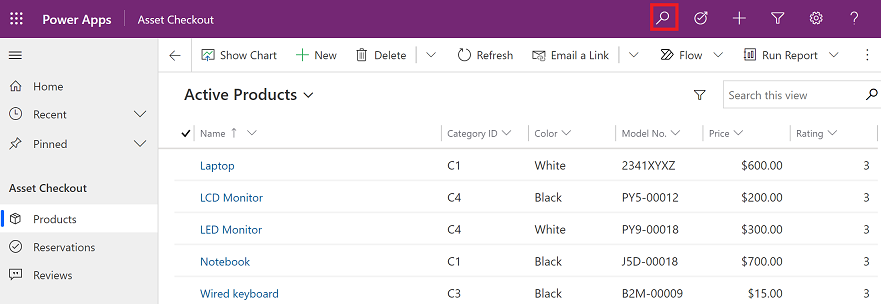

# Use quick find search 

Quickly search across multiple tables at the same time and find the information that you're looking for. When you enter a search term the system finds matches to all words in the search term in one column within a table. The words can be matched in any order in the column.

With categorized search, you can search for rows that begin with a specific word or use a wildcard character.
  
- **Begins with**: Results include rows that begin with a specific word. For example, if you want to search for "Alpine Ski House," type **alp** in the search box; if you type **ski**, the row won't show up.  
  
- **Wildcard**: For example, *ski or *ski\*. 

  > [!NOTE]
  >  Using a wildcard at the beginning of your quick find (single or multiple-table) search query might result in slower performance.

## Single table quick find 

*Single table quick find* is aslo called *grid search*. For more information, see [Grid search](grid-filters.md#grid-search).

## Multiple-table quick find (categorized search)

Multiple-table quick find searches up to 10 tables and returns the search results grouped by table.

You can view a maximum of 80 rows per table with multiple-table quick find. You may need to refine your query, if the row that you're looking for is outside the maximum range.

1.  To start a categorized search, on the command bar, select **Search**.  

     > [!div class="mx-imgBorder"]
     > 
  
2.  Type your search words in the search box, and then select **Search**. The search results are grouped by table such as Products, Reservations, and Reviews.

     > [!div class="mx-imgBorder"]
     >  

 3. Select a table from the **Filter with** list to filter results by table type. To search across all tables, select **None**.
 
    > [!div class="mx-imgBorder"]
    >   

  

[!INCLUDE[footer-include](../includes/footer-banner.md)]
