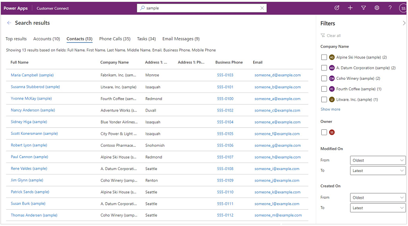

# Frequently asked questions about relevance search

## What is the scope of content searched by relevance search?

The scope of content that's searched is defined by your administrator. An administrator can configure the tables, and specific columns in the tables, that can be searched. The specific columns that were searched for a table are indicated on the results page on each tab.

 

## Why am I not seeing search results from a table that is enabled for relevance search?

This happens when the table is not part of the model-driven app. Use the Power Apps app designer to verify that the table is included in tha app's components. For more information see, [Add or edit model-driven app components](../maker/model-driven-apps/add-edit-app-components.md#add-a-component).

## Can I configure quick actions to show or hide certain commands?
Yes, you can with version 9.2.21034.00126 or later. Quick actions are a subset of a table's grid-level command set. They can be configured using ribbon rules
For more information on how to configure quick actions, see [Configure Relevance Search to improve search results and performance](/power-platform/admin/configure-relevance-search-organization#configure-quick-actions).

## Why are results that appear in suggestions sometimes not seen on the results page?

Suggestions are quick results based on a search performed on the primary column of a table. This is enabled for relevance search in model-driven apps. More information: [Inline suggestions](relevance-search.md#inline-suggestions)

When you navigate to the results page, the search terms are treated as the complete search query and a lot more types of matching are performed to display a more comprehensive set of results.

## Can I see search results from SharePoint files and documents through relevance search?

Currently, relevance search searches your data in Microsoft Dataverse only. SharePoint files and documents, including the names of the files and the content in the files, aren't searched. Objects of **File** data type in Dataverse are also not searched on.

## Why am I unable to view information for party list fields like To, From, and CC in full results?

Party list fields are special fields that aren't searchable or viewable in the results page. 

### See also

[What is relevance search?](relevance-search-benefits.md) 
[Search for tables and rows using relevance search](relevance-search.md) 
[Configure facets and filters](facets-and-filters.md)

[!INCLUDE[footer-include](../includes/footer-banner.md)]

