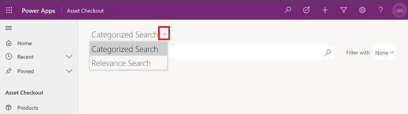
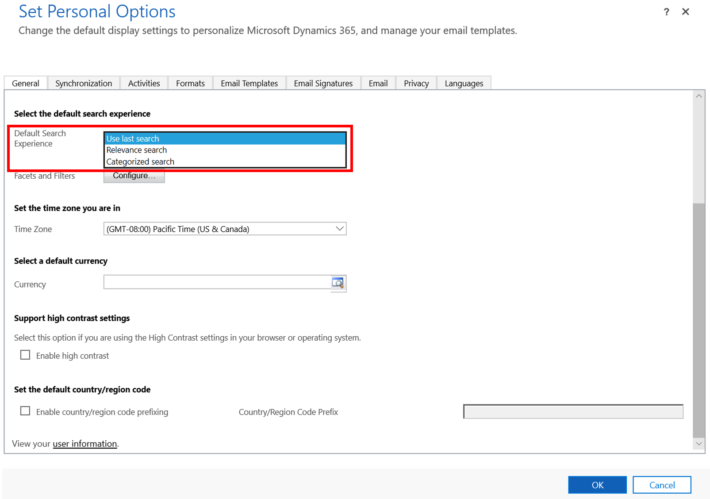
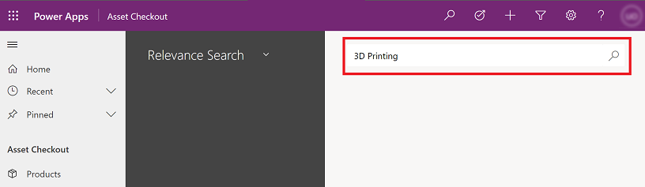
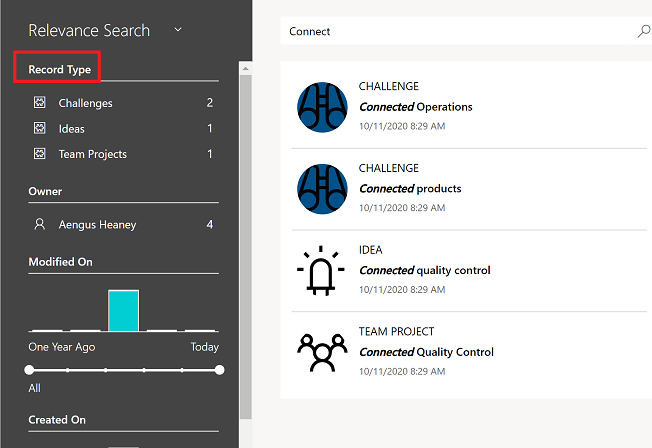
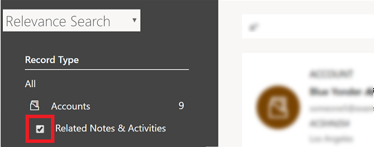
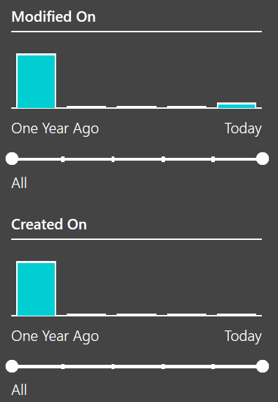

# Using Relevance Search to search for records

## What is Relevance Search?

Relevance Search delivers fast and comprehensive results across multiple entities, in a single list, sorted by relevance. It uses a dedicated search service external to Common Data Service (powered by [!INCLUDE[pn_Windows_Azure](../includes/pn-windows-azure.md)]) to boost search performance. 
  
Relevance Search brings the following enhancements and benefits:  
  
- Improves performance with external indexing and [!INCLUDE[pn_azure_shortest](../includes/pn-azure-shortest.md)] search technology.  
  
- Finds matches to any word in the search term in any field in the entity, compared to Quick Find where all words from the search term must be found in one field. 

- Matches can include inflectional words like **stream**, **streaming**, or **streamed**.  
  
- Returns results from all searchable entities in a single list sorted by relevance, so the better the match, the higher it appears in the results. A match has a higher relevancy if more words from the search term are found in close proximity to each other. The smaller the amount of text where the search words are found, the higher the relevancy. For example, if you find the search words in a company name and address, it might be a better match than the same words found in a large article, far apart from each other.   
  
- Highlights matches in the result list. When a search term matches a term in a record, the term appears as bold and italicized text in your search results. 

    > [!NOTE]
    > - Certain words that are extremely commonly used in a language (like **the** or **a**) are ignored while searching since they do not help uniquely identify records. Since they are ignored while searching, these words are also not highlighted in results.
    > - Highlighted terms are often returned as a portion of the full value in a field because only the matched terms are highlighted.  

- You'll find search results for text in a document that is stored in Common Data Service, including text in notes, email attachments, or appointments. The following file formats are supported for search: PDF, Microsoft Office documents, HTML, XML, ZIP, EML, plain text, and JSON.  
  
- You can search for records that are shared with you and records that you own.  
  
  > [!NOTE]
  >  Hierarchical security models aren't supported.  Even if you see a row in Common Data Service because you have access to it through hierarchical security, you won't see the result in Relevance Search.  
  
- You can also search for option sets and lookups. For example, let's say you want to find a retail store account that has **Pharmaceuticals** in the name. When you search for **Pharmaceutical Retail**, you'll find the result because there's a match to the Industry field, which is a searchable option set.

  > [!NOTE]
  > - Relevance search is text-based, and can search only on fields of type Single Line of Text, Multiple Lines of Text, Option Sets, or Lookups. It doesn't support searching in fields of Numeric or Date data type. 
  
- Use syntax in your search term to get the results you want. For example, type **car silver 2-door** to include matches for any word in the search term in the search results. Type **car+silver+2-door** to find only matches that include all three words. Type **car&#124;silver&#124;2-door** to  get results that contain **car** or **silver** or **2-door**, or all three words. More information about syntax you can use in your search queries: [Simple query syntax in Azure Search](https://docs.microsoft.com/rest/api/searchservice/simple-query-syntax-in-azure-search)
  
  > [!NOTE]
  > Relevance Search is configured to require matches to any (instead of all) of the criteria in a query, which may result in results different from your expectations. This is especially true when boolean operators are included in the query.

## Enabling Relevance Search

Relevance Search is disabled by default. Your administrator needs to enable it for the organization, thus allowing all users in the organization to use it. After Relevance Search is enabled, you might have to wait up to an hour or more, depending on the size of your organization, before you start seeing Relevance Search results for your apps. Smaller changes in indexed data can take up to 15 minutes to show up in your system.

## Switch between Relevance and Categorized search

If your organization has turned on both search options (Relevance and Categorized search), then you can switch between the two.

1. To switch between search types, on the navigation bar, select the **Search** button.

2. On the left, select the drop-down menu to switch between **Relevance Search** or **Categorized Search**.

   > [!div class="mx-imgBorder"]
   >  
    
## Set a default search experience

If your organization has turned on both search options then you can select a default search experience in your personal settings.

1. In the upper-right corner of the page, select **Settings** and then select **Personalization Settings**.  
  
   > [!div class="mx-imgBorder"]
   >   

2. On the **General** tab, in the **Select the default search experience** section, for the **Default Search Experience**, select your default experience. 

   > [!div class="mx-imgBorder"]
   >   

## Start a search 
 
1.  From the top nav bar, select the **Search** button.  

    > [!div class="mx-imgBorder"]
    >  
  
2.  Type your search words in the search box and then select **Search** button.   

    > [!div class="mx-imgBorder"]
    >    

## Filter records with facets  
With Common Data Service, you can now refine your search results by using facets and filters. Facets and filters let you drill into and explore the results of your current search without having to repeatedly refine your search term. 

Facets are available in the left pane. Immediately after you perform a search, the following global facets are available for four common fields:  
  
-   Record Type  
  
-   Owner  
  
-   Created On  
  
-   Modified On  
  
### Record Type facets  
To narrow your search results to a specific entity, select the entity under the **Record Type** section.  
 
  > [!div class="mx-imgBorder"]
  >   
  
When you filter on a specific record type, you can include activities and notes that are related to the selected record in your search results. To do that, select the **Related Notes & Activities** check box. The activities and notes will appear in top-level results.
 
  > [!div class="mx-imgBorder"]
  >   
  
Search results that are found in email attachments or appointment entities are shown in the search results under their parent record, either Email or Appointment.  
  
When you refine by record type, the facet scope switches to the selected entity, and up to four facets that are specific to the entity are shown. For example, if you select the Account entity, you'll see the **Primary Contact** facet in addition to the global facets.  
  
In the **Set Personal Options** dialog box, you can also choose other facets from the ones that your system administrator or customer has made available to you. The user setting overrides the default setting. [!INCLUDE[proc_more_information](../includes/proc-more-information.md)] [Configure facets and filters for the search](#BKMK_ConfigureFacets)  
  
### Text-based facets  
All lookups, option sets, and record types are text-based facets. For example, the text-based facet Owner consists of a list of field values and their corresponding counts.  
 
  > [!div class="mx-imgBorder"]
  >   
  
Filters in these facets are sorted in descending order by count. The top four facet values are displayed by default. When there are more than four facet values, you'll see a **SHOW MORE** link that you can select to expand the list and see up to 15 top facet values. Select each value to filter the search results to show only records where the field has the value you've selected. For example, if you select **Kim Abercrombie**, the search results will show all records where the owner is Kim Abercrombie. When you select a Lookup or Option Set facet value, search results are filtered to only include records with the value that you specified.  
  
### Date and Time facets  
Like other facets, you can use date and time facets to filter and see search results for a specific time. To select a range of values, drag the slider or select one of the vertical columns.  
 
  > [!div class="mx-imgBorder"]
  >   

## Configure facets and filters    
  
> [!NOTE]
>  The system customizer can set the default experience for all entities, but you can configure your own facets and filters.  
  
1. In the upper-right corner of the page, select **Settings** and then select **Personalization Settings**.  
  
   > [!div class="mx-imgBorder"]
   >     
  
2. On the **General** tab, in the **Select the default search experience** section, for the **Facets and Filters** field, select **Configure**.  

   > [!div class="mx-imgBorder"]
   >   
  
3. In the **Configure Facets and Filters** dialog box, specify the facets you'd like to see for an entity. Your system administrator or customizer can set a default experience for all entities, but you can set your own here.  
  
   - In the **Select Entity** drop-down list, select an entity you want to configure facets for. This drop-down list contains only the entities that are enabled for Relevance Search.  
  
   - For the selected entity, select up to four facet fields. By default, the first four facetable fields in the **Quick Find** view for the selected entity are selected in the list. At any time, you can only have four fields selected as facets.  
  
   You can update multiple entities at one time. When you select **OK**, the changes for all entities that you've configured are saved. To revert to the default behavior for an entity that you previously configured, select **Default**.  
  
   > [!NOTE]
   > - If a system customizer deletes a field or makes it no longer searchable, and you've saved a facet for that field, it will no longer show up as a facet.  
   >   -   You'll only see the fields that exist in the default solution and that are configured as searchable by your system customizer.  
