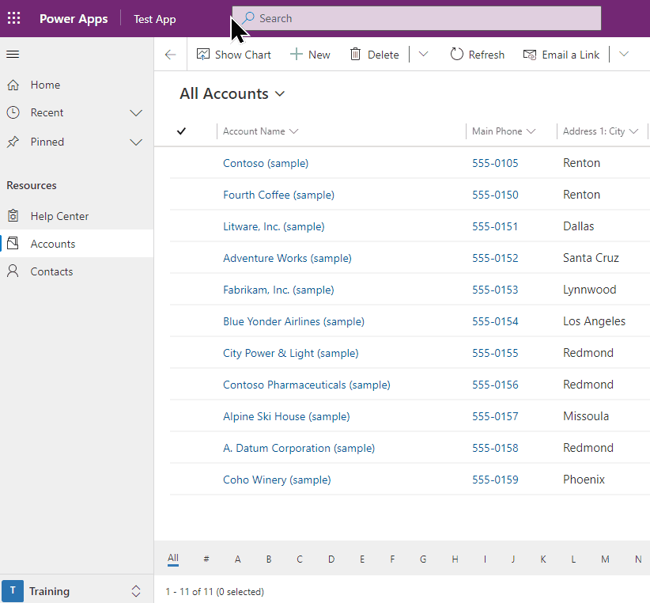
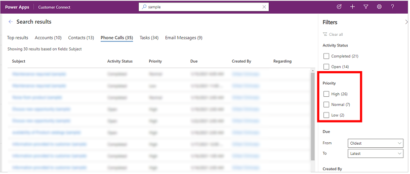
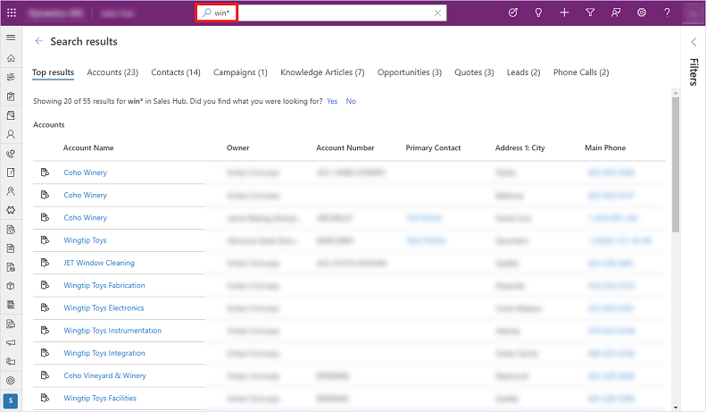

# Search for tables and rows by using relevance search

[!INCLUDE[cc-data-platform-banner](../includes/cc-data-platform-banner.md)]

With relevance search, the search box is always available at the top of every page in your app. You can start a new search and quickly find the information that you're looking for. 

When relevance search is turned on, it's your default and only global search experience for all your apps. You won't be able to switch to [quick find search also known as categorized search](quick-find.md).

> [!div class="mx-imgBorder"]
> 

## See recent rows and searches

See your recent searches and recently accessed rows when you select the search box. Before you start typing in the search box, you'll see information pop-up that helps you complete your search.

Up to three recent search terms appear at the top, based on the last three search queries that you viewed the results for. These recent search terms are personalized and based on your device and browser.

The recent search terms are followed by up to seven of the rows you recently accessed. If you frequently access a small number of rows, you can quickly get to them from here. Recently accessed rows are independent of tables that have been indexed for relevance search, because no search has been performed yet. The rows are also grouped by table type, which lets you quickly scan the list.

> [!div class="mx-imgBorder"]
>  

Legend

1. **Recent searches**: Shows your recent searches.
2. **Recently accessed rows**: Shows rows that you recently accessed, grouped by table type.

## Inline suggestions

As you start entering text, you'll see suggested results that help minimize keystrokes and simplify page navigation. Suggested results are based on a search performed on the primary column of a table, which is enabled for relevance search and included in your model-driven app. For more information, see [Add or edit model-driven app components in the Power Apps app designer](../maker/model-driven-apps/add-edit-app-components.md#add-a-component).

Suggestions are shown when three or more characters are entered in the search box, and are based on two types of matching:

- **Word completion**: Rows where the primary field contains a word that begins with the search term. For example, entering **work** will show the account **AdventureWorks** and the contact **John Worker**, among other results.

- **Fuzzy search**: Terms that are misspelled by one character are matched. For example, entering **winry** will show the account **Coho Winery**, among other results. 

Suggested rows show a secondary field in addition to the primary field. This helps you differentiate between rows that have the same primary field value. The secondary field is chosen based on the table’s quick find view. It is always the first non-primary field on the table’s quick find view that contains data for the row.

With suggestions, you can access your information quickly by using minimal keystrokes even when the search term is misspelled by a character. Text that's highlighted in bold in the suggestions shows the term that was matched.

## Search results page

View the full results for a search by pressing **Enter** on your keyboard or selecting **Show more results**.

Search results are ranked based on relevance and grouped by tables. The list of tables that include rows that match the search term are displayed horizontally as tabs along the top of the screen.

### Top results tab

The **Top results** tab displays the top 20 results for the search term, with results grouped by table type. Each group shows results for a table in a grid that has up to six columns. The columns are the first six columns of the table's **View columns** quick find view.

> [!NOTE]
> - The primary column of a table is always used as the first column in the results on the **Top results** tab.
> - For notes and attachment tables, two additional columns show information about the related row for that note or attachment.
> - Party list columns on activity tables&mdash;such as **To**, **CC**, and attendees&mdash;can't be searched on or shown, and will be blank.

In the following image, the top search results from three tables are displayed.

Legend:

 1. **Top results**:  This tab shows the top 20 results for your search term.
 2. **Rows grouped by table type**: To narrow your search results to a specific table, select the table-specific tab.
 3. **Show more**: When you select **Show more** at the bottom of a group, you switch to the table-specific tab.

### Table-specific tabs

Tabs for the specific tables that contain search results are displayed horizontally. The exact order of the tables from left to right (in a left-to-right environment) is based on the relevance of the results. You can collapse the filter panel or hover over the list of tabs to scroll horizontally.

The tables that include the rows in the top 20 results are shown in the first three tabs from left to right, from most to least relevant. The tables that include the results outside of the top 20 are displayed in descending order.

Legend:

 Shows the top 20 results from three different tables. 

 Shows the three tables that are part of the top results, ordered by relevance.

 Shows the rest of the matched table types, ordered by the number of records that match the search.

Select a tab to drill down into a specific table and view more information about the rows in the results.

, number 2 is a list of fields the results were based on")

Legend:

1. Shows the number of results for this specific table.
2. Shows the columns that were searched for the table.

Each table-specific tab displays more information than the **Top results** tab along two different dimensions:

- If the quick find view for the table has more than six **View Column**, then all columns are displayed on the table-specific tab, compared to the maximum of six columns shown on the **Top results** tab.
- All matching rows for the table are accessible in the table-specific tab as an infinitely scrollable list.

## Filter results by using facets

On the search results page, you can use facets and filters to refine and explore your search results. Facets are available on the **Filter** panel, which you can expand or collapse.

The **Top results** tab shows search results across different row types, such as a contact versus a phone call. Thus, the **Top results** tab only shows the three global facets that apply to all row types:

- Owner
- Modified On
- Created On

On a table-specific tab, facets that apply to that table type are displayed above the three global facets.

| The Top results tab shows only global facets  | Other tabs show facets that are specific to that table type |
|---------|---------|
|      |       |

You can personalize facets for a table by using the **Set Personal Options** dialog box. More information: [Configure facets and filters](facets-and-filters.md)

### Text-based facets with discrete values

All **Lookup** and **Choice** data types are text-based facets. For example, the text-based facet **Priority** consists of a list of column values (choices) and their corresponding counts.

 

Filters in these facets are sorted in descending order by count. By default, the top four facet values are displayed. When there are more than four facet values, you can select **Show more** to expand the list and see up to 15 results. 

When you select a facet value, you filter search results to show only rows where the column includes the value that you selected.

### Date and time facets

The date and time facets let you filter and see search results for a specific period. Use the **From** and **To** drop-down lists to specify a time period.

 

## Feedback link

On the search results page, the answer to **Did you find what you were looking for?** is collected in our product telemetry as a binary feedback. Search parameters&mdash;like the query text that you entered in the search box&mdash;isn't collected, irrespective of your response to the question. We only use **Yes** or **No** response statistics to help us understand the usefulness of the search experience. 

Currently there is no option to disable the feedback question prompt.

> [!div class="mx-imgBorder"]
>   

## Understand search results

Relevance search has a powerful set of capabilities to help you put Microsoft Dataverse at your fingertips. Here are some pointers to help you understand what results you can expect in different scenarios.

> [!NOTE]
> - Relevance search is text-based, and can search only on columns of type **Single line of text**, **Multiple lines of text**, **Choice**, or **Lookup**. Columns of type **Numeric**, **Date**, and **File** aren't searched on.
> - Relevance search enables you to search for rows that are shared with you and rows that you own. Hierarchical security models aren't supported. This means that even if you see a row in Dataverse because you have access to it through hierarchical security, you won't see that row matched by relevance search unless you own it or it was shared with you.

- **Boosted search results**  
  Use important attributes as keywords to "boost" your search for information. Entering a table type to boost search results is an easy way to indicate which results you prefer. For example, searching for **Susan Adatum** indicates that you're looking for a contact **Susan** related to the account **Adatum**.

- **Natural language understanding**   
  Search<!--note from editor: Should this be "relevance search" or "intelligent search"?--> has a better understanding of terms that are used to indicated intent. Some examples include:
  - Searching for **open phone calls** will show phone call activity records that have the status **open**.
  - Searching for **contact missing email** will show contacts who have an empty email address field, rather than treating **missing** as a keyword.

- **Spelling correction**  
   Search forgives common spelling mistakes. For example, when you search for **william conatc**, search results will include the contact record with the name **William**, even though the word **contact** was misspelled.

- **Synonyms, acronyms, and abbreviations**  
  With support for common abbreviations and synonyms, you can search for your information the way you remember it, not necessarily the way it's stored. Some examples include:
  - Common name variations like **Bob/Robert** are matched with either search term.
  - A search term that uses an abbreviation like **active accts** will be interpreted semantically as "active accounts."

- **The power of common knowledge**  
  Search can understand popular locations, date, time, holidays, and numbers. For example, a search for **account in WA** will generate results for accounts located in Washington state.

<!--
### Boosted search results

Use important attributes as keywords to "boost" your search for information. Entering a table type to boost search results is an easy way to indicate which results you prefer. For example, searching for **Susan Adatum** indicates that you're looking for a contact **Susan** related to the account **Adatum**.

### Natural language understanding

Search has a better understanding of terms that are used to indicated intent. Some examples include:

- Searching for **open phone calls** will show phone call activity records that have the status **open**.

- Searching for **contact missing email** will show contacts who have an empty email address field, rather than treating **missing** as a keyword.

### Spelling correction

Search forgives common spelling mistakes. For example, when you search for **william conatc**, search results will include the contact record with the name **William**, even though the word **contact** was misspelled.

### Synonyms, acronyms, and abbreviations

With support for common abbreviations and synonyms, you can search for your information the way you remember it, not necessarily the way it's stored. Some examples include:

- Common name variations like **Bob/Robert** are matched with either search term.

- A search term that uses an abbreviation like **active accts** will be interpreted semantically as "active accounts."

### The power of common knowledge

Search can understand popular locations, date, time, holidays, and numbers. For example, a search for **account in WA** will generate results for accounts located in Washington state.
-->
> [!NOTE]
> - All the preceding capabilities are part of intelligent search, which is only available for public cloud environments that have English as the base language.
> - To get these results, the preceding examples assume that specific fields for each table were indexed.

## Working with operators

Operators help you craft precise search queries that can tailor your results according to specific conditions. This section describes some of the supported operators.

### Boolean operators

Search on a combination of terms using the **+** operator, which performs an **AND** search and shows results containing all the individual terms separated by **+**.
For example, **alpine + paul** returns the contact record **Paul Cannon** related to the account record **Alpine Ski House**.

  

Similarly, the **OR** operator can be indicated by separating terms with a vertical bar (**|**). For example, searching for **alpine | paul** returns records with reference to either term.

  

Use the **NOT** operator with a hyphen (**-**) before a keyword to indicate that it should be excluded from results.<!--note from editor: I suggest using this term, otherwise, people might try to find a hyphen on the keyboard.-->

For example, when you search for **evaluation**, all rows matching the term **evaluation** will appear in results.

  

However, searching for **evaluation + -agreed** will match all rows that contain the term **evaluation** but not the term **agreed**.

  

### Wildcards

Use wildcards for operators such as **begins-with** and **ends-with**. Using an asterisk (\*) at the beginning or end of a keyword makes the asterisk a placeholder for zero or more characters. For example, searching on **\*win** will show results for all records associated with a keyword that ends with **win**.

  

### Exact matches

Use double quotation marks around a keyword to perform an exact match. Search ignores common used words such as **the**, **an**, and **a**. To improve matching, use double quotation marks and force an exact match for your search. For example, searching on **"Call back for resolution (sample)"** will match the exact keywords. 

  

## Quick actions

The relevance search experience brings some of the most frequently used actions closer to search results, to help you complete your task without having to navigate to the record page in model-driven apps.

Quick actions are small set of commands specific to a table. You can see quick actions when you're interacting with search in model-driven apps running on a web browser. Some of the commonly used tables are configured to show a set of commands to help you complete your task without losing context.

| Table  | Quick actions |
|---------|---------|
| Account     |     Assign, Share, Email a link  |
| Contact     |     Assign, Share, Email a link  |
| Appointment     |     Mark complete, Cancel, Set Regarding, Assign, Email a link  |
| Task     |     Mark complete, Cancel, Set Regarding, Assign, Email a link  |
| Phone Call     |     Mark complete, Cancel, Set Regarding, Assign, Email a link |
| Email     |     Cancel, Set Regarding, Email a link  |

For more information on how to configure quick actions, see [Configure Relevance Search to improve search results and performance](/power-platform/admin/configure-relevance-search-organization#configure-quick-actions).

### Quick actions and suggested results

As you interact with search, you'll find quick actions next to the most recently accessed records and the suggested results that appear as you type.

| Quick actions for recently accessed rows  | Quick actions for suggested results as you type |
|---------|---------|
|      |       |

### Quick actions in results pages

As you type, quick actions will appear for suggested results.

On the results page, hover over the results to see quick actions available for the row.

## Use keyboard shortcuts

The following keyboard shortcuts apply to grids. For more information, see:

- [Navigation](https://www.ag-grid.com/javascript-grid/keyboard-navigation/#navigation) 
- [Editing](https://www.ag-grid.com/javascript-grid/keyboard-navigation/#editing)
- [Selection](https://www.ag-grid.com/javascript-grid/keyboard-navigation/#selection)

### See also

[What is relevance search?](relevance-search-benefits.md) 
[Configure facets and filters](facets-and-filters.md) 
[Frequently asked questions about relevance search](relevance-faq.md)

[!INCLUDE[footer-include](../includes/footer-banner.md)]
