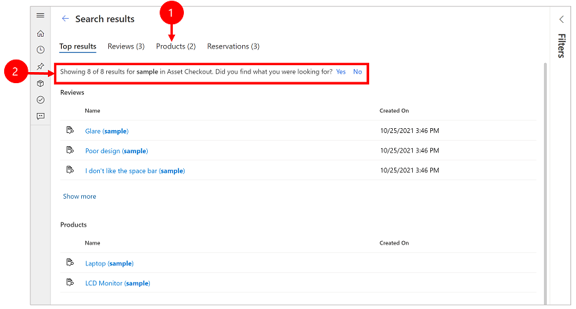
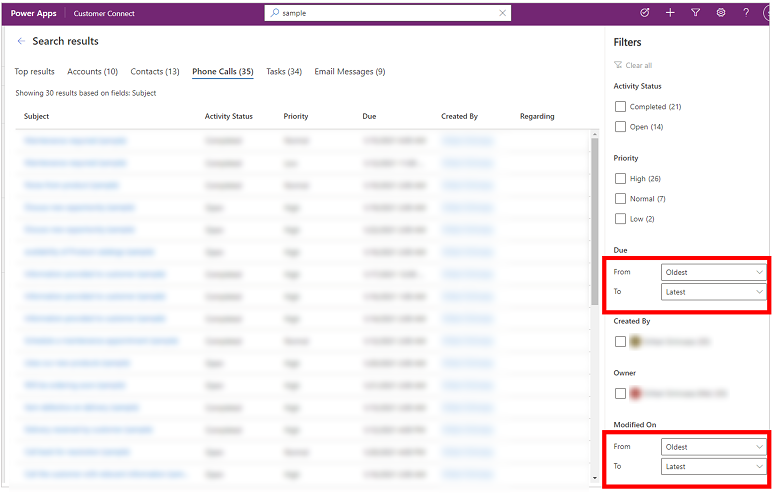

# Using relevance search to search for rows

[!INCLUDE[cc-data-platform-banner](../includes/cc-data-platform-banner.md)]

Relevance search is easy to use, fast, and more accurate in helping you find information that you're looking for. The search bar in the top is easy to find from any page in your app. It is always available to start a new search and quickly find the information that you're looking for.

> [!div class="mx-imgBorder"]
> 

  
## Turn on Relevance Search

The new experience needs to be enabled by the administrator for your organization. When relevance search is enabled for your environment, you see the search bar in the header. Search can be accessed in a familiar and recognizable way in all model-driven Power Apps in that environment. For more information, see [Enable the new Relevance Search experience](https://docs.microsoft.com/power-platform/admin/configure-relevance-search-organization#enable-the-new-relevance-search-experience).

## See recent rows and searches

See your recent searches and recently accessed rows when you select the search box. Before you even start typing in the search box, you will see information to help you complete the search quickly. 

Up to three recent search terms appear at the top, based on the three most recent search queries that you accessed and viewed the results. The recent search terms are personalized for you, based on your device and browser.

The next information in the flyout is recently accessed rows. You can see up to seven recently accessed rows. If you frequently access a small set of rows, you can quickly get to it from here. Recently accessed rows are independent of tables that are indexed for Relevance Search, because there is no search performed at this point. The rows are also grouped by table type, allowing you to quickly scan the list.

> [!div class="mx-imgBorder"]
>  

Legend

1. **Recent searches**: Shows your recent searches.
2. **Recently accessed rows**:  Shows recently accessed rows that are grouped by table type.

## Inline suggestions

As you start typing, you will see suggested results which minimize keystrokes and simplify page navigation. Suggested results are quick results based on a search performed on the primary column of a table that is both enabled for Relevance Search and included in the model-driven app.

Suggestions are shown when three or more characters are entered in the search box, and it based on two types of matching.

-	**Word completion**: Rows where the primary field contains a word that begins with the search term. For example, entering **work** will show the Account Adventure **Work**s, contact John **Work**er, among other results.

- **Fuzzy search**: Suggestions incorporate fuzzy search where terms that are misspelled by one character are matched. For example, entering **winry** will show the Account Coho **Winery**, among other suggestions. 

With suggestions you can access your information quickly with minimal keystrokes even when the search term is misspelled by up to one character. Text that's highlighted in bold in the suggestions shows the term that is matched.

## Search results page

You can view the full results for a search by pressing Enter or select **Show results for (search term)** at the bottom of the suggested results flyout.

Search results are ranked based on relevance and grouped by tables. The list of tables with rows matching the search term are displayed as a horizontal list of tabs along the top of the screen.

### Top results tab

The **Top results** tab displays the top 20 results for the search term, with rows grouped by table type. Each group has results for that table in a grid with up to six columns. These columns are the first six columns of the table’s quick find view's **View Columns set**.

> [!NOTE]
> - The primary column of a table is always used as the first column for a table in the **Top results** tab.
> - For notes and attachment tables, you can see two additional columns to indicate information on the related row for that note or attachment row.
> - Party list columns on activity tables like To, CC, attendees cannot be searched on or shown and will be blank

Legend:

 1. **Top results**:  Shows the top 20 results for the search term.
 2. **Rows grouped by table type**: To narrow your search results to a specific table, select the table tab.
 3. **Show more**: When you select **Show more** at the bottom of a group switches to the table tab.

### Table specific tab

Specific table tabs are displayed as a horizontal list of tabs along the top of the screen. The exact order of the list of tables from left to right in an LTR environment is based on the relevance of the results. You can collapse the filter panel or hover over the list of tabs to scroll horizontally.

The tables of the rows in the top 20 results are shown in the first few tabs from left to right, based on relevance. The tables corresponding to result rows outside of the top 20 are displayed in descending order of matched rows.

Legend:

 Shows top 20 results that match (let's say 3 tables).

 Shows the 3 tables that are part of the top results, ordered by relevance.

 Shows rest of the matched table types, ordered by number of records that matches the search.

Each of the tabs lets you drill into a specific table and view more information on rows in the results. 

Legend:

1. Shows number of results for each table. 
2. Shows the list of columns that was searched for the table.

Each table tab displays more information than **Top results** tab along two different dimensions:

- If the quick find view for the table has more than 6 **View Columns**, then all columns are displayed in the table tab, compared to up to 6 columns shown in **Top results** tab.
- All matching rows for the table are accessiable in the table specific tab as an infinitely scrollable list.

## Filter results with facets

On the search results page, you can refine and explore your search results using facets and filters. Facets are available on the **Filter** pane which you can expand or collapse. 

The **Top results** tab, shows search results accross different row types such as a contact vs. a phone call. Thus, the **Top results** tab only shows three global facets which apply all row types.

Global facets: 
-	Owner
-	Modified On
-	Created On

On the other tabs the three global facets are pushed down and facets that apply to that specific row type are available for you to filter on.

|**Top results tab shows global facets only**  |**Other tabs shows facets that is specific for the row type** |
|---------|---------|
|      |       |

You can personalize facets for a table, in the **Set Personal Options** dialog box. For more information, see [Configure facets and filters](facets-and-filters.md).

### Text-based facets with discrete values

All lookups and choices types are text-based facets. For example, the text-based facet **Priority** consists of a list of column values and their corresponding counts.

 

Filters in these facets are sorted in descending order by count. The top 4 facet values are displayed by default. When there is more than 4 facet values, you can select the **Show more** link to expand the list and see up to 15 values. 

Select each value to filter the search results to show only rows where the column has the value that you selected.

### Date and Time facets

The date and time facets let you filter and see search results for a specific period. Use the **From** and **To** drop-down list to specify a custom period.

 

## Feedback link

On the search results page, the **Did you find what you were looking for? Yes No** is collected in our product telemetry as a binary feedback. Search parameters like the query text that you entered in the search box is not collected, irrespective of the response to the question. We only **Yes** or **No** response statistics to help us understand the usefulness of the new search experience. 

Currently there isn't an option to disable the feedback question prompt.

  
   

## Understand the search results 

Relevance search has a powerful set of capabilities to help you put Dataverse at your fingertips. Here are some pointers to help you understand what results you can expect in different scenarios.
      
> [!NOTE]
> - Relevance Search is text-based and can search only on columns of type single line of text, multiple lines of text, choice, and lookups. Columns of type numeric, date, and file are not searched on.
> - Relevance Search enables you to search for rows that are shared with you and rows that you own. Hierarchical security models aren't supported. This means, even if you see a row in Dataverse because you have access to it through hierarchical security, you won't see that row matched by Relevance Search.

   
### Boosted search results

You can use important attributes as keywords to search for information. Entering table type to boost search results is an easy way to indicated preference of results.  

Searching for **Susan Adatum** indicates the preference of contact record **Susan** related to account **Adatum**.

### Natural language understanding

Search has a better understanding of terms that are used to indicated intent. 

Searching for **open phone calls** will show phone call activity records with status open.

Searching for **contact missing email** will show contacts with an empty email address field rather than treating missing as a keyword.

### Spelling correction

Search is smarter and forgiving of spelling mistakes to still be accurate. For example, searching for **william conatc** will show the contact record with name **William**, even though **contact** is misspelled.

### Synonyms, acronyms, and abbreviations

With support for common abbreviations and synonyms, you can search for your information the way you remember them, not the way it is stored.

Common name variations like **Bob/Robert** are matched with either search term.

Search terms with abbreviations like **active accts** are interpreted semantically as active accounts.

### Power of common knowledge

Search can understand popular locations, date, time, holidays and numbers.

You can search for **account in WA** and see results for accounts located in Washington state.

> [!NOTE]
> - All the above capabilities are part of intelligent search, that are only available for public cloud environments with English as the base language.
> - The examples above assume that a specific set of fields per table are indexed to be able to see the results described.

## Working with operators

Operators help you craft precise search queries that can tailor your results according to specific conditions. Here are some of the supported operators.

### Boolean operators

You can search on a combination of terms using the **+** operator, which performs an **AND** search and shows results containing all the individual terms separated by **+**.
For example, **alpine + paul** returns the contact record **Paul Cannon** related to account record **Alpine Ski House**.

  

Similarly, the **OR** operator can be indicated by separating terms with a **|**. For example, searching for **alpine | paul** returns records with reference to either term.

  

You can use the NOT operator with a minus sign before a keyword to indicate exclusion. For example, searching for evaluation displays all records matching the term, whereas searching for evaluation + -agreed will match all records containing the term evaluation but not the term agreed.

<Pictures from Slide 7 and Slide 8> 

### Wildcards

You can use wildcards for operators like begins-with and ends-with. Using an asterisk (*) at the beginning or end of a keyword makes the asterisk a placeholder for zero or more characters. For example, searching on *winery will show results for all records associated with a keyword that ends with winery.

<Picture from Slide 9>

### Exact matches

You can use double quotes around a keyword to perform an exact match. Since search ignores some of the commonly used words like the, an, a to improve matching, using double quotes is a way to override that behavior and force an exact match. For example, searching on “Call back for resolution (sample)” will match that keyword literally.

<Picture from Slide 10>
 
 
 
 
 
 
 
 
 
 
 
 
 
 
 
 
 
 
 
 
 
 
 
 

## Use the old Relevance Search experience 

If you're organization has Relevance Search enabled but your administrator has not turned on the [new relevance search experience](https://docs.microsoft.com/powerapps/user/relevance-search#use-the-new-relevance-search-experience) then you will see the old search experience.

### Switch between the old Relevance Search experience and Categorized Search

If your organization has turned on both search options (relevance search and categorized search), you can switch between the two.

1. To switch between search types, on the navigation bar, select **Search**.

   > [!div class="mx-imgBorder"]
   >  

2. On the left, select the drop-down menu to switch between **Relevance Search** or **Categorized Search**.

   > [!div class="mx-imgBorder"]
   >  
   
### Start a search using the old Relevance Search experience
 
1.  From the top nav bar, select **Search**.  

    > [!div class="mx-imgBorder"]
    >  
  
2.  Enter your search words in the search box, and then select **Search**.

    > [!div class="mx-imgBorder"]
    >    

