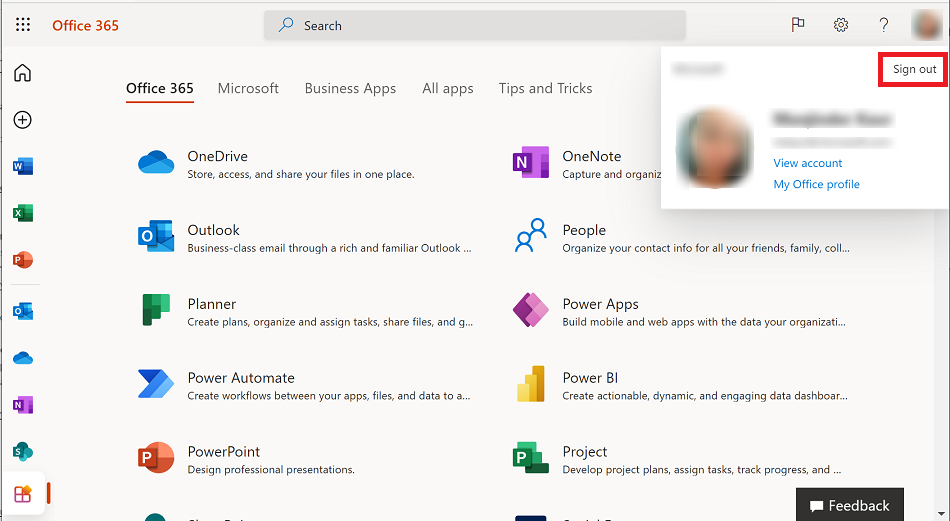

# Run an app in a web browser

When you create an app, or someone shares an app with you, you can run that app on the [Power Apps mobile app](../mobile/run-powerapps-on-mobile.md) or in a web browser. In this topic, you'll learn how to run a canvas or model-driven app in a web browser from the [Microsoft 365 apps page](https://www.office.com/apps?auth=2).

For full functionality and optimized experience on a tablet device, we strongly recommend that you use the [Power Apps mobile app](../mobile/run-powerapps-on-mobile.md). If you don't have the Power Apps mobile installed, you can still use the web browser on your tablet, as long as your device has sufficiently high screen resolution. For more information: [What's supported](../mobile/run-powerapps-on-mobile.md#supported-devices).

> [!NOTE]
> Using the web browser on your phone to run your model-driven apps isn't supported; you must use the [Power Apps mobile app](../mobile/run-powerapps-on-mobile.md).

To follow this quickstart, you need:
- A Power Apps license. This is available with a Power Apps plan, such as the Power Apps per user plan, or [Power Apps trial](../maker/signup-for-powerapps.md), or any of the [Microsoft Office 365](https://signup.microsoft.com/Signup?OfferId=467eab54-127b-42d3-b046-3844b860bebf&dl=O365_BUSINESS_PREMIUM&ali=1) or [Dynamics 365](https://dynamics.microsoft.com/pricing/) plans that include Power Apps.
- Access to an app that you built or that someone else built and shared with you.
- Access to a supported web browser and operating system.
   - For canvas apps, see: [System requirements, limits, and configuration values](../maker/canvas-apps/limits-and-config.md)
   - For model-driven apps, see: [Requirements/supported configurations](/power-platform/admin/online-requirements)

## Sign in to Microsoft 365 apps page
Sign in to the [Microsoft 365 apps page](https://www.office.com/apps?auth=2).

## Find an app on the Home page
The Home page may show several types of business apps, but you can find a specific app by typing part of its name in the search box. You also select **Business Apps** to launch your business app that you have access to.

## Run an app from a URL
You can save an app's URL as a bookmark in your browser and run it by selecting the bookmark, or you can send a URL as a link through email. If someone else created an app and shared it with you in an email, you can run the app by selecting the link in the email. When running an app using a URL, you may be prompted to sign in using your Azure Active Directory credentials.

## Connect to data
If an app requires a connection to a data source or permission to use the device's capabilities (such as the camera or location services), you must give consent before you can use the app. Typically, you're prompted only the first time.

## Sign out
To sign out of the Microsoft 365 apps page, select your profile image and then select **Sign out**.

## Next steps
In this topic, you learned how to run a canvas or model-driven app in a web browser. To learn how to:
- run a model-driven apps or canvas apps on a mobile device, see [Run model-driven apps and canvas apps on Power Apps mobile](../mobile/run-powerapps-on-mobile.md)
- use a model-driven app, see [Use model-driven apps](use-model-driven-apps.md)

[!INCLUDE[footer-include](../includes/footer-banner.md)]