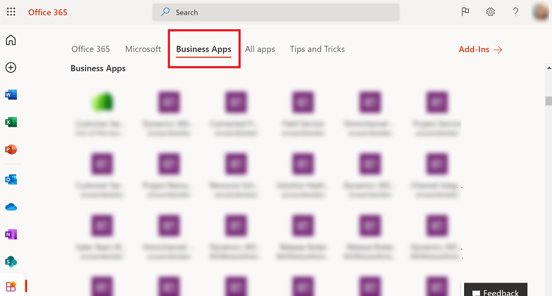

# Run an app in a web browser

When you create an app, or someone shares an app with you, you can run that app on the [Power Apps mobile app](../mobile/run-powerapps-on-mobile.md) or in a web browser. In this topic, you'll learn how to run a canvas or model-driven app in a web browser from the [Microsoft 365 apps page](https://www.office.com/apps?auth=2).

For full functionality and optimized experience on a tablet device, we strongly recommend that you use the [Power Apps mobile app](../mobile/run-powerapps-on-mobile.md). If you don't have the Power Apps mobile app installed, you can still use the web browser on your tablet, as long as your device has sufficiently high screen resolution. For more information: [Required privileges and supported devices](../mobile/run-powerapps-on-mobile.md#required-privileges-and-supported-devices).

> [!NOTE]
> Using the web browser on your phone to run your model-driven apps isn't supported; you must use the [Power Apps mobile app](../mobile/run-powerapps-on-mobile.md).

To follow this quickstart, you need:
- A Power Apps license. This is available with a Power Apps plan, such as the Power Apps per user plan, or [Power Apps trial](../maker/signup-for-powerapps.md), or any of the [Microsoft Office 365](https://signup.microsoft.com/Signup?OfferId=467eab54-127b-42d3-b046-3844b860bebf&dl=O365_BUSINESS_PREMIUM&ali=1) or [Dynamics 365](https://dynamics.microsoft.com/pricing/) plans that include Power Apps.
- Access to an app that you built or that someone else built and shared with you.
- Access to a supported web browser and operating system. For more information: [System requirements, limits, and configuration values for Power Apps](../maker/canvas-apps/limits-and-config.md)

## Sign in to Microsoft 365 apps page
Sign in to the [Microsoft 365 apps page](https://www.office.com/apps?auth=2).

## Find an app on the Home page
The Home page may show several types of business apps. 

The list of Office apps is a limited, curated list based on the following criteria:

- Apps that you launched in the last week.
- Apps that you created. 
- Apps your admin marked as **Featured** in your tenant.
- First-party, model-driven apps such as Dynamics 365 Sales, Dynamics 365 Customer Service, and Dynamics 365 Field Service that you can access and are hosted in production or default environments.

> [!NOTE]
> Marking an app as **Featured** is the only way to guarantee inclusion in the list.

### Known limitations
- When a new app is shared with users, the app needs to meet the criteria listed above. It can take up to 24 hours for the app to appear in the list of **Office** apps.
- Some model-driven apps aren't recording the last launched time. Until this issue is resolved, we recommend using [featured apps](/powershell/module/microsoft.powerapps.administration.powershell/set-adminpowerappasfeatured?view=pa-ps-latest&preserve-view=true). Featured apps only appear to users who have access to the apps. Featured apps don't appear to all users.
- It's possible that users will be able to see model-driven apps that they used to be able to access, but can no longer. There's also a chance that users won't be able to see model-driven apps that they have access to.    

### What if I can't find an app?

Apps that haven't been used in the last week won't appear in the list of **Office** apps. If you can't find an app, then you need to use the web link to open the app directly in your browser.

1. To find the web link for an app, sign in to [Power Platform admin center](https://admin.powerplatform.microsoft.com) or [Power Apps](https://make.powerapps.com).
2. Find the app that you're looking for.
3. Across the app name, select (...) **More Commands** > **Details**.
4. From the **Details** tab copy the **Web link**.
5. Paste the web link in a browser window to launch the app.

The Microsoft 365 apps page has a different URL per cloud. 

|  **#**        | Cloud         |  Microsoft   365 app discovery URL |
| ------------- | ------------- | ------------- 
| 1             | Commercial    | [https://www.office.com/apps](https://www.office.com/apps)                |
| 2             | Government Community Cloud (GCC) | [https://www.office.com/apps](https://www.office.com/apps) |
| 3             | Government Community Cloud (GCC High)  | [https://www.office365.us/apps ](https://www.office365.us/apps)   |
| 4             | Department of Defense  | [https://www.ohome.apps.mil/apps ](https://www.ohome.apps.mil/apps ) |
| 5             | Office 365 operated by 21Vianet  | There isn’t a corresponding [https://www.office.com/apps](https://www.office.com/apps)   experience for this cloud. However, the Microsoft 365 app launcher experience   throughout Microsoft 365 experiences includes Power Apps and Dynamics apps such as new word document in [https://portal.partner.microsoftonline.cn/NewSpoDocument?docType=Word](https://portal.partner.microsoftonline.cn/NewSpoDocument?docType=Word)   |

## Run an app from a URL
You can save an app's URL as a bookmark in your browser and run it by selecting the bookmark, or you can send a URL as a link through email. If someone else created an app and shared it with you in an email, you can run the app by selecting the link in the email. When running an app using a URL, you may be prompted to sign in using your Azure Active Directory credentials.

## Connect to data
If an app requires a connection to a data source or permission to use the device's capabilities (such as the camera or location services), you must give consent before you can use the app. Typically, you're prompted only the first time.

## Sign out
To sign out of the Microsoft 365 apps page, select your profile image and then select **Sign out**.

## Next steps
In this topic, you learned how to run a canvas or model-driven app in a web browser. To learn how to:
- run a model-driven apps or canvas apps on a mobile device, see [Run model-driven apps and canvas apps on Power Apps mobile](../mobile/run-powerapps-on-mobile.md)
- use a model-driven app, see [Use model-driven apps](use-model-driven-apps.md)
- mark an app as featured, see [Set-AdminPowerAppsFeatured](/powershell/module/microsoft.powerapps.administration.powershell/set-adminpowerappasfeatured?view=pa-ps-latest&preserve-view=true)

[!INCLUDE[footer-include](../includes/footer-banner.md)]
