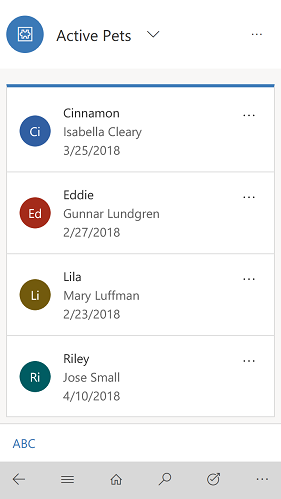
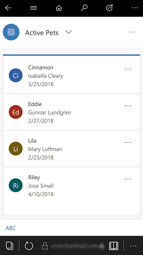
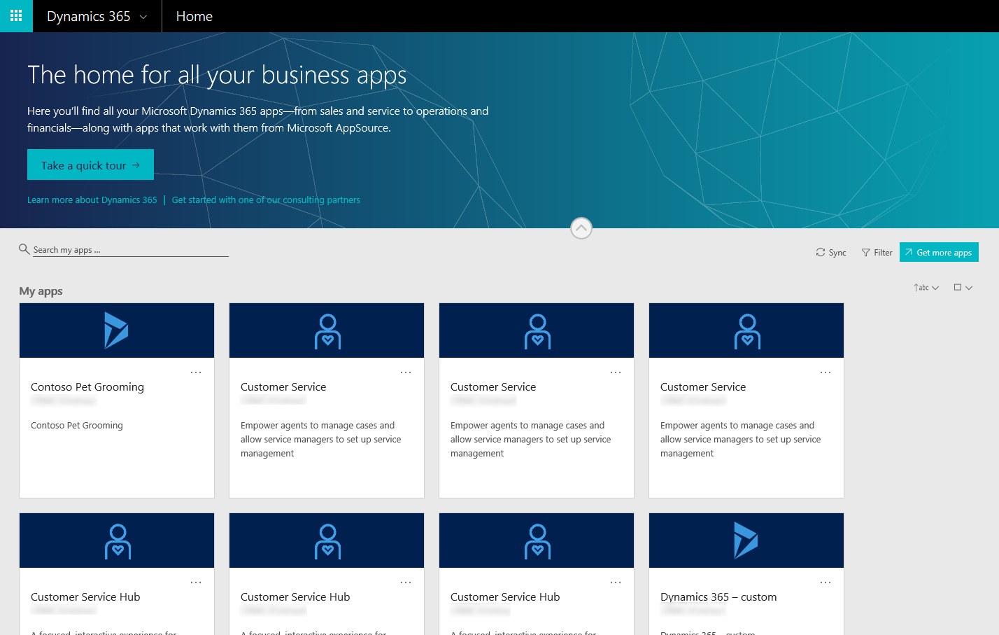

# Quickstart: Run a model-driven app on a mobile device

After the app is created and then shared with you, you can run that app on a variety of popular mobile devices such as Windows, iOS, Android, or in a web browser. In this quickstart, you'll learn how to run a model-driven app on a mobile device. 

[!INCLUDE [cc-preview-features-definition](../includes/cc-preview-features-definition.md)]

To follow this quickstart, if you're not signed up for PowerApps, [sign up for free](https://web.powerapps.com/signup?redirect=marketing&email=) before you begin. Also, make sure you have access to an app that you created or that someone else created and shared with you.

## Run the model-driven app

You run a model-driven app on a mobile device using any of the following ways.

### Use the mobile app
Install the Dynamics 365 for phones or Dynamics 365 for tablets app from your device’s app store. More information: [Install Dynamics 365 for phones and tablets](https://docs.microsoft.com/dynamics365/customer-engagement/mobile-app/install-dynamics-365-for-phones-and-tablets)

 

### Run in your phone’s browser
Enter the app URL directly into your phone’s browser and follow the directions on your screen to load the app. 

### Go to home.dynamics.com
Select your app to run in your phone’s browser. 

## Next steps
In this quickstart, you learned how to run a model-driven app on a mobile device. You can also run canvas apps on a mobile device.

> [!div class="nextstepaction"]
> [Run a model-driven app on a mobile device](run-app-client.md)