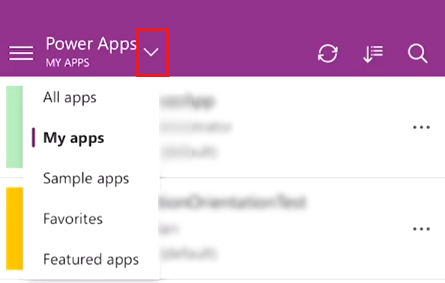
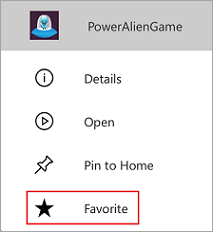
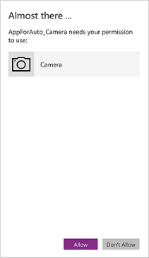

# Quickstart: Run a canvas app on a mobile device
When you create an app, or an app creator shares an app with you, you can run that app on Windows, iOS, Android, or in a web browser. In this quickstart, you'll learn how to run a canvas app on a mobile device. Apps running on a mobile device can take advantage of the device's capabilities, such as location services and camera.

To follow this quickstart, if you're not signed up for PowerApps, [sign up for free](https://web.powerapps.com/signup?redirect=marketing&email=) before you begin, and then download PowerApps from the Windows Store, the App Store, or Google Play onto an iPhone, iPad, or Android device running a [supported operating system](../maker/canvas-apps/limits-and-config.md). Also, make sure you have access to a canvas app that you built or that someone else built and shared with you.

## Open PowerApps and sign in
Open PowerApps on your mobile device and sign in using your Azure Active Directory credentials.

If you have the Microsoft Authenticator app installed on your mobile device, simply enter your username when prompted, and then approve the notification sent to your device.

## Find the app
To make it easier to find the app, open the **PowerApps** menu, and then select a filter.

The following filters are available:

* **All apps**: Displays all apps to which you have access, including apps you created and apps that others shared with you.

* **My Apps**: Displays apps that you've run at least once.

* **Sample apps**: Displays sample apps from Microsoft that showcase real application scenarios with fictitious data to help you explore design possibilities.

* **Favorites**: Displays apps that you've marked by tapping the ellipsis (...) on the app tile, and then tapping **Favorite**. To remove an app from this list, tap the ellipsis (...) on the app tile, and then tap **Unfavorite**.

    

After you filter your apps, you can sort the filtered list by the date the apps were most recently opened or modified, or alphabetically by name. These preferences are retained when you close and reopen PowerApps.

If you know the name of the app you want to run, you can tap the search icon at the top of Powerapps, and then type part of its name in the search box.

If you filtered your apps, it will search the filtered list.

## Run an app
To run a canvas app on a mobile device, tap the app tile. If someone else created a canvas app and shared it with you in an email, you can run the app by tapping the link in the email.

If this is the first time you're using PowerApps, a screen shows the swipe gesture to close the app.

## Give consent
If an app requires a connection to a data source or permission to use the device's capabilities (such as the camera or location services), you must give consent before you can use the app. Typically, you're prompted only the first time.

## Pin an app to the home screen
If you've downloaded an app and used it at least once, you can pin it to the home screen of your device for quick access. Tap the ellipsis (...) on the app tile, tap **Pin to Home**, and then follow the instructions that appear.

## Close an app
To close an app, use your finger to swipe from the left edge of the app to the right. On Android devices, you can also press the Back button and then confirm that you intended to close the app.

## Next steps
In this quickstart, you learned how to run a canvas app on a mobile device. To learn more about PowerApps, continue to the PowerApps tutorials.

> [!div class="nextstepaction"]
> [PowerApps Tutorials](../maker/canvas-apps/get-started-create-from-blank.md)
