# Run canvas and model-driven apps on a mobile device

[!INCLUDE [cc-beta-prerelease-disclaimer](../includes/cc-beta-prerelease-disclaimer.md)]

When you create an app, or someone shares an app with you, canvas or model-driven app, you can run that app on iOS and Android device using the Power Apps mobile app. If you're on a Windows device, you can only run canvas apps. Model-driven apps are not support on the Power App mobile app for Widnows devices. In this topic, you'll learn how to get started and run a canvas app and a model-driven app on your mobile device. 

To learn how to use model-driven apps running on the Power Apps mobile app, see [User Guide for model-driven apps running on the Power Apps mobile app](use-custom-model-driven-app-on-mobile.md).

> [!IMPORTANT]
> Model-driven apps for sales, customer service and other dynamics verticals don't run in the Power Apps mobile app. Instead, you use the Dynamics 365 for phones and tablets app. For more information, see [User Guide for Dynamics 365 for phones and tablets](https://docs.microsoft.com/dynamics365/mobile-app/dynamics-365-phones-tablets-users-guide).

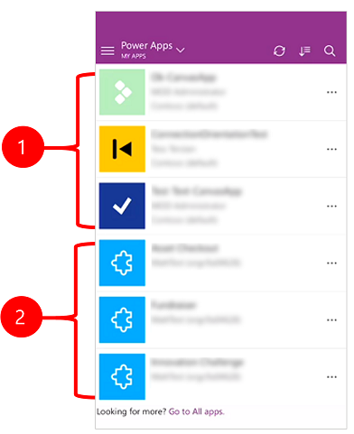

Legend:

1. **Model-driven apps**
2. **Canvas apps**

To sign up for preview, download the beta version of the Power Apps mobile app using the following links:
1. FOr iOS, download the app using this link. For android, download the app using this link. 
2. If you already have the app installed, the installed app will be replaced by the beta version of the app.

## Open Power Apps and sign in
Open Power Apps on your mobile device and sign in using your Azure Active Directory credentials.

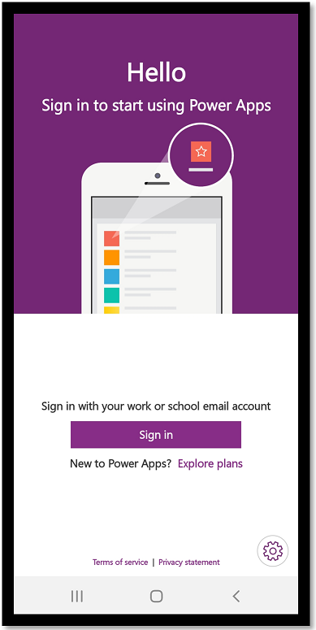

If you have the Microsoft Authenticator app installed on your mobile device, simply enter your username when prompted, and then approve the notification sent to your device.

## Find the app
When you sign in to the app, **my apps** filter is set by default. If you don't find the app you are looking for, you can open the **Power Apps** menu, and then select a different filter. 

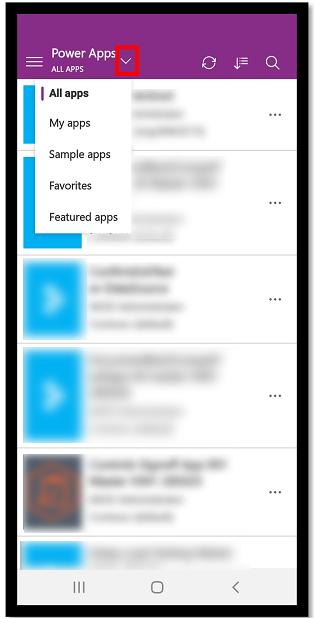

The following filters are available:

* **All apps** : Displays all canvas and model-driven apps to which you have access, including apps you created and apps that others shared with you.

* **My apps**: Displays canvas apps that you have opened, app that you are the owner of, and apps that you can edit. Displays all model apps that you have access to. 

* **Sample apps** (only for canvas apps): Displays sample canvas apps from Microsoft that showcase real application scenarios with fictitious data to help you explore design possibilities.

* **Favorites** (only for canvas apps): Displays canvas apps that you've marked by selecting the ellipsis (...) on the app tile, and then select **Favorite**. To remove an app from this list, select the ellipsis (...) on the app tile, and then tap **Unfavorite**.

    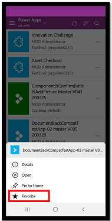

* **Featured apps** (only for canvas apps): Displays canvas apps that your admin as marked as featured apps.

### Sort apps

After you filter your apps, you can sort the filtered list by the date the apps were most recently opened or modified, or alphabetically by name. These preferences are retained when you close and reopen apps. You can sort both canvas and model-driven apps.

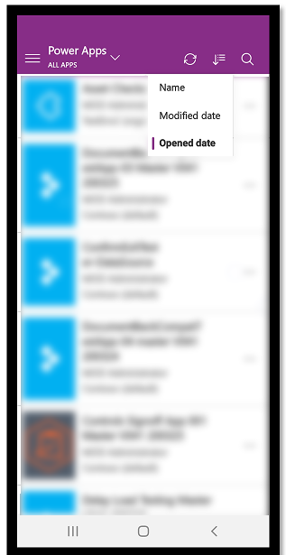

### Search apps

If you know the name of the app you want to run, you can select the search icon at the top, and then type part of its name in the search box. You can search for both canvas and model-driven apps.

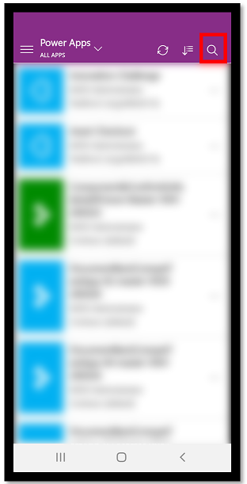

If you filtered your apps, it will search the filtered list.

### Refresh the list of apps

Select the refresh icon  to refresh the list of apps. This will refresh both the canvas and model-driven app list. 

## Pin an app to the home screen
You can pin both canvas and model-driven apps to the home screen of your device for quick access. Select the ellipsis (...) on the app tile, select **Pin to Home**, and then follow the instructions that appear.

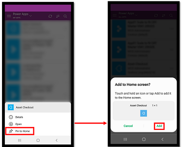

## See non production apps

By default, only production model-driven apps are shown in the list of apps. 

To see model-driven apps from non production environments, select the setting menu  and then set the **Show non production apps** toggle to on, and then follow the instructions that appear.

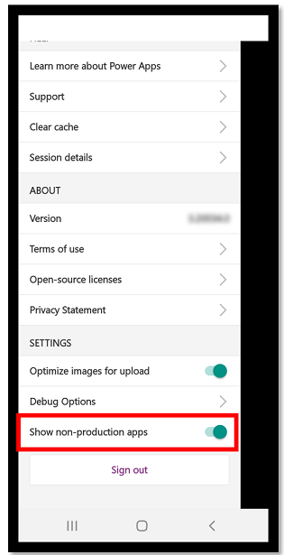

## Run an app
To run an app on a mobile device, select the app tile. If someone else created an app and shared it with you in an email, you can run the app by selecting the link in the email.

### Run a canvas app

If this is the first time you're running canvas app using the Power Apps mobile app, a screen shows the swipe gestures.

#### Close a canvas app

Use your finger to swipe from the left edge of the app to the right to close an app. On Android devices, you can also press the Back button and then confirm that you intended to close the app.

#### Pinch and zoom in on a canvas app

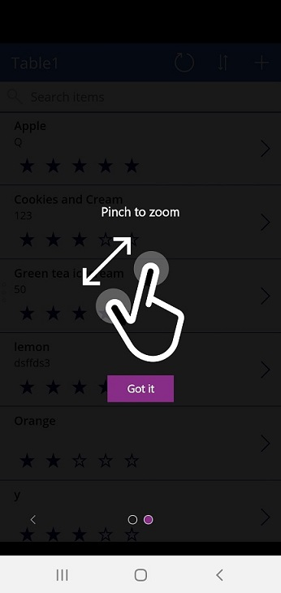

#### Give consent

If an app requires a connection to a data source or permission to use the device's capabilities (such as the camera or location services), you must give consent before you can use the app. Typically, you're prompted only the first time.

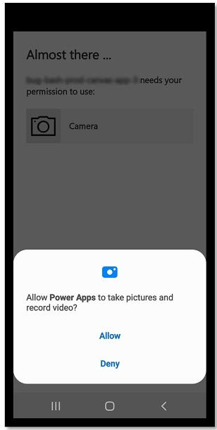

### Run a model-driven app 

Exmaple of a mode-driven app screen after you sign in. To learn how to use model-driven apps running on the Power Apps mobile app, see [User Guide for model-driven apps running on the Power Apps mobile app](use-custom-model-driven-app-on-mobile.md). 

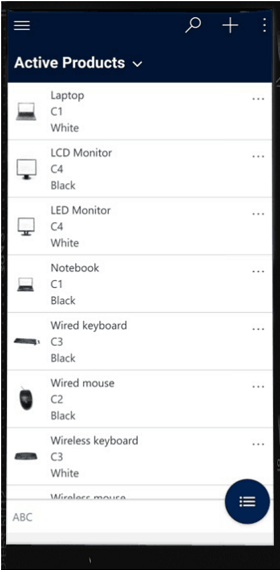

#### Give consent

If an app requires a connection to a data source or permission to use the device's capabilities (such as the camera or location services), you must give consent before you can use the app. Typically, you're prompted only the first time.

#### Close a model-drive app

Select the site map  and then select, **Apps**.

