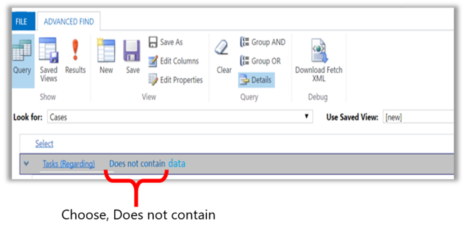

# Create, edit, or save an Advanced Find search

[!INCLUDE[cc-applies-to-update-9-0-0](../includes/cc_applies_to_update_9_0_0.md)]

Find the records you want in [!INCLUDE[pn_dynamics_crm](../includes/pn-dynamics-crm.md)] by using the Advanced Find command. You can also use Advanced Find to prepare data for export to [!INCLUDE[pn_MS_Excel_Full](../includes/pn-ms-excel-full.md)] so that you analyze, summarize, or aggregate data, or create PivotTables to view your data from different perspectives.  

With the [!INCLUDE[pn-crm-9-0-0-online](../includes/pn-crm-9-0-0-online.md)], you can use the advanced find option to build a “Not In” query records using **Does not contain data** option.
  
1. [!INCLUDE[proc_advanced_find](../includes/proc-advanced-find.md)]  
  
2. Specify what to search for.  
  
   1.  In the **Look for** list, select a record type.  
  
   2.  Click **Select** to define search criteria: field (for example, Account Name or City), the query relational operator (Part of an expression (for example "is equal to" or "contains") that defines how a specified attribute should be compared with a value.), and the values to locate (for example, "Seattle" or "Email").  
  
        You can select fields from the current record type, or from related records. For example, an account might have many related contact records.  
  
        At the bottom of the **Select** list, the **Related** section shows related record types. For example, most record types have a related Notes record type. To select fields from a related record type, select field, and a new **Select** link appears.  
         
        If you’re on July 2017 update for Dynamics 365 (online) or later, can use advanced find to build a “Does not contain data” query. For example, you can query for all cases that do not contain a task. To do this launch advanced find and in the query, choose look for **Cases** and **Tasks (Regarding)** and chooses **Does not contain data**. 
         
        
  
3. Specify the columns to include in the search results.  
  
   1.  Click **Edit Columns**, and then click **Add Columns**.  
  
   2.  Select the record type that includes the columns you want to add.  
  
   3.  Select the columns you want to add, and then click **OK**.  
  
4. Specify the sort order.  
  
   1.  Click **Edit Columns**.  
  
   2.  Click **Configure Sorting**.  
  
   3.  Specify the column to sort on, specify the sort order, and then click **OK**.  
  
   4.  Click **OK**.  
  
5. Click **Results**.  
  
### See also  
 [Search and Find in Dynamics 365](search-and-find-header.md)
 [Search for records](search-records.md)
 [Use Relevance Search for faster, comprehensive search results](relevance-search-results.md)
