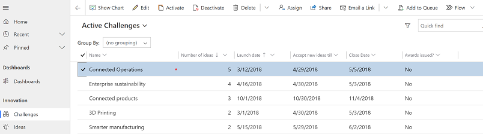
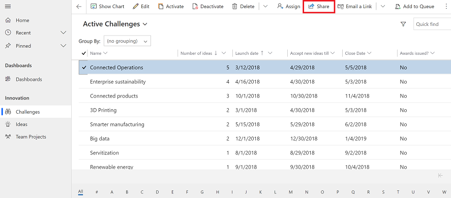
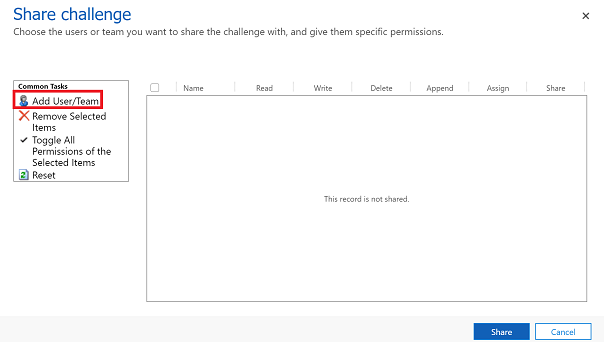
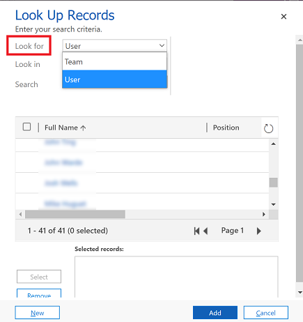
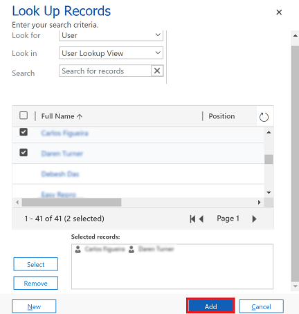
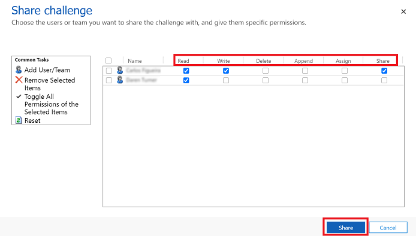

---
title: "Share a row| MicrosoftDocs"
description: How to share a row.
author: mduelae
manager: kvivek
ms.service: powerapps
ms.component: pa-user
ms.topic: conceptual
ms.date: 08/1/2021
ms.subservice: end-user
ms.author: mkaur
ms.custom: ""
ms.reviewer: ""
ms.assetid: 
search.audienceType: 
  - enduser
search.app: 
  - PowerApps
  - D365CE
---

 ## Share a row with someone else
 
 If you want to keep ownership of a row but let someone else work on the row with you then use the share option.
 
 
1. From a list of rows, select the row that you want to assign to someone else. You can select multiple rows.

   > [!div class="mx-imgBorder"]
   > 

2. On the command bar, select **Share**. 

   > [!div class="mx-imgBorder"]
   > 
   
 3. On the share dialog box, select **Add User/Team**.  

    > [!div class="mx-imgBorder"]
    > 
   
 4. On the **Look up Rows** dialog box, select the **Look for** menu and choose **User** or **Team**.
 
    > [!div class="mx-imgBorder"]
    > 
    
 5. Use the lookup to find the user or team and select the name and then choose **Select**.
 
     > [!div class="mx-imgBorder"]
     > 
     
 6. Select **Add**. 
 
     > [!div class="mx-imgBorder"]
     > 
     
 7. On the share dialog box, select the type of permissions the user or team has for the row. When you're done, select **Share**   
 
     > [!div class="mx-imgBorder"]
     > 
 
 
 ## Remove someone from a shared row
 
 When you are the assigned owner of a row, you can remove another user the row is shared with.
 
 1. From a list of rows that you own, select the row that you want to remove someone from the shared row.
 2. On the command bar, select **Share**.
 3. On the share dialog box, select the user or team who you want to remove sharing from.
 4. Select the **Remove Selected items**.
 5. Select the **Share** button.

 
