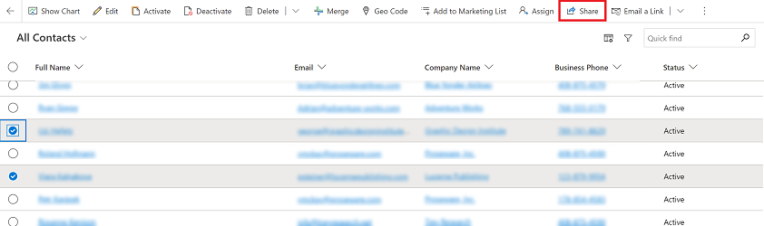
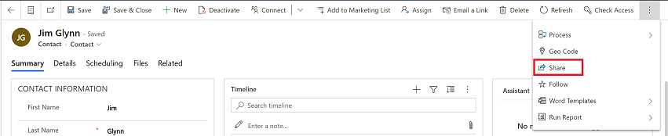
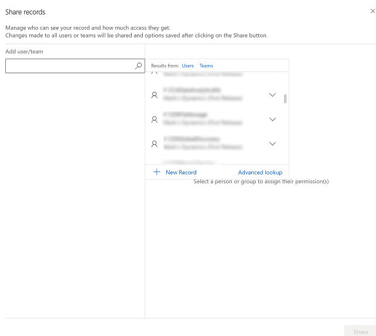

 # Share rows with a user or team

 
Keep ownership of a row and use the share feature to share the row with another user or team. 
 

> [!NOTE]
> - This feature isn't supported on Power Apps mobile or when you're using the app in offline mode with no internet connection. 
> - Any user that you share a row with needs to have basic level access that is granted by a system administrator. If you cannot select permissions such as read or write then contact your system administrator and check if the user or team has the required access.

## Share rows

1. Share a row from a view page or when you open a row.

    - **Share from the view page**: Select one or more rows on a view page and then select **Share** on the command bar.

      > [!div class="mx-imgBorder"]
      > 

    - **Open a row and share**: Open a row and then select **Share** on the command bar. If you don't see the share option, then select the **More commands** ellipsis and then select **Share**.

      > [!div class="mx-imgBorder"]
      > 

2.  On the share dialog box, do one of the following:

    - **First time sharing a row**
      1.  Select the lookup column under **Add user/team**. Enter the name of the user or team in the [lookup column](lookup-field.md). The lookup will start displaying users or teams based what you typed, or you can select the lookup icon (magnifying glass) and an alphabetical list of names appears that you can select to assign access.
          > [!NOTE] You can also search for a user that has previous share rights to manage or change access privileges.

          > [!div class="mx-imgBorder"]
          > 

      2. Select a user or team one at a time, and then grant them the appropriate permissions to the row.     If check boxes are disabled it means a user or team does not have basic privileges to the row. For more information on user access, see [Check your user access to a row](access-checker.md).

         > [!div class="mx-imgBorder"]
         > 

    - **Previously shared access to a row**
      1. Under **Previously shared access** select a user or team one at a time and then grant them the appropriate permissions to the row.     If check boxes are disabled it means a user or team does not have basic privileges to the row. For more information on user access, see [Check your user access to a row](access-checker.md).

          > [!div class="mx-imgBorder"]
          > 

3. Select **Share** to save your changes. 

    > [!div class="mx-imgBorder"]
    > 

  > ![NOTE] 
  > If you add additional users or teams after saving share access and the check box is disable but has a value, this means that your administrator has changed the basic privileges for the user, and they no longer have basic access rights, however, the share permissions is retained and isn't reset when the administrator changes the base privileges. Contact your system administrator to update a user’s access if you want to change or update the disabled options for sharing a row.
 
 ## Issues and errors
 
1. If you're disconnected from the internet when sharing a row, then you won't be able to set or update options for users or teams. Sharing won't be available.

   > [!div class="mx-imgBorder"]
   > 

2. If you get a generic error while sharing, this means that one or more of the rows can't be shared. The users will be hi-lighted in red. Select **Share** in the dialog to attempt another share with those users or close the dialog and retry. This usually happens if you are sharing lots of rows at once.

   > [!div class="mx-imgBorder"]
   > 

3. You may see an error when the system is unable to retrieve the users to assign share rights or sharing fails due to access related issues.

   > [!div class="mx-imgBorder"]
   > 

   > [!div class="mx-imgBorder"]
   > 

