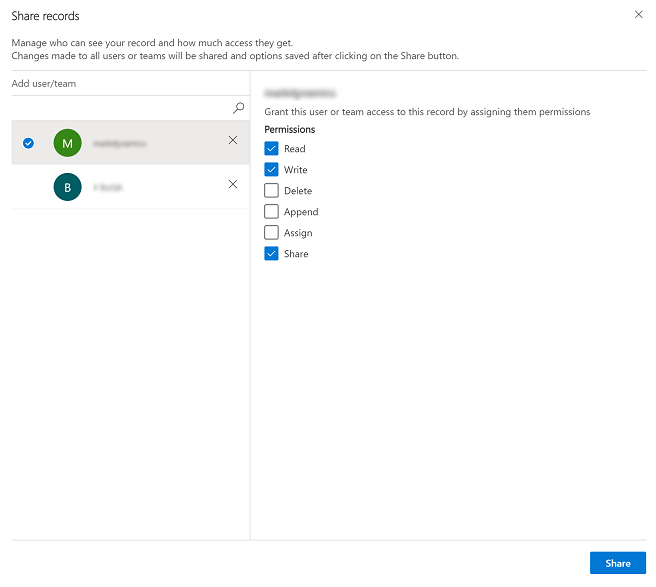

 ## Share a row with someone else
 
 [!INCLUDE [cc-beta-prerelease-disclaimer](../includes/cc-beta-prerelease-disclaimer.md)]
 
 If you want to keep ownership of a row but let someone else work on the row with you then use the share option.
 
Any user that you want to share a row with needs to have basic level access that is granted by a system administrator. If you cannot select an option when you share a row the you need to check with your system administrator to see if that user or team can be granted basic access based on your organizations roles and access defined by your administrator.

> ![Note]
> This feature is not supported on Power Apps mobile or when you're using the app in offline mode with no internet connection. 

## Share rows

1. You can share a row from a view page or when you open a row.

    - **Share from the view page**: Select one or more rows on a view page and then select **Share** on the command bar.

      > [!div class="mx-imgBorder"]
      > 

    - **Open a row and share**: Open a row and then select **Share** on the command bar. If you don't see the share option, then select the **More commands** ellipsis and then select **Share**.

      > [!div class="mx-imgBorder"]
      > 

2.  On the share dialog box, select the lookup column under **Add user/team**.  

    > [!div class="mx-imgBorder"]
    > 
   
3. Enter the name of the user or team in the [lookup column](lookup-field.md). The lookup will start displaying users or teams based what you typed, or you can select the lookup icon (magnifying glass) and an alphabetical list of names appears that you can select to assign access.

    > [!div class="mx-imgBorder"]
    > 

4. The user or team that you selected is listed under the lookup column. To add additional users or teams repeat the process or to remove a user or team from the list select **X** next to the name.

    > [!div class="mx-imgBorder"]
    > 

5. Select a user or team one at a time, and then grant them the appropriate permissions to the row.   If check boxes are disabled it means a user or team does not have basic privileges to the record. For more information on user access, see [Check your user access to a row](access-checker).

    > [!div class="mx-imgBorder"]
    > 

7. in the list on the left pane of the share dialog. When you select a record, you will see permissions on the right-hand pane to assign to the selected user(s) or team(s)

Note that the share button is disabled until you start assigning access rights.  After selecting the share access rights click on the Share button to save your changes.

 
 ## Remove someone from a shared row
 
 When you are the assigned owner of a row, you can remove another user the row is shared with.
 
 1. From a list of rows that you own, select the row that you want to remove someone from the shared row.
 2. On the command bar, select **Share**.
 3. On the share dialog box, select the user or team who you want to remove sharing from.
 4. Select the **Remove Selected items**.
 5. Select the **Share** button.

 
