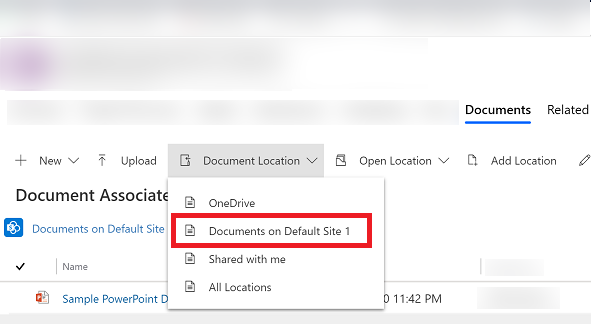
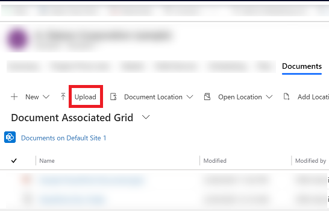
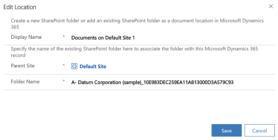

# Manage your SharePoint documents and document locations 

With Common Data Service, you can store your documents on SharePoint and manage them from within your app.

The documents that you create in your app are stored on SharePoint, and are automatically synced to your desktop and mobile devices.

Before you can use OSharePoint to store the document, it must be enabled by your system administrator. More information:

-   [Find your administrator or support person](find-admin.md)  

-   [Manage your documents using SharePoint](https://docs.microsoft.com/power-platform/admin/manage-documents-using-sharepoint)  

## Where do you access the documents from?

1. For record types that support document management, open the record, select the **Related** tab, and then select **Documents**.

   > [!div class="mx-imgBorder"]
   > 

2. Select **Document Location** > **Documents on Default Site 1**. When SharePoint is enabled, by default, the location is set to  **Documents on Default Site 1**.

   > [!div class="mx-imgBorder"]
   > 

## Create a new document 

To create a new document and save it in SharePoint:

1. Open a record and go to the Document Associated Grid. For example, open a contact record.

2. On the open record, select the **Related** tab, and then select **Documents**.
 
    > [!div class="mx-imgBorder"]
    > 

2. Select **Document Location**, and change the location to **Documents on Default Site 1**.

3. Select **New**, and then choose a document type such as Word, Excel, PowerPoint and so on. 

    > [!div class="mx-imgBorder"]
    > 

4. Enter a document name, and then select **Save**.  

## Create a new folder 

To create a new folder in the default SharePoint site location:

1. Open a record and go to the Document Associated Grid. For example, open a contact record.

2. On the open record, select the **Related** tab, and then select **Documents**.
 
    > [!div class="mx-imgBorder"]
    > 

2. Select **Document Location**, and change the location to **Documents on Default Site 1**.

3. Select **New**, and then choose **Folder**.

    > [!div class="mx-imgBorder"]
    > 
    
 4. Enter a folder name, and then select **Save**.  
 
 
 ## Upload a document

To upload existing document to SharePoint from your app:

1. Go to the record you want to create the document for, select the **Related** tab and then select **Documents**.
 
2. Select **Upload.**

   > [!div class="mx-imgBorder"]
   > 

3. Choose the file you want to upload. You can choose only one file at a time.

   The document is created in the current document location you're in.

   > [!Note]
   > You can upload a file of up to 50 MB. If your internet connection is slow, you might get an error while uploading large files.

4. If files with the same name exist in SharePoint, select whether you want to overwrite the files.

5. Select **OK**.

## Manage SharePoint locations

You can create new or edit existing SharePoint locations from your app in Common Data Service.

### Edit a location

1. Open a record and select the **Related** tab and then select **Documents**.

2. Select **Edit Location** and select a SharePoint site location.

The **Edit Location** dialog box appears.

   > [!div class="mx-imgBorder"]
   > 

3. The display name, parent site, and folder name are automatically populated. Enter details about the new location, and then select **Save**.

### Add a new location

1. Open a record and select the **Related** tab and then select **Documents**.
2. Select **Add Location**. 

The **Add Location** dialog box appears.

   > [!div class="mx-imgBorder"]
   > 

3. The display name, parent site, and folder name are automatically populated. Change the details if required, and then select **Save**.

