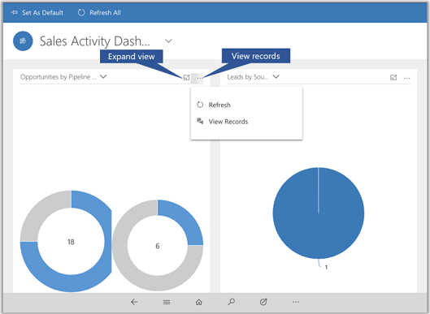
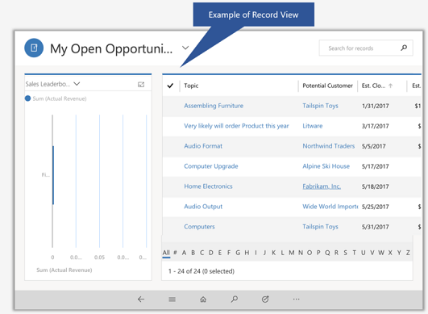
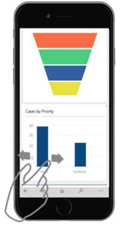
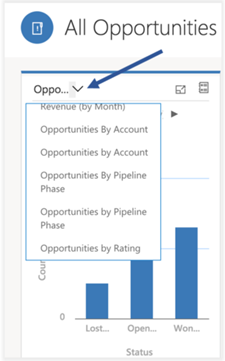

# Track your progress with charts

[!INCLUDE[cc-applies-to-update-9-0-0](../includes/cc_applies_to_update_9_0_0.md)]

Charts on the Unified Interface framework, give you a quick view of how you’re tracking to your goals. They’re interactive, so you can tap an area of a chart to get more info.

-   Select once on a chart section to see a tooltip that provides quick info about that area of the chart.

-   Select again on the same section to see a grid view with more details about the data in the chart.

-   To expand a chart, from the charts Home page grid, choose the **Expand Chart**   button.

-   To view records in chart or refresh the chart, choose  and then choose an  action: **Refresh** or **View Records**.
            
       
  
     
       

Two dimensions charts like Line, Bar, Column, and Area support zooming. Single dimension charts like, Funnel, Doughnut, Pie, and Tag chart don’t support zooming.

**Change the chart view**
 
Changing the chart view shows you a different breakdown of your data, such as opportunities opened within a specific time period. You can change a chart view by selecting the View selector on the Grid page.

For example, choose "All Opportunities", then select a different view, both chart and grid will get refreshed.

### See also 
 [Create or edit a chart](../basics/create-edit-chart.md)
 
 [Drill down in a chart](../basics/drill-down-chart.md)

