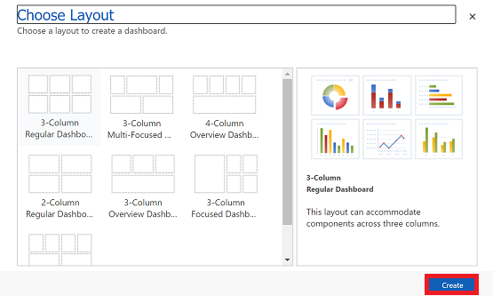
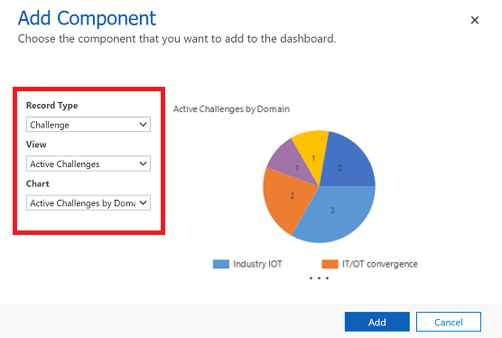
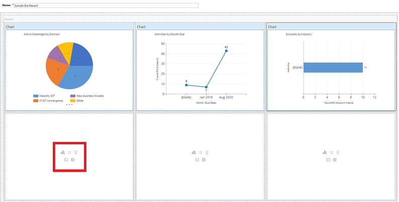
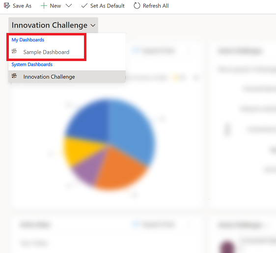

# Track your progress with dashboards and charts

A dashboard is made up of a collection of easy-to-read charts and graphs that provide visual representation of filtered app data. The interactive charts and graphs on a dashboard displays important data that gives you a 360 degree view of your business and helps you to understand key performance indicators (KPI).

Dashboards are available for all record types. 

> [!div class="mx-imgBorder"]
>  

## Create a dashbaord and add charts

1. On the left nav under **My Work** select **Dashboards** and then on the command bar select **New** > **Dynamics 365 Dashboard**. 

   > [!div class="mx-imgBorder"]
   > 
   
2. Choose a layout and then select **Create**. This is how your dashboard displays the charts, graphics, and numbers. 

   > [!div class="mx-imgBorder"]
   > 
 
3. Type in a name for the dashboard. 

   > [!div class="mx-imgBorder"]
   > 
   
   
4. Add what you want to each area of your dashboard. For example, let's add a chart. 

   > [!div class="mx-imgBorder"]
   > 
 
5. On the **Add Componet** dialog box, select your options. 
 
      |  |  |
      | --- | --- |
      | **Record Type** |Select a record.  |
      | **View** |Select a view for the record.  |
      | **Chart** |Select the type of chart that you want use. |

    > [!div class="mx-imgBorder"]
    > 

 
6. When you're done adding each compoent, select **Add**.
 

7. Continue adding components to the dashboard. You can add up to six components.   
 
   > [!div class="mx-imgBorder"]
   > 
 
8. When you are done, on the command bar select **Save**. 
 
9. The dashboard that you created will appear in the drop-down menu under **My Dashbaords**.

   > [!div class="mx-imgBorder"]
   > 

## Edit chart properties

When you add a chart on a dashboard you can edit the chart properites and modify the chart view and dispaly options. 

To edit the chart properties, you need to be edit the dashboard that the chart is in. If you're in the process of of adding a new chart on a dashboard, then you're aleady in edit mode and can skip to step 2.

1. Go to the dashboard that the chart is in and on the command bar, select **Edit**.

   > [!div class="mx-imgBorder"]
   > 
   
2. Double select the chart that you want to edit. 

   > [!div class="mx-imgBorder"]
   > 

3. On the **Set Properties** dialog box select a **View Selector** option. 

	- **Off**: Do not show view selector, show the view title only.
	- **Show All Views**: Show the view selector on chart and display all views in the view selector.
	- **Show Selected Views**: Show the view selector on chart and display only the selected views in the view selector.
 
  > [!div class="mx-imgBorder"]
  > 

4. Once **View Selector** is turned on, you can select different view, to see how the chart renders with different data associated with the view.

   > [!div class="mx-imgBorder"]
   > 

5. Select the **Display Chart Selection**  check box to show the chart selector. When chart selector is enabled, you can toggle to a different chart for the entity, to see a different visualization of the data. If the box is unchecked then you only see the chart title.

### Charts on dashboard page

When you add a chart on a dashboard page, you can configure view selector and view title or chart selector and chart title.

Charts provide you with a quick view of how you’re tracking to your goals. You can select different areas of a chart to get more info. Charts are aviable on the dashboard page, grid page, associated home page, and on edit form page. 

-   Hover your mouse over the chart to see a tooltip that provides quick information about that area of the chart.
-   Click on the area of a chart to see a grid view with more details about the data in the chart.
-   To expand a chart, select the **Expand Chart**   button.
-   To view records in the chart or refresh the chart, select  and then choose an  action: **Refresh** or **View Records**.
     
     > [!div class="mx-imgBorder"]
     >   
       

**Change the chart view**
 
Changing the chart view shows you a different breakdown of your data, such as opportunities opened within a specific time period. You can change a chart view by selecting the View selector on the Grid page.

For example, choose "All Opportunities," then select a different view, and both chart and grid will get refreshed.

> [!div class="mx-imgBorder"]
> 

## Known issues  
In the chart designer, adding a order by on certain calculated fields are not supported and will cause an error.  The calculated fields causing this are using another calculated fields, a related entity field, or a local field on the entity.

