# Track your progress with dashboards and charts

A dashboard is made up of a collection of easy-to-read charts and graphs that provide visual representation of filtered app data. The interactive charts and graphs on a dashboard display important data that gives you a 360-degree view of your business and helps you to understand key performance indicators (KPI).

Dashboards are available for all row types. Charts are available on the Dashboard page, Grid page, Associated Home page, and Edit Form page. 

> [!div class="mx-imgBorder"]
> 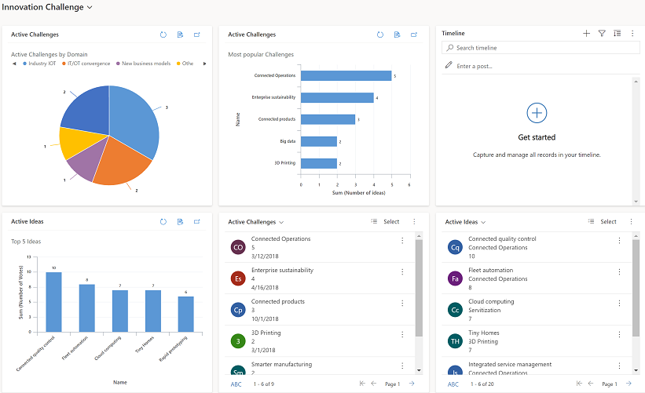 

## View dashboards

There are two types of dashboards, **System Dashboards** and **My Dashboards**.

 

Legend: 
1. **My Dashboards**: Personal dashboards that can only be seen by the user who creates them. The user can also share their personal dashboard with other users if the user has sharing privileges for their security role.

2. **System Dashboards**: Created by your administrator. By default, these dashboards are visible to all users. 

## Expand, refresh, and view rows

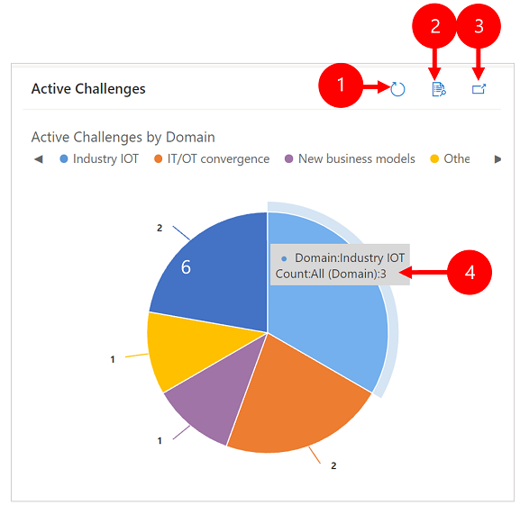

Legend:

1. **Expand Chart**: Shows the chart in full screen mode. The chart is still interactive in expanded mode.  
2. **Refresh**: Refreshes the rows in the chart.
3. **View Rows**: See the chart and the underlying rows together. This opens the chart for the corresponding rows.
4. **Tool tips**: Hover your mouse over the chart to see a tooltip that provides quick information about that area of the chart.      

## Create a dashboard with charts

1. Go to **Dashboards** and then on the command bar select **New** > **Dynamics 365 Dashboard**. 

   > [!div class="mx-imgBorder"]
   > 
   
2. Choose a layout and then select **Create**. This is how your dashboard displays the charts, graphics, and numbers. 

   > [!div class="mx-imgBorder"]
   > 
 
3. Type a name for the dashboard. 

   > [!div class="mx-imgBorder"]
   > 
   
   
4. Add what you want to each area of your dashboard. For example, let's add a chart. 

   > [!div class="mx-imgBorder"]
   > 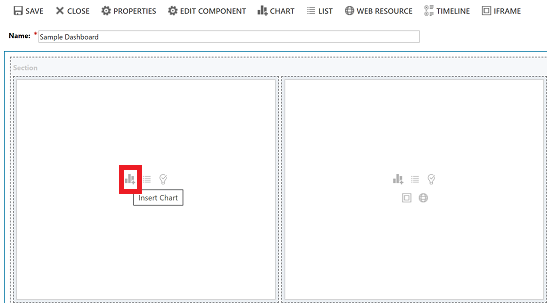
 
5. On the **Add Component** dialog box, select your options. 
 
      |  |  |
      | --- | --- |
      | **Row Type** |Select a row.  |
      | **View** |Select a view for the row.  |
      | **Chart** |Select the type of chart that you want use. |

      > [!div class="mx-imgBorder"]
      > 

 
6. When you're done adding each component, select **Add**.
 

7. Continue adding components to the dashboard. You can add up to six components.   
 
   > [!div class="mx-imgBorder"]
   > 
 
8. When you're done, on the command bar select **Save**. 
 
9. The dashboard that you created will appear in the drop-down menu under **My Dashboards**.

   > [!div class="mx-imgBorder"]
   > 

## Edit the properties of a chart

When you add a chart on a dashboard, you can edit the chart properties and modify the chart view and display options. The following screenshot shows how a chart will display based on the chart properties that you selected.

   > [!div class="mx-imgBorder"]
   > 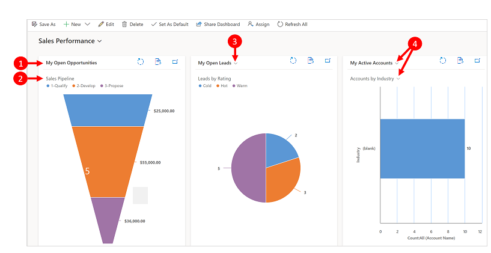

Legend:

 1. View title with **View Selector** turned off. You cannot toggle between different views. You only see the title.
 2. Chart title with **Display Chart Selection** turned off. You cannot toggle between different charts for the table. You only see the title.
 
 
 
 3. Only **View Selector** is turned on. You can toggle to a different view and the chart will render based on the underlying data for the selected view.
 4. Both **View Selector** and **Display Chart Selection** is turned on. You can toggle to a different view and chart for the table.

To edit the chart properties, you need to edit the dashboard that the chart is in. If you're in the process of adding a new chart on a dashboard, then you're already in edit mode and can skip to step 2.

1. Go to the dashboard that the chart is in and on the command bar, select **Edit**.

   > [!div class="mx-imgBorder"]
   > 
   
2. Double-select the chart that you want to edit. 

   > [!div class="mx-imgBorder"]
   > 

3. On the **Set Properties** dialog box, select a **View Selector** option. 

	- **Off**: Do not show view selector, show the view title only.
	- **Show All Views**: Show the view selector on chart and display all views in the view selector.
	- **Show Selected Views**: Show the view selector on chart and display only the selected views in the view selector.
 
   > [!div class="mx-imgBorder"]
   > 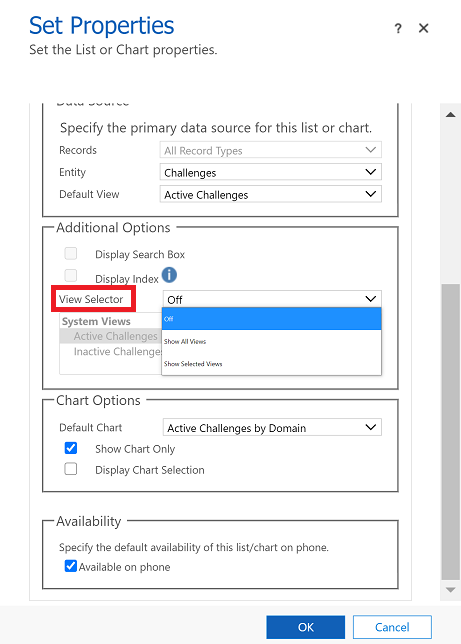

4. Once **View Selector** is turned on, you can select different views to see how the chart renders with different data associated with the view.

   > [!div class="mx-imgBorder"]
   > 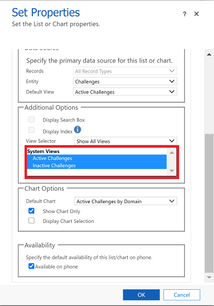

5. Select the **Display Chart Selection** check box to show the chart selector. When chart selector is enabled, you can toggle to a different chart for the table and see  different visualizations of the data. If the box is unchecked, then you only see the chart title.

   > [!div class="mx-imgBorder"]
   > 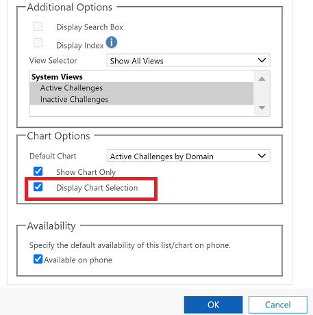

6. When you're done, select **OK**.

## Drill-down in a chart

You can drill down into a segment on a chart and filter the data for that segment. For example, you can drill down on one segment of a chart and change the chart type as you drill down.

The chart drill-down feature is only available on the browser. It is not available on the mobile app for phones or tablets.

In the example below, let's further drill down into the chart.

1. Select a data point on the chart to open the **Drill down by** dialog box.

   > [!div class="mx-imgBorder"]
   > 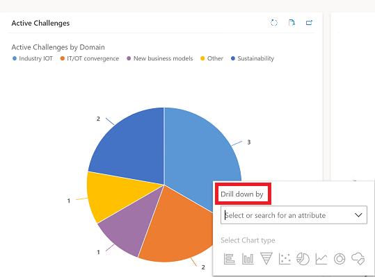

2. Select the drop-down menu and choose how you want to group the data.

   > [!div class="mx-imgBorder"]
   > 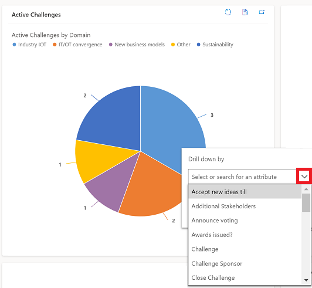
   
3. Select the type of chart that you want to see the drill-down data in.

   > [!div class="mx-imgBorder"]
   > 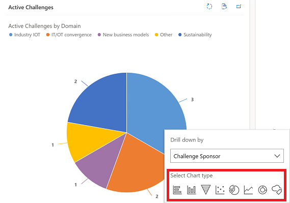

4. The chart with the drilled-down data will show. The breadcrumbs at the top show the filter criteria of the drill-down data. You can select the breadcrumbs to go back home or to the previous screen.

   > [!div class="mx-imgBorder"]
   > 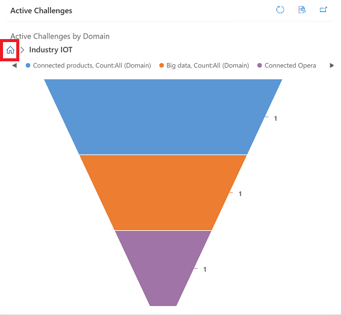

You can continue drilling further into the chart data. As you drill down deeper, the breadcrumbs will expand and you can go back to the previous screen or select the Home button to go back to the Home screen.

   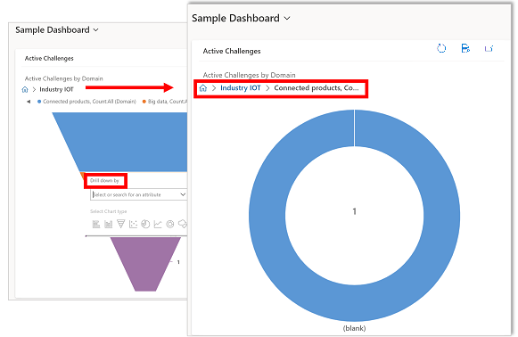

## Known issues  

- In the chart designer, adding an order on certain calculated columns is not supported and will cause an error. The calculated columns causing this are using other calculated columns, a related table column, or a local column on the table.

- Chart displays zero values when there is no data. With Unified Interface for model-driven apps you can still select a chart with zero value and drill down in to the data. More information: [Chart displays zero values when there is no data](https://support.microsoft.com/topic/chart-displays-zero-values-when-there-is-no-data-56f9e224-cb71-40eb-4dc1-bbcda7e28b12) 

- By design, charts in rollup column can't be displayed because rollup columns contain an aggregate value computed over the rows related to a specified row.

[!INCLUDE[footer-include](../includes/footer-banner.md)]
