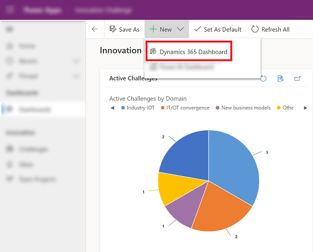
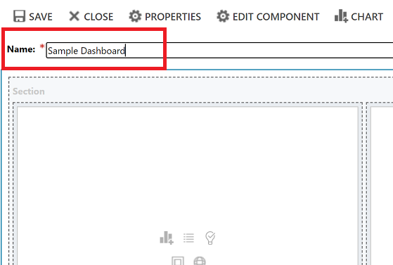
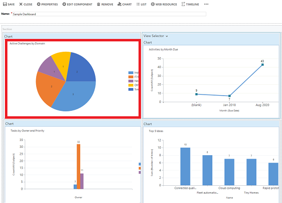

# Track your progress with dashboards and charts

A dashboard is made up of a collection of easy-to-read charts and graphs that provide visual representation of filtered app data. The interactive charts and graphs on a dashboard displays important data that gives you a 360 degree view of your business and helps you to understand key performance indicators (KPI).

Dashboards are available for all record types. Charts are aviable on the Dashboard page, Grid page, Associated Home page, and on Edit Form page. 

> [!div class="mx-imgBorder"]
>  

## Expand, refresh, and view records

Legend:

1. **Expand Chart**: Shows the chart in full screen mode. The chart is still interactive in expanded mode.  
2. **Refresh**: Refreshes the records in the chart.
3. **View Records**: To view the chart and the underlying records together.The chart navigate to the entity's grid home page, with the corresponding view and chart. 
4. **Tool tips**: Hover your mouse over the chart to see a tooltip that provides quick information about that area of the chart.      

## Create a dashbaord and add charts

1. On the left nav under **My Work** select **Dashboards** and then on the command bar select **New** > **Dynamics 365 Dashboard**. 

   > [!div class="mx-imgBorder"]
   > 
   
2. Choose a layout and then select **Create**. This is how your dashboard displays the charts, graphics, and numbers. 

   > [!div class="mx-imgBorder"]
   > 
 
3. Type in a name for the dashboard. 

   > [!div class="mx-imgBorder"]
   > 
   
   
4. Add what you want to each area of your dashboard. For example, let's add a chart. 

   > [!div class="mx-imgBorder"]
   > 
 
5. On the **Add Componet** dialog box, select your options. 
 
      |  |  |
      | --- | --- |
      | **Record Type** |Select a record.  |
      | **View** |Select a view for the record.  |
      | **Chart** |Select the type of chart that you want use. |

    > [!div class="mx-imgBorder"]
    > 

 
6. When you're done adding each compoent, select **Add**.
 

7. Continue adding components to the dashboard. You can add up to six components.   
 
   > [!div class="mx-imgBorder"]
   > 
 
8. When you are done, on the command bar select **Save**. 
 
9. The dashboard that you created will appear in the drop-down menu under **My Dashbaords**.

   > [!div class="mx-imgBorder"]
   > 

## Edit chart properties

When you add a chart on a dashboard you can edit the chart properites and modify the chart view and dispaly options. 

   > [!div class="mx-imgBorder"]
   > 

Legend:

 1. View title with **View Selector** turned off. You cannont toggle between differt views. You only see the title.
 2. Chart title with **Display Chart Selection** turned off. You cannot toggle between differnt charts for the entity. You only see the title.
 3. Only **View Selector** is turned. You can toggle to a different views and the chart will render based on the underline data for the selected view.
 4. Both **View Selector** and **Display Chart Selection** is turned. You can toggle a different views and chart for the entity

To edit the chart properties, you need to edit the dashboard that the chart is in. If you're in the process of of adding a new chart on a dashboard, then you're aleady in edit mode and can skip to step 2.

1. Go to the dashboard that the chart is in and on the command bar, select **Edit**.

   > [!div class="mx-imgBorder"]
   > 
   
2. Double select the chart that you want to edit. 

   > [!div class="mx-imgBorder"]
   > 

3. On the **Set Properties** dialog box select a **View Selector** option. 

	- **Off**: Do not show view selector, show the view title only.
	- **Show All Views**: Show the view selector on chart and display all views in the view selector.
	- **Show Selected Views**: Show the view selector on chart and display only the selected views in the view selector.
 
  > [!div class="mx-imgBorder"]
  > 

4. Once **View Selector** is turned on, you can select different view, to see how the chart renders with different data associated with the view.

   > [!div class="mx-imgBorder"]
   > 

5. Select the **Display Chart Selection** check box to show the chart selector. When chart selector is enabled, you can toggle to a different chart for the entity, to see a different visualization of the data. If the box is unchecked then you only see the chart title.

## Drilldown in a chart

## Known issues  
In the chart designer, adding a order by on certain calculated fields are not supported and will cause an error.  The calculated fields causing this are using another calculated fields, a related entity field, or a local field on the entity.

